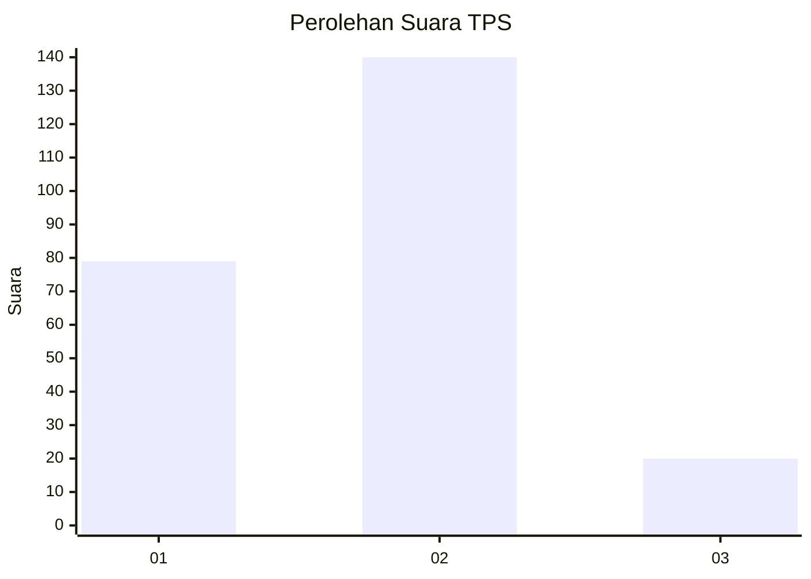
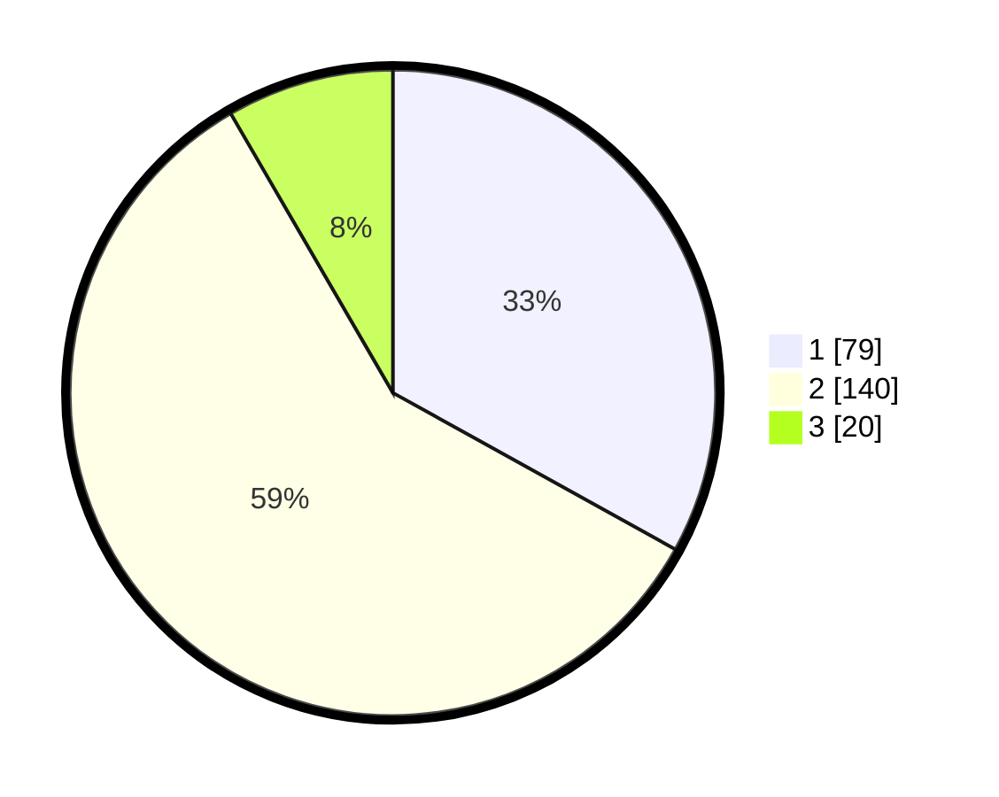

# Hasil

## Grafik

## Tabel

| No. | Nama Paslon    | Suara | Suara (raw) | Persentase |
|:--- |:-------------- | -----:| -----------:| ----------:|
| 1   | ANIES MUHAIMIN | 79    | [79][p-1]   | 33,05      |
| 2   | PRABOWO GIBRAN | 140   | [140][p-2]  | 58,58      |
| 3   | GANJAR MAHFUD  | 20    | [20][p-3]   | 8,37       |

[p-1]: https://github.com/gigit-pemilu/pemilu-2024-74-sulawesi-tenggara/blob/main/pilpres/hitung-suara/sub/74-sulawesi-tenggara/sub/01-kolaka/sub/01-wundulako/sub/1001-19-nopember/sub/002-tps/sub/paslon-1.txt
[p-2]: https://github.com/gigit-pemilu/pemilu-2024-74-sulawesi-tenggara/blob/main/pilpres/hitung-suara/sub/74-sulawesi-tenggara/sub/01-kolaka/sub/01-wundulako/sub/1001-19-nopember/sub/002-tps/sub/paslon-2.txt
[p-3]: https://github.com/gigit-pemilu/pemilu-2024-74-sulawesi-tenggara/blob/main/pilpres/hitung-suara/sub/74-sulawesi-tenggara/sub/01-kolaka/sub/01-wundulako/sub/1001-19-nopember/sub/002-tps/sub/paslon-3.txt

## Foto C Plano

https://sirekap-obj-formc.kpu.go.id/9294/pemilu/ppwp/74/01/01/10/01/7401011001002-20240215-141536--cc41f501-9381-4095-ba65-d0b21a66974d.jpg

https://sirekap-obj-formc.kpu.go.id/9294/pemilu/ppwp/74/01/01/10/01/7401011001002-20240215-135553--b9aff42c-267a-4bdd-9833-ed0c0ac4dbf4.jpg

https://sirekap-obj-formc.kpu.go.id/9294/pemilu/ppwp/74/01/01/10/01/7401011001002-20240215-141409--dc1f8a2d-30f4-4b8a-96f6-e23e8989e0e2.jpg

## Metadata

| Key        | Value               |
| ---------- | ------------------- |
| Time Stamp | 2024-02-16 23:00:00 |

## DATA PEMILIH TETAP

Jumlah pemilih dalam DPT: **290**.
 * L: **132**.
 * P: **158**.

## DATA PENGGUNA HAK PILIH

Jumlah pengguna hak pilih dalam DPT: **238**.
 * L: **102**.
 * P: **136**.

Jumlah pengguna hak pilih dalam DPTb: **0**.
 * L: **0**.
 * P: **0**.

Jumlah pengguna hak pilih dalam DPK: **6**.
 * L: **3**.
 * P: **3**.

Jumlah pengguna hak pilih: **244**.
 * L: **105**.
 * P: **139**.

## JUMLAH SUARA SAH DAN TIDAK SAH

JUMLAH SELURUH SUARA SAH: **239**.

JUMLAH SUARA TIDAK SAH: **5**.

JUMLAH SELURUH SUARA SAH DAN SUARA TIDAK SAH: **244**.

