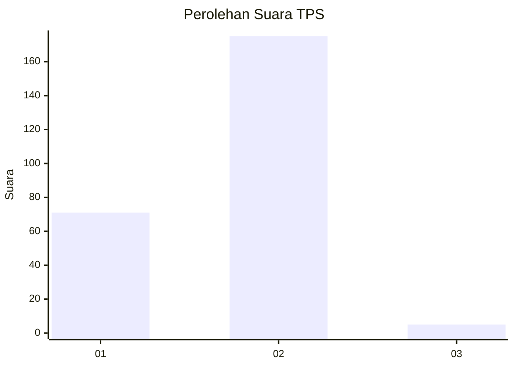
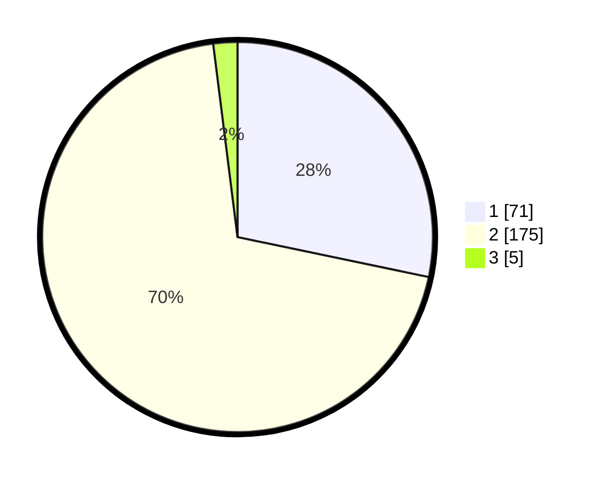

# Hasil

## Grafik

## Tabel

| No. | Nama Paslon    | Suara | Suara (raw) | Persentase |
|:--- |:-------------- | -----:| -----------:| ----------:|
| 1   | ANIES MUHAIMIN | 71    | [71][p-1]   | 28,29      |
| 2   | PRABOWO GIBRAN | 175   | [175][p-2]  | 69,72      |
| 3   | GANJAR MAHFUD  | 5     | [5][p-3]    | 1,99       |

[p-1]: https://github.com/gigit-pemilu/pemilu-2024-74-sulawesi-tenggara/blob/main/pilpres/hitung-suara/sub/74-sulawesi-tenggara/sub/01-kolaka/sub/01-wundulako/sub/1001-19-nopember/sub/003-tps/sub/paslon-1.txt
[p-2]: https://github.com/gigit-pemilu/pemilu-2024-74-sulawesi-tenggara/blob/main/pilpres/hitung-suara/sub/74-sulawesi-tenggara/sub/01-kolaka/sub/01-wundulako/sub/1001-19-nopember/sub/003-tps/sub/paslon-2.txt
[p-3]: https://github.com/gigit-pemilu/pemilu-2024-74-sulawesi-tenggara/blob/main/pilpres/hitung-suara/sub/74-sulawesi-tenggara/sub/01-kolaka/sub/01-wundulako/sub/1001-19-nopember/sub/003-tps/sub/paslon-3.txt

## Foto C Plano

https://sirekap-obj-formc.kpu.go.id/1ba5/pemilu/ppwp/74/01/01/10/01/7401011001003-20240214-191928--70408198-10fd-4fb7-8d6f-31ff2d785fe4.jpg

https://sirekap-obj-formc.kpu.go.id/1ba5/pemilu/ppwp/74/01/01/10/01/7401011001003-20240214-192236--1b811643-80bf-47ac-a87c-40df3fab7326.jpg

https://sirekap-obj-formc.kpu.go.id/1ba5/pemilu/ppwp/74/01/01/10/01/7401011001003-20240214-192400--f326f118-01ca-47f7-981e-9d7d7985266c.jpg

## Metadata

| Key        | Value               |
| ---------- | ------------------- |
| Time Stamp | 2024-02-15 09:00:24 |

## DATA PEMILIH TETAP

Jumlah pemilih dalam DPT: **270**.
 * L: **137**.
 * P: **133**.

## DATA PENGGUNA HAK PILIH

Jumlah pengguna hak pilih dalam DPT: **247**.
 * L: **123**.
 * P: **124**.

Jumlah pengguna hak pilih dalam DPTb: **2**.
 * L: **1**.
 * P: **1**.

Jumlah pengguna hak pilih dalam DPK: **6**.
 * L: **4**.
 * P: **2**.

Jumlah pengguna hak pilih: **255**.
 * L: **128**.
 * P: **127**.

## JUMLAH SUARA SAH DAN TIDAK SAH

JUMLAH SELURUH SUARA SAH: **251**.

JUMLAH SUARA TIDAK SAH: **4**.

JUMLAH SELURUH SUARA SAH DAN SUARA TIDAK SAH: **255**.

