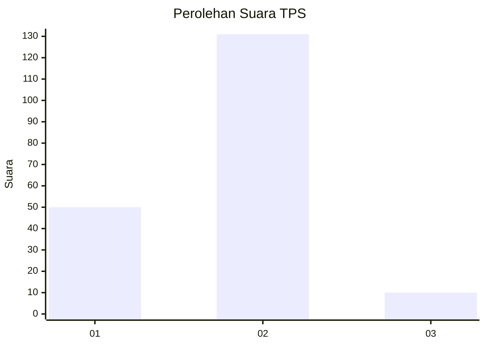
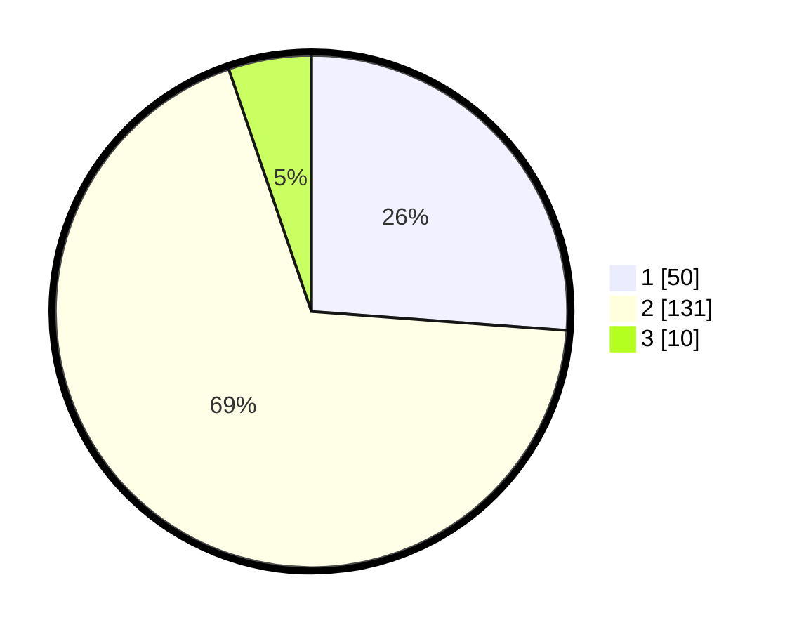

# Hasil

## Grafik

## Tabel

| No. | Nama Paslon    | Suara | Suara (raw) | Persentase |
|:--- |:-------------- | -----:| -----------:| ----------:|
| 1   | ANIES MUHAIMIN | 50    | [50][p-1]   | 26,18      |
| 2   | PRABOWO GIBRAN | 131   | [131][p-2]  | 68,59      |
| 3   | GANJAR MAHFUD  | 10    | [10][p-3]   | 5,24       |

[p-1]: https://github.com/gigit-pemilu/pemilu-2024-74-sulawesi-tenggara/blob/main/pilpres/hitung-suara/sub/74-sulawesi-tenggara/sub/01-kolaka/sub/01-wundulako/sub/1001-19-nopember/sub/004-tps/sub/paslon-1.txt
[p-2]: https://github.com/gigit-pemilu/pemilu-2024-74-sulawesi-tenggara/blob/main/pilpres/hitung-suara/sub/74-sulawesi-tenggara/sub/01-kolaka/sub/01-wundulako/sub/1001-19-nopember/sub/004-tps/sub/paslon-2.txt
[p-3]: https://github.com/gigit-pemilu/pemilu-2024-74-sulawesi-tenggara/blob/main/pilpres/hitung-suara/sub/74-sulawesi-tenggara/sub/01-kolaka/sub/01-wundulako/sub/1001-19-nopember/sub/004-tps/sub/paslon-3.txt

## Foto C Plano

https://sirekap-obj-formc.kpu.go.id/a312/pemilu/ppwp/74/01/01/10/01/7401011001004-20240214-220222--c5119a73-2957-4d19-a902-cbf9f3557ba5.jpg

https://sirekap-obj-formc.kpu.go.id/a312/pemilu/ppwp/74/01/01/10/01/7401011001004-20240214-230623--366936e6-3c95-4b7f-b580-e7b51fc1175d.jpg

https://sirekap-obj-formc.kpu.go.id/a312/pemilu/ppwp/74/01/01/10/01/7401011001004-20240214-230732--3ab98964-4942-4f4d-a54f-669a0f428902.jpg

## Metadata

| Key        | Value               |
| ---------- | ------------------- |
| Time Stamp | 2024-02-15 15:30:25 |

