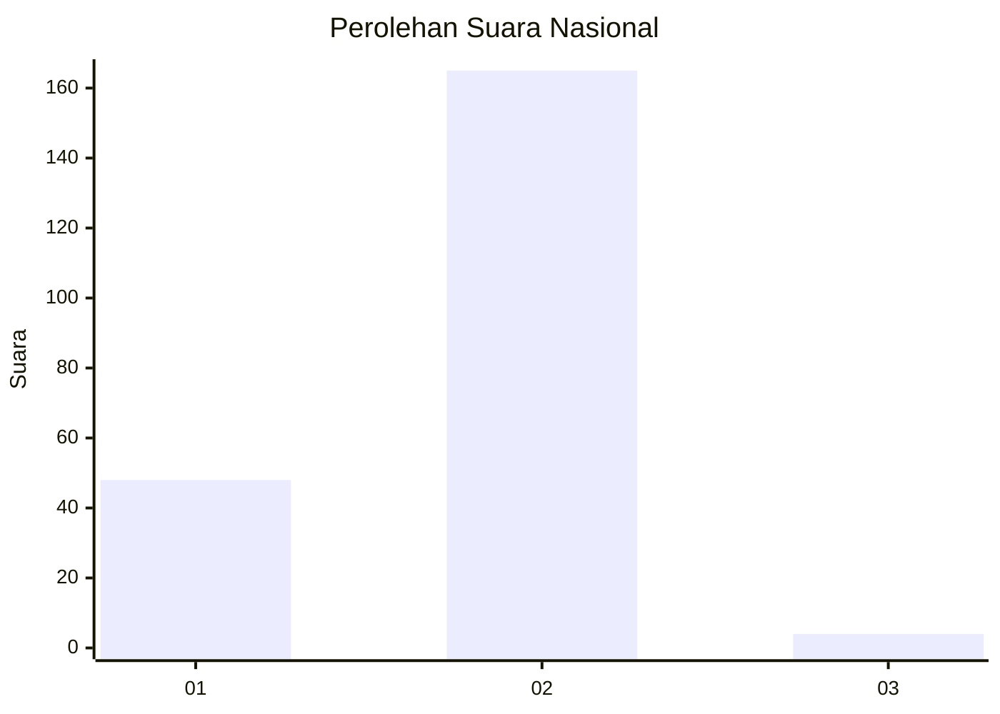
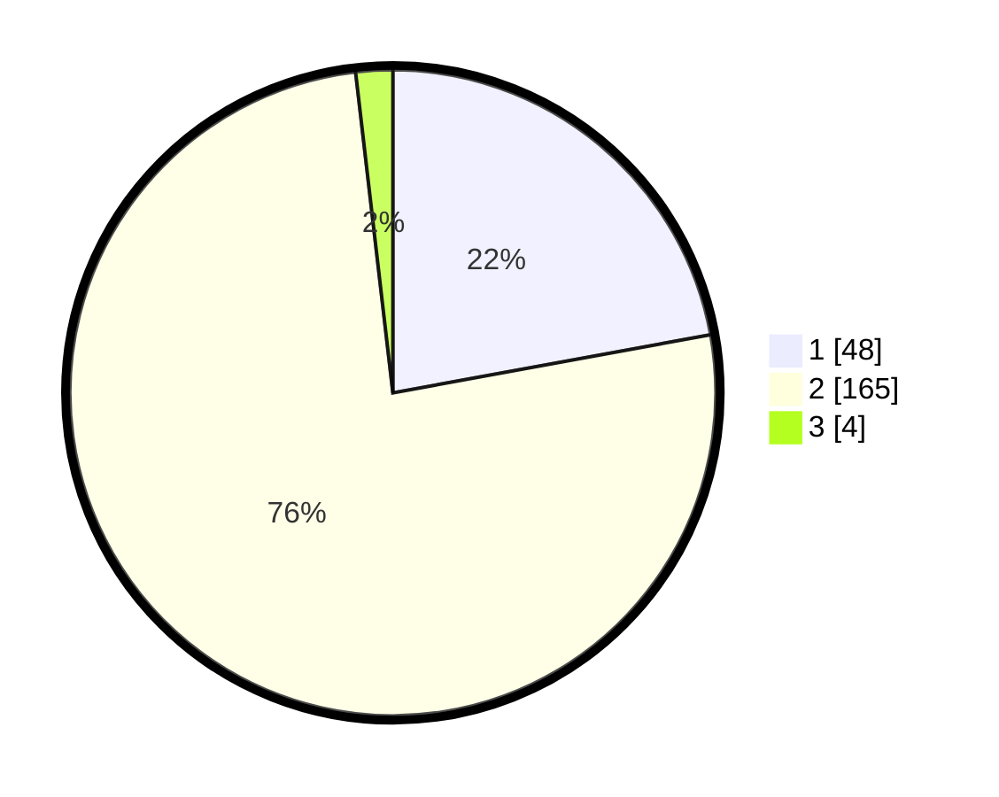

# Hasil

## Grafik

## Tabel

| No. | Nama Paslon    | Suara | Suara (raw) | Persentase |
|:--- |:-------------- | -----:| -----------:| ----------:|
| 1   | ANIES MUHAIMIN | 48    | [48][p-1]   | 22,12      |
| 2   | PRABOWO GIBRAN | 165   | [165][p-2]  | 76,04      |
| 3   | GANJAR MAHFUD  | 4     | [4][p-3]    | 1,84       |

[p-1]: https://github.com/gigit-pemilu/pemilu-2024/blob/main/pilpres/hitung-suara/sub/74-sulawesi-tenggara/sub/01-kolaka/sub/01-wundulako/sub/1001-19-nopember/sub/005-tps/sub/paslon-1.txt
[p-2]: https://github.com/gigit-pemilu/pemilu-2024/blob/main/pilpres/hitung-suara/sub/74-sulawesi-tenggara/sub/01-kolaka/sub/01-wundulako/sub/1001-19-nopember/sub/005-tps/sub/paslon-2.txt
[p-3]: https://github.com/gigit-pemilu/pemilu-2024/blob/main/pilpres/hitung-suara/sub/74-sulawesi-tenggara/sub/01-kolaka/sub/01-wundulako/sub/1001-19-nopember/sub/005-tps/sub/paslon-3.txt

## Foto C Plano

https://sirekap-obj-formc.kpu.go.id/926c/pemilu/ppwp/74/01/01/10/01/7401011001005-20240214-221656--6aa65afe-5201-4c69-ae1e-85e15b7700a8.jpg

https://sirekap-obj-formc.kpu.go.id/926c/pemilu/ppwp/74/01/01/10/01/7401011001005-20240214-215458--bcf87380-7ceb-454d-98a0-8ceda4c4a931.jpg

https://sirekap-obj-formc.kpu.go.id/926c/pemilu/ppwp/74/01/01/10/01/7401011001005-20240214-202401--77efe726-58d0-44bf-b5e7-7f4130fe9895.jpg

## Metadata

| Key        | Value               |
| ---------- | ------------------- |
| Time Stamp | 2024-02-15 20:00:44 |

