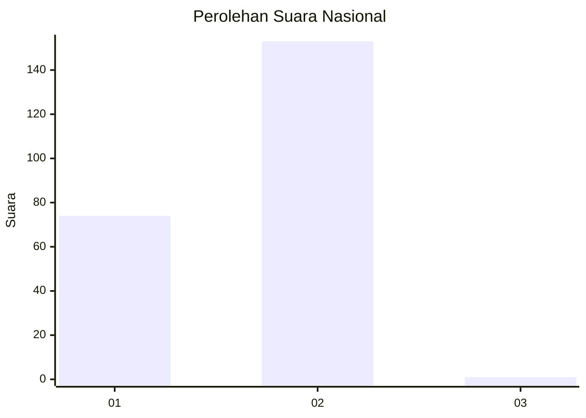
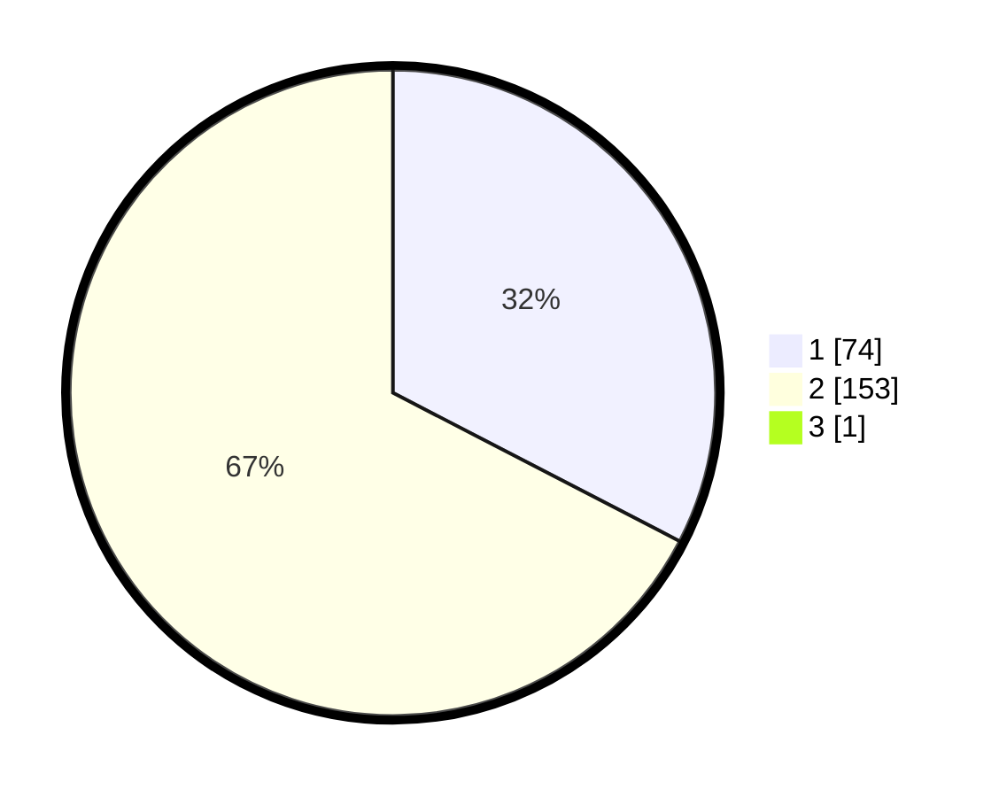

# Hasil

## Grafik

## Tabel

| No. | Nama Paslon    | Suara | Suara (raw) | Persentase |
|:--- |:-------------- | -----:| -----------:| ----------:|
| 1   | ANIES MUHAIMIN | 74    | [74][p-1]   | 32,46      |
| 2   | PRABOWO GIBRAN | 153   | [153][p-2]  | 67,11      |
| 3   | GANJAR MAHFUD  | 1     | [1][p-3]    | 0,44       |

[p-1]: https://github.com/gigit-pemilu/pemilu-2024/blob/main/pilpres/hitung-suara/sub/74-sulawesi-tenggara/sub/01-kolaka/sub/01-wundulako/sub/1004-kowioha/sub/003-tps/sub/paslon-1.txt
[p-2]: https://github.com/gigit-pemilu/pemilu-2024/blob/main/pilpres/hitung-suara/sub/74-sulawesi-tenggara/sub/01-kolaka/sub/01-wundulako/sub/1004-kowioha/sub/003-tps/sub/paslon-2.txt
[p-3]: https://github.com/gigit-pemilu/pemilu-2024/blob/main/pilpres/hitung-suara/sub/74-sulawesi-tenggara/sub/01-kolaka/sub/01-wundulako/sub/1004-kowioha/sub/003-tps/sub/paslon-3.txt

## Foto C Plano

https://sirekap-obj-formc.kpu.go.id/9c1e/pemilu/ppwp/74/01/01/10/04/7401011004003-20240214-194519--7ac6c4dc-b8dc-4aed-bb7b-ed05c8cf767e.jpg

https://sirekap-obj-formc.kpu.go.id/9c1e/pemilu/ppwp/74/01/01/10/04/7401011004003-20240214-200348--6cb7a50e-45dc-4b3c-9f37-a7a3c01d0d87.jpg

https://sirekap-obj-formc.kpu.go.id/9c1e/pemilu/ppwp/74/01/01/10/04/7401011004003-20240214-224311--7ba76a57-109a-44fe-9a18-0bcede341570.jpg

## Metadata

| Key        | Value               |
| ---------- | ------------------- |
| Time Stamp | 2024-02-15 16:00:26 |

