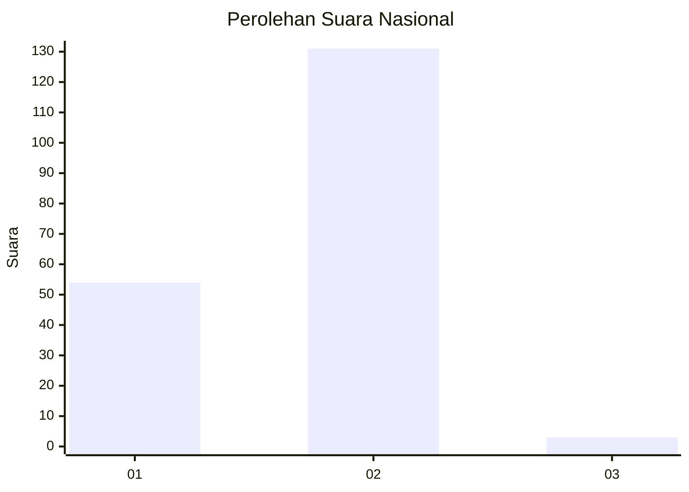
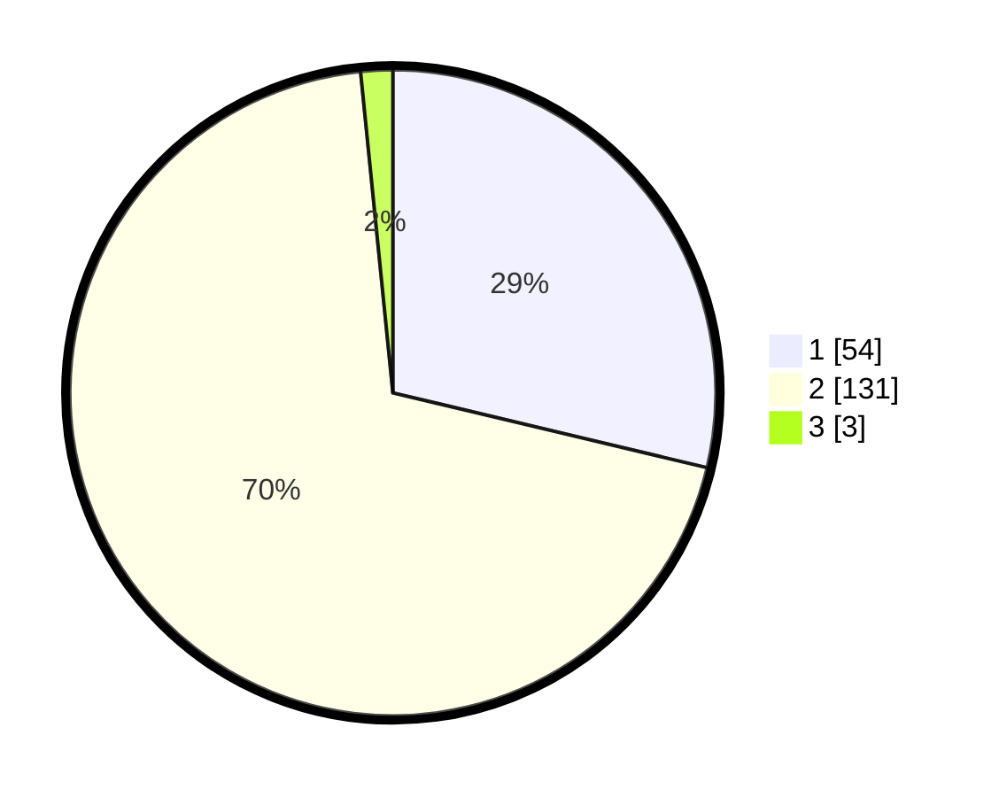

# Hasil

## Grafik

## Tabel

| No. | Nama Paslon    | Suara | Suara (raw) | Persentase |
|:--- |:-------------- | -----:| -----------:| ----------:|
| 1   | ANIES MUHAIMIN | 54    | [54][p-1]   | 28,72      |
| 2   | PRABOWO GIBRAN | 131   | [131][p-2]  | 69,68      |
| 3   | GANJAR MAHFUD  | 3     | [3][p-3]    | 1,60       |

[p-1]: https://github.com/gigit-pemilu/pemilu-2024/blob/main/pilpres/hitung-suara/sub/74-sulawesi-tenggara/sub/01-kolaka/sub/07-pomalaa/sub/1001-dawi-dawi/sub/002-tps/sub/paslon-1.txt
[p-2]: https://github.com/gigit-pemilu/pemilu-2024/blob/main/pilpres/hitung-suara/sub/74-sulawesi-tenggara/sub/01-kolaka/sub/07-pomalaa/sub/1001-dawi-dawi/sub/002-tps/sub/paslon-2.txt
[p-3]: https://github.com/gigit-pemilu/pemilu-2024/blob/main/pilpres/hitung-suara/sub/74-sulawesi-tenggara/sub/01-kolaka/sub/07-pomalaa/sub/1001-dawi-dawi/sub/002-tps/sub/paslon-3.txt

## Foto C Plano

https://sirekap-obj-formc.kpu.go.id/8e53/pemilu/ppwp/74/01/07/10/01/7401071001002-20240215-034830--27152d58-5622-4f21-9ede-d3b8d22ad587.jpg

https://sirekap-obj-formc.kpu.go.id/8e53/pemilu/ppwp/74/01/07/10/01/7401071001002-20240215-035100--148a5fcf-9ae3-4355-885d-71a898832523.jpg

https://sirekap-obj-formc.kpu.go.id/8e53/pemilu/ppwp/74/01/07/10/01/7401071001002-20240215-021040--54ea57ba-3a2b-4258-b59b-563d634e968d.jpg

## Metadata

| Key        | Value               |
| ---------- | ------------------- |
| Time Stamp | 2024-02-15 22:30:27 |

