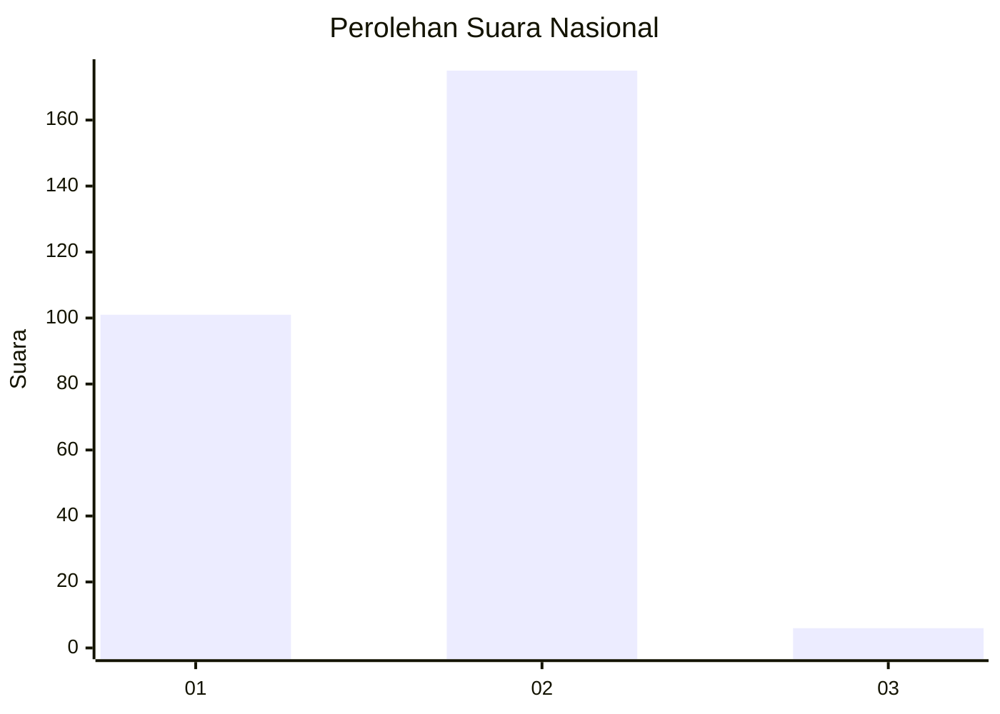
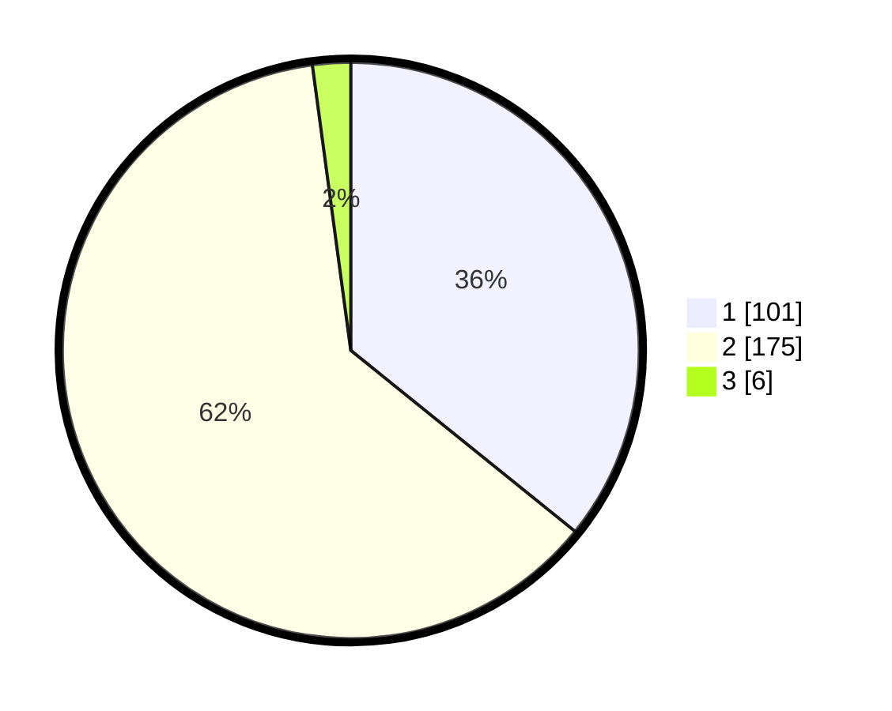

# Hasil

## Grafik

## Tabel

| No. | Nama Paslon    | Suara | Suara (raw) | Persentase |
|:--- |:-------------- | -----:| -----------:| ----------:|
| 1   | ANIES MUHAIMIN | 101   | [101][p-1]  | 35,82      |
| 2   | PRABOWO GIBRAN | 175   | [175][p-2]  | 62,06      |
| 3   | GANJAR MAHFUD  | 6     | [6][p-3]    | 2,13       |

[p-1]: https://github.com/gigit-pemilu/pemilu-2024/blob/main/pilpres/hitung-suara/sub/74-sulawesi-tenggara/sub/01-kolaka/sub/07-pomalaa/sub/1001-dawi-dawi/sub/008-tps/sub/paslon-1.txt
[p-2]: https://github.com/gigit-pemilu/pemilu-2024/blob/main/pilpres/hitung-suara/sub/74-sulawesi-tenggara/sub/01-kolaka/sub/07-pomalaa/sub/1001-dawi-dawi/sub/008-tps/sub/paslon-2.txt
[p-3]: https://github.com/gigit-pemilu/pemilu-2024/blob/main/pilpres/hitung-suara/sub/74-sulawesi-tenggara/sub/01-kolaka/sub/07-pomalaa/sub/1001-dawi-dawi/sub/008-tps/sub/paslon-3.txt

## Foto C Plano

https://sirekap-obj-formc.kpu.go.id/30d7/pemilu/ppwp/74/01/07/10/01/7401071001008-20240215-115617--0875a7bc-8117-46d0-a1a8-9ddc0d3b0be5.jpg

https://sirekap-obj-formc.kpu.go.id/30d7/pemilu/ppwp/74/01/07/10/01/7401071001008-20240215-121848--9b891ced-77e8-4f2c-8f52-bc20be0e37de.jpg

https://sirekap-obj-formc.kpu.go.id/30d7/pemilu/ppwp/74/01/07/10/01/7401071001008-20240215-123533--0b2aa6e6-22a7-484b-b438-4c8e5d331c2e.jpg

## Metadata

| Key        | Value               |
| ---------- | ------------------- |
| Time Stamp | 2024-02-15 22:30:27 |

