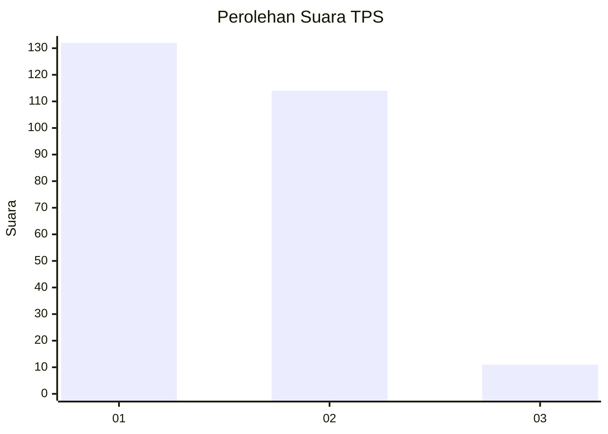
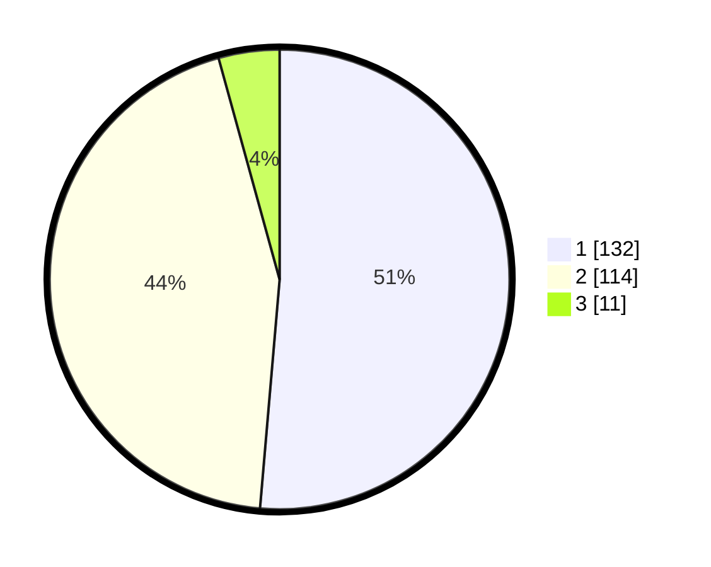

# Hasil

## Grafik

## Tabel

| No. | Nama Paslon    | Suara | Suara (raw) | Persentase |
|:--- |:-------------- | -----:| -----------:| ----------:|
| 1   | ANIES MUHAIMIN | 132   | [132][p-1]  | 51,36      |
| 2   | PRABOWO GIBRAN | 114   | [114][p-2]  | 44,36      |
| 3   | GANJAR MAHFUD  | 11    | [11][p-3]   | 4,28       |

[p-1]: https://github.com/gigit-pemilu/pemilu-2024-74-sulawesi-tenggara/blob/main/pilpres/hitung-suara/sub/74-sulawesi-tenggara/sub/01-kolaka/sub/07-pomalaa/sub/1009-tonggoni/sub/005-tps/sub/paslon-1.txt
[p-2]: https://github.com/gigit-pemilu/pemilu-2024-74-sulawesi-tenggara/blob/main/pilpres/hitung-suara/sub/74-sulawesi-tenggara/sub/01-kolaka/sub/07-pomalaa/sub/1009-tonggoni/sub/005-tps/sub/paslon-2.txt
[p-3]: https://github.com/gigit-pemilu/pemilu-2024-74-sulawesi-tenggara/blob/main/pilpres/hitung-suara/sub/74-sulawesi-tenggara/sub/01-kolaka/sub/07-pomalaa/sub/1009-tonggoni/sub/005-tps/sub/paslon-3.txt

## Foto C Plano

https://sirekap-obj-formc.kpu.go.id/1f12/pemilu/ppwp/74/01/07/10/09/7401071009005-20240215-074131--b39d7176-234e-44a2-9cf1-21ed7ff194ce.jpg

https://sirekap-obj-formc.kpu.go.id/1f12/pemilu/ppwp/74/01/07/10/09/7401071009005-20240215-074429--ccb00aee-24c9-405e-bfa0-550e5c02f4fa.jpg

https://sirekap-obj-formc.kpu.go.id/1f12/pemilu/ppwp/74/01/07/10/09/7401071009005-20240215-074617--57d0e961-ed88-4fd3-8f2a-2fbf0e776635.jpg

## Metadata

| Key        | Value               |
| ---------- | ------------------- |
| Time Stamp | 2024-02-16 00:30:27 |

