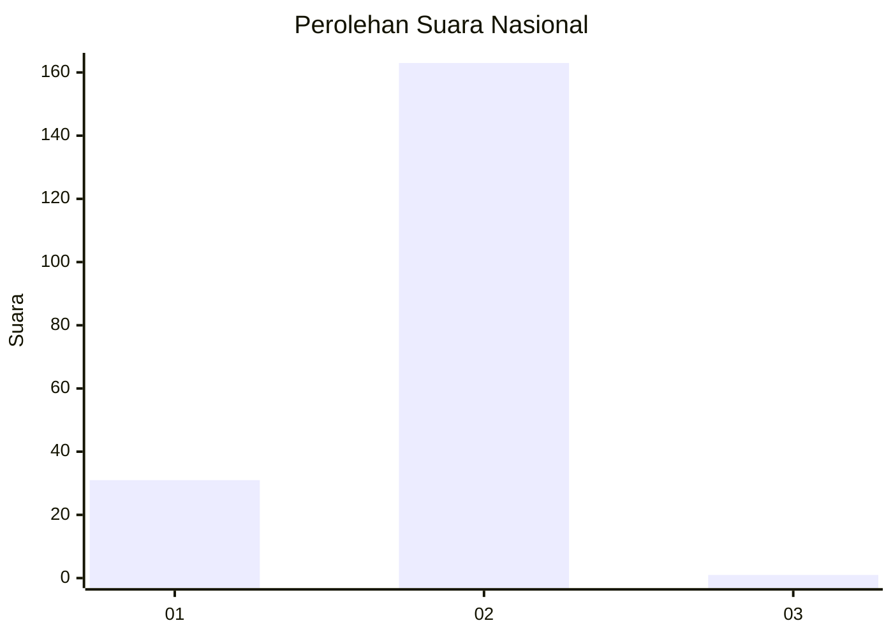
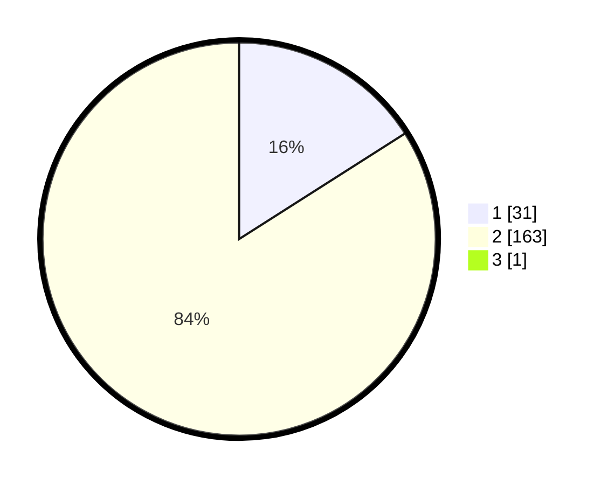

# Hasil

## Grafik

## Tabel

| No. | Nama Paslon    | Suara | Suara (raw) | Persentase |
|:--- |:-------------- | -----:| -----------:| ----------:|
| 1   | ANIES MUHAIMIN | 31    | [31][p-1]   | 15,90      |
| 2   | PRABOWO GIBRAN | 163   | [163][p-2]  | 83,59      |
| 3   | GANJAR MAHFUD  | 1     | [1][p-3]    | 0,51       |

[p-1]: https://github.com/gigit-pemilu/pemilu-2024/blob/main/pilpres/hitung-suara/sub/74-sulawesi-tenggara/sub/01-kolaka/sub/08-watubangga/sub/2002-lamundre/sub/003-tps/sub/paslon-1.txt
[p-2]: https://github.com/gigit-pemilu/pemilu-2024/blob/main/pilpres/hitung-suara/sub/74-sulawesi-tenggara/sub/01-kolaka/sub/08-watubangga/sub/2002-lamundre/sub/003-tps/sub/paslon-2.txt
[p-3]: https://github.com/gigit-pemilu/pemilu-2024/blob/main/pilpres/hitung-suara/sub/74-sulawesi-tenggara/sub/01-kolaka/sub/08-watubangga/sub/2002-lamundre/sub/003-tps/sub/paslon-3.txt

## Foto C Plano

https://sirekap-obj-formc.kpu.go.id/d363/pemilu/ppwp/74/01/08/20/02/7401082002003-20240215-055748--0d4d9e19-2063-4eec-8cc9-bee38fd53618.jpg

https://sirekap-obj-formc.kpu.go.id/d363/pemilu/ppwp/74/01/08/20/02/7401082002003-20240215-053432--1bf8abeb-3bdc-4476-99c9-7cb3b79b2f97.jpg

https://sirekap-obj-formc.kpu.go.id/d363/pemilu/ppwp/74/01/08/20/02/7401082002003-20240215-055227--7d987941-608c-48cd-81d7-887b018ec469.jpg

## Metadata

| Key        | Value               |
| ---------- | ------------------- |
| Time Stamp | 2024-02-16 23:00:00 |

