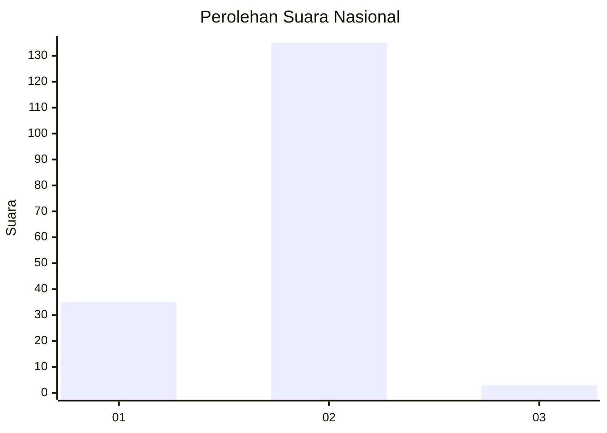
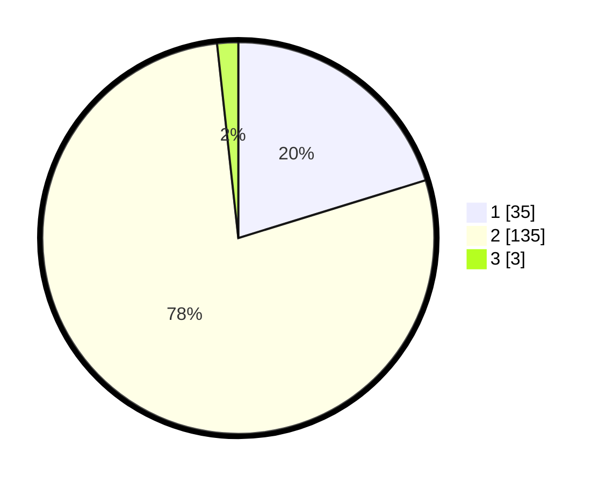

# Hasil

## Grafik

## Tabel

| No. | Nama Paslon    | Suara | Suara (raw) | Persentase |
|:--- |:-------------- | -----:| -----------:| ----------:|
| 1   | ANIES MUHAIMIN | 35    | [35][p-1]   | 20,23      |
| 2   | PRABOWO GIBRAN | 135   | [135][p-2]  | 78,03      |
| 3   | GANJAR MAHFUD  | 3     | [3][p-3]    | 1,73       |

[p-1]: https://github.com/gigit-pemilu/pemilu-2024/blob/main/pilpres/hitung-suara/sub/74-sulawesi-tenggara/sub/01-kolaka/sub/10-wolo/sub/2015-lalonggopi/sub/002-tps/sub/paslon-1.txt
[p-2]: https://github.com/gigit-pemilu/pemilu-2024/blob/main/pilpres/hitung-suara/sub/74-sulawesi-tenggara/sub/01-kolaka/sub/10-wolo/sub/2015-lalonggopi/sub/002-tps/sub/paslon-2.txt
[p-3]: https://github.com/gigit-pemilu/pemilu-2024/blob/main/pilpres/hitung-suara/sub/74-sulawesi-tenggara/sub/01-kolaka/sub/10-wolo/sub/2015-lalonggopi/sub/002-tps/sub/paslon-3.txt

## Foto C Plano

https://sirekap-obj-formc.kpu.go.id/dbac/pemilu/ppwp/74/01/10/20/15/7401102015002-20240215-051544--fda74988-65a0-43c6-826d-b5f5b9995c34.jpg

https://sirekap-obj-formc.kpu.go.id/dbac/pemilu/ppwp/74/01/10/20/15/7401102015002-20240215-045944--f24abadd-00ce-4399-9edc-2110cb07328a.jpg

https://sirekap-obj-formc.kpu.go.id/dbac/pemilu/ppwp/74/01/10/20/15/7401102015002-20240215-043738--57d106ea-6fb4-4b2f-9ff0-a6d5f0ba5587.jpg

## Metadata

| Key        | Value               |
| ---------- | ------------------- |
| Time Stamp | 2024-02-16 23:00:00 |

