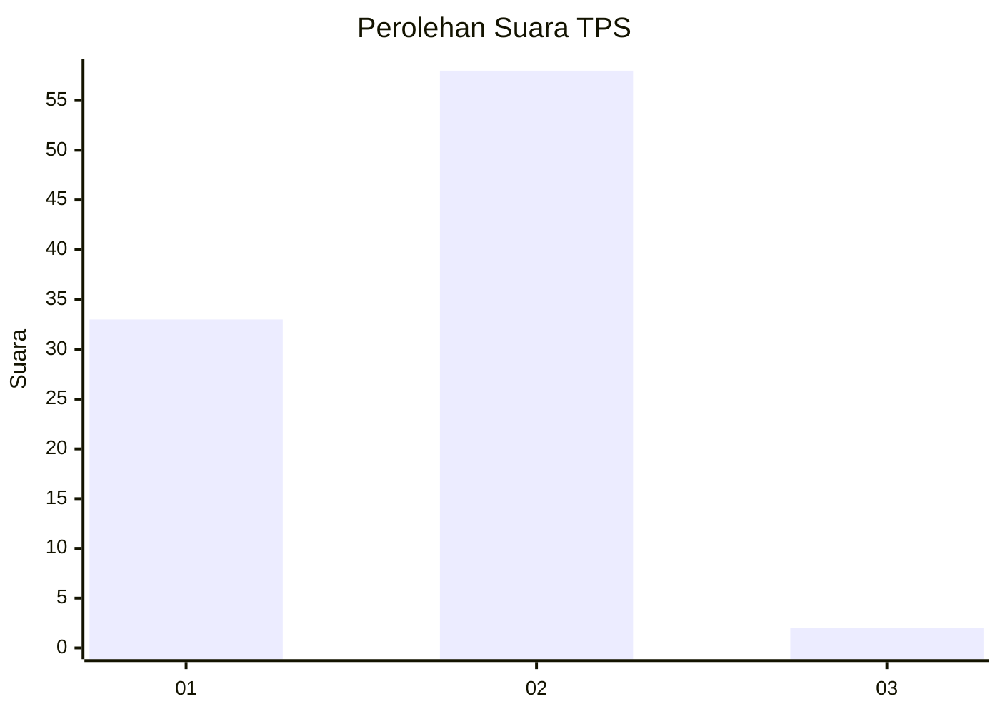
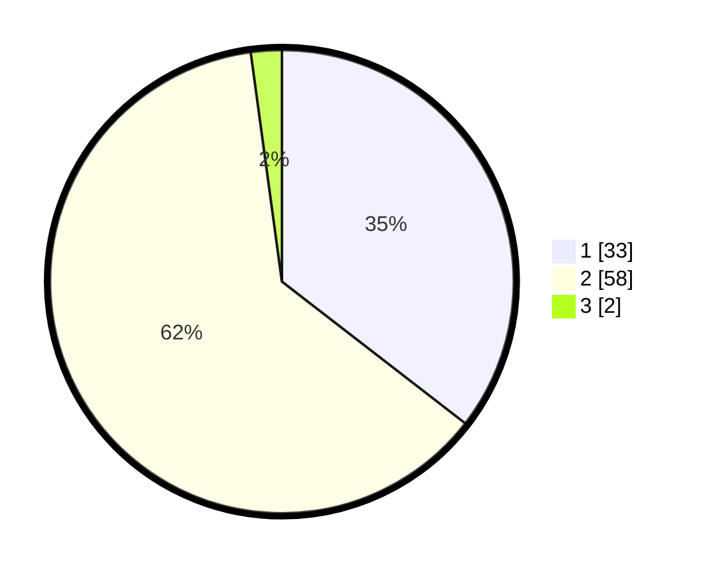

# Hasil

## Grafik

## Tabel

| No. | Nama Paslon    | Suara | Suara (raw) | Persentase |
|:--- |:-------------- | -----:| -----------:| ----------:|
| 1   | ANIES MUHAIMIN | 33    | [33][p-1]   | 35,48      |
| 2   | PRABOWO GIBRAN | 58    | [58][p-2]   | 62,37      |
| 3   | GANJAR MAHFUD  | 2     | [2][p-3]    | 2,15       |

[p-1]: https://github.com/gigit-pemilu/pemilu-2024-74-sulawesi-tenggara/blob/main/pilpres/hitung-suara/sub/74-sulawesi-tenggara/sub/01-kolaka/sub/10-wolo/sub/2021-ulu-rina/sub/002-tps/sub/paslon-1.txt
[p-2]: https://github.com/gigit-pemilu/pemilu-2024-74-sulawesi-tenggara/blob/main/pilpres/hitung-suara/sub/74-sulawesi-tenggara/sub/01-kolaka/sub/10-wolo/sub/2021-ulu-rina/sub/002-tps/sub/paslon-2.txt
[p-3]: https://github.com/gigit-pemilu/pemilu-2024-74-sulawesi-tenggara/blob/main/pilpres/hitung-suara/sub/74-sulawesi-tenggara/sub/01-kolaka/sub/10-wolo/sub/2021-ulu-rina/sub/002-tps/sub/paslon-3.txt

## Foto C Plano

https://sirekap-obj-formc.kpu.go.id/8932/pemilu/ppwp/74/01/10/20/21/7401102021002-20240219-180351--78580479-2090-49bb-88b8-68fec5e22631.jpg

https://sirekap-obj-formc.kpu.go.id/8932/pemilu/ppwp/74/01/10/20/21/7401102021002-20240219-180512--252cb98c-3eda-4025-9b45-497cd2b4d90f.jpg

https://sirekap-obj-formc.kpu.go.id/8932/pemilu/ppwp/74/01/10/20/21/7401102021002-20240219-180539--0f210e89-8b37-4508-8c36-ab87ae623ddc.jpg

## Metadata

| Key        | Value               |
| ---------- | ------------------- |
| Time Stamp | 2024-02-22 20:00:00 |

