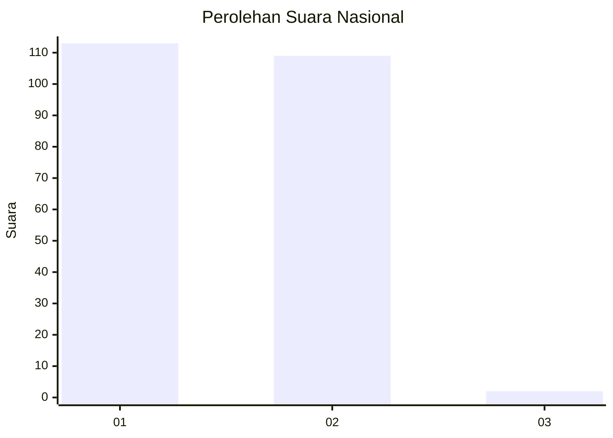
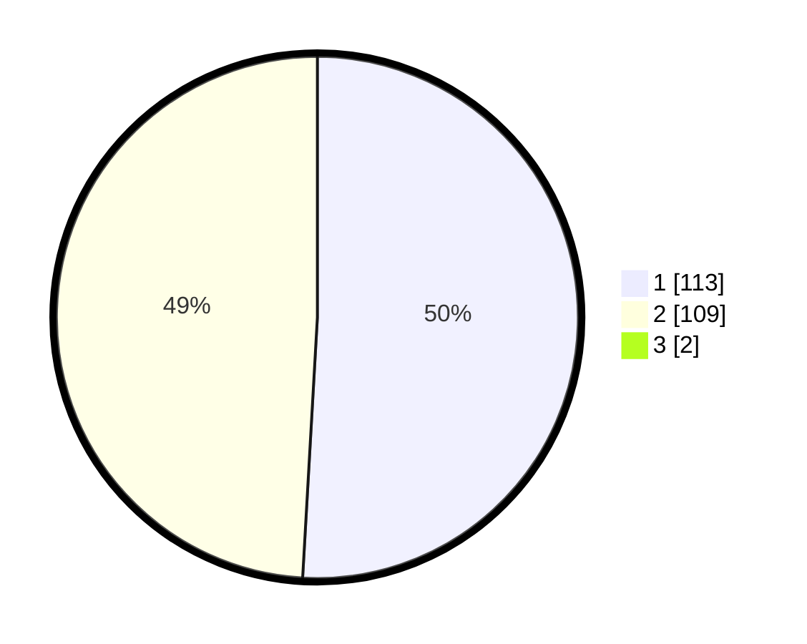

# Hasil

## Grafik

## Tabel

| No. | Nama Paslon    | Suara | Suara (raw) | Persentase |
|:--- |:-------------- | -----:| -----------:| ----------:|
| 1   | ANIES MUHAIMIN | 113   | [113][p-1]  | 50,45      |
| 2   | PRABOWO GIBRAN | 109   | [109][p-2]  | 48,66      |
| 3   | GANJAR MAHFUD  | 2     | [2][p-3]    | 0,89       |

[p-1]: https://github.com/gigit-pemilu/pemilu-2024/blob/main/pilpres/hitung-suara/sub/74-sulawesi-tenggara/sub/01-kolaka/sub/18-tanggetada/sub/1003-anaiwoi/sub/001-tps/sub/paslon-1.txt
[p-2]: https://github.com/gigit-pemilu/pemilu-2024/blob/main/pilpres/hitung-suara/sub/74-sulawesi-tenggara/sub/01-kolaka/sub/18-tanggetada/sub/1003-anaiwoi/sub/001-tps/sub/paslon-2.txt
[p-3]: https://github.com/gigit-pemilu/pemilu-2024/blob/main/pilpres/hitung-suara/sub/74-sulawesi-tenggara/sub/01-kolaka/sub/18-tanggetada/sub/1003-anaiwoi/sub/001-tps/sub/paslon-3.txt

## Foto C Plano

https://sirekap-obj-formc.kpu.go.id/f31e/pemilu/ppwp/74/01/18/10/03/7401181003001-20240215-070110--b53fd486-a468-4457-9cac-f0d448bb3321.jpg

https://sirekap-obj-formc.kpu.go.id/f31e/pemilu/ppwp/74/01/18/10/03/7401181003001-20240215-071522--1f5228a7-5440-49ae-9304-9fbc5bab5a1c.jpg

https://sirekap-obj-formc.kpu.go.id/f31e/pemilu/ppwp/74/01/18/10/03/7401181003001-20240215-090447--7add8790-5cc2-442a-85cf-a9796d5176cc.jpg

## Metadata

| Key        | Value               |
| ---------- | ------------------- |
| Time Stamp | 2024-02-15 22:00:27 |

