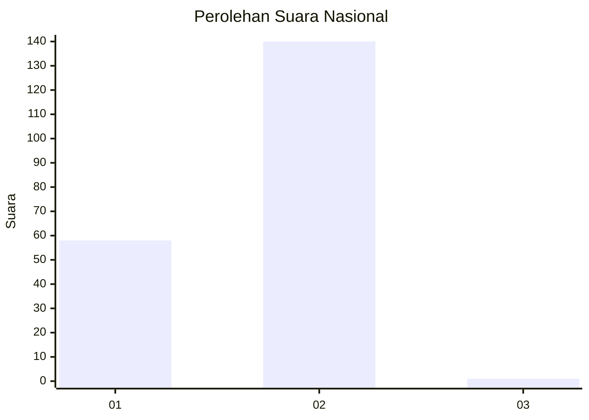
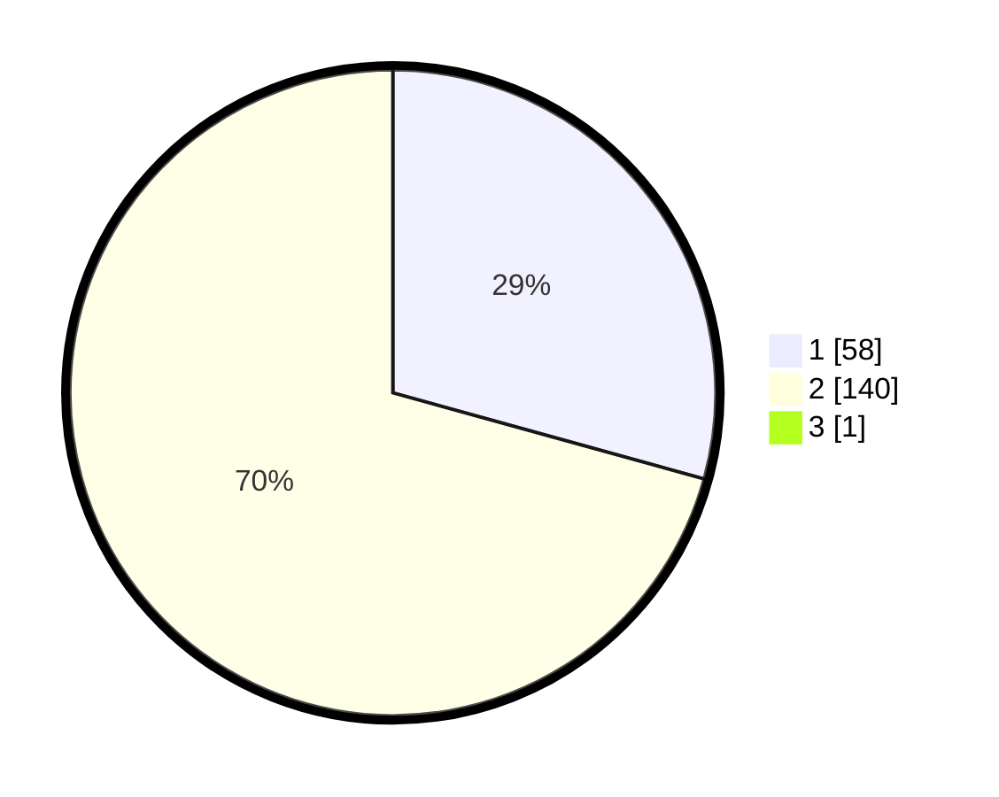

# Hasil

## Grafik

## Tabel

| No. | Nama Paslon    | Suara | Suara (raw) | Persentase |
|:--- |:-------------- | -----:| -----------:| ----------:|
| 1   | ANIES MUHAIMIN | 58    | [58][p-1]   | 29,15      |
| 2   | PRABOWO GIBRAN | 140   | [140][p-2]  | 70,35      |
| 3   | GANJAR MAHFUD  | 1     | [1][p-3]    | 0,50       |

[p-1]: https://github.com/gigit-pemilu/pemilu-2024/blob/main/pilpres/hitung-suara/sub/74-sulawesi-tenggara/sub/01-kolaka/sub/27-iwoimendaa/sub/2002-ladahai/sub/001-tps/sub/paslon-1.txt
[p-2]: https://github.com/gigit-pemilu/pemilu-2024/blob/main/pilpres/hitung-suara/sub/74-sulawesi-tenggara/sub/01-kolaka/sub/27-iwoimendaa/sub/2002-ladahai/sub/001-tps/sub/paslon-2.txt
[p-3]: https://github.com/gigit-pemilu/pemilu-2024/blob/main/pilpres/hitung-suara/sub/74-sulawesi-tenggara/sub/01-kolaka/sub/27-iwoimendaa/sub/2002-ladahai/sub/001-tps/sub/paslon-3.txt

## Foto C Plano

https://sirekap-obj-formc.kpu.go.id/ffa4/pemilu/ppwp/74/01/27/20/02/7401272002001-20240215-072628--efb1c4d5-7e6b-4358-aef6-99e73f371d76.jpg

https://sirekap-obj-formc.kpu.go.id/ffa4/pemilu/ppwp/74/01/27/20/02/7401272002001-20240215-073031--f891dbd5-2659-4e6a-a1d9-b238b7c2137e.jpg

https://sirekap-obj-formc.kpu.go.id/ffa4/pemilu/ppwp/74/01/27/20/02/7401272002001-20240215-075436--80a5ba51-2b7f-4a0e-9172-5959c5627ef1.jpg

## Metadata

| Key        | Value               |
| ---------- | ------------------- |
| Time Stamp | 2024-02-15 20:00:44 |

