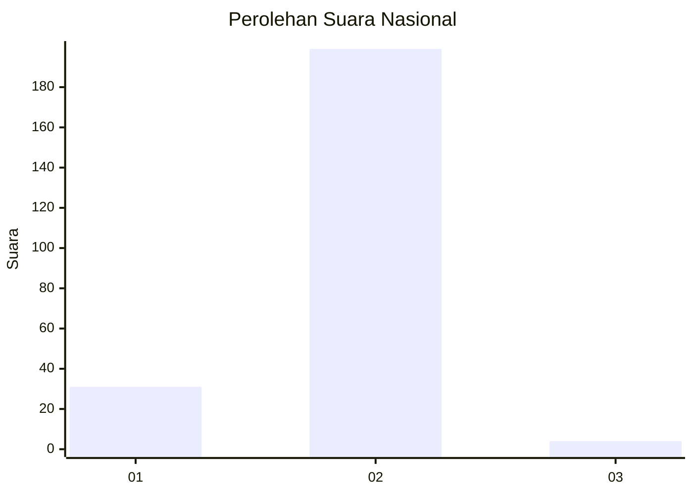
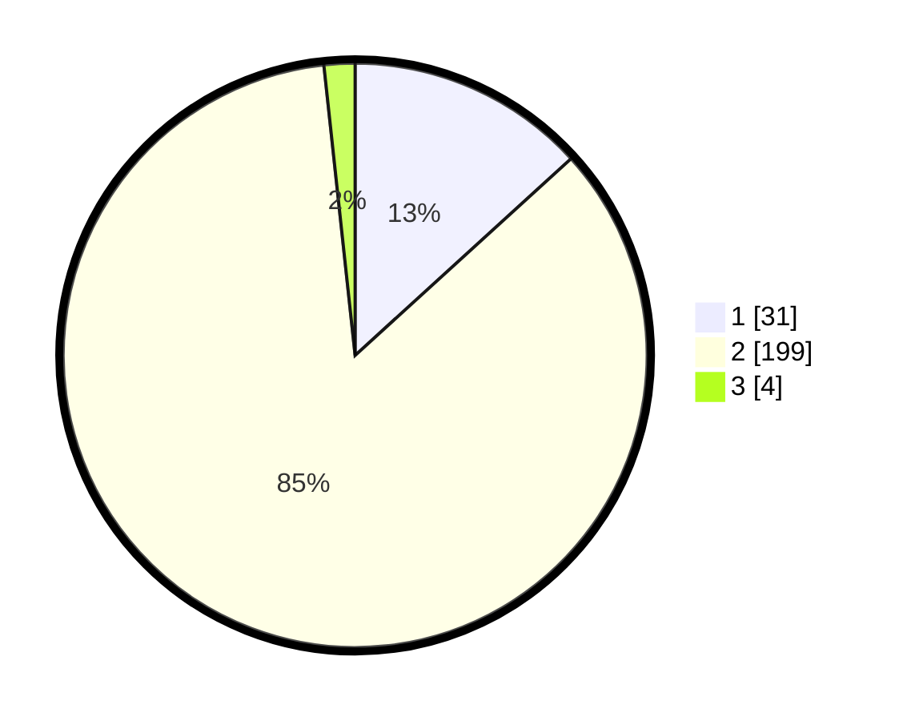

# Hasil

## Grafik

## Tabel

| No. | Nama Paslon    | Suara | Suara (raw) | Persentase |
|:--- |:-------------- | -----:| -----------:| ----------:|
| 1   | ANIES MUHAIMIN | 31    | [31][p-1]   | 13,25      |
| 2   | PRABOWO GIBRAN | 199   | [199][p-2]  | 85,04      |
| 3   | GANJAR MAHFUD  | 4     | [4][p-3]    | 1,71       |

[p-1]: https://github.com/gigit-pemilu/pemilu-2024/blob/main/pilpres/hitung-suara/sub/74-sulawesi-tenggara/sub/02-konawe/sub/05-sampara/sub/1001-sampara/sub/002-tps/sub/paslon-1.txt
[p-2]: https://github.com/gigit-pemilu/pemilu-2024/blob/main/pilpres/hitung-suara/sub/74-sulawesi-tenggara/sub/02-konawe/sub/05-sampara/sub/1001-sampara/sub/002-tps/sub/paslon-2.txt
[p-3]: https://github.com/gigit-pemilu/pemilu-2024/blob/main/pilpres/hitung-suara/sub/74-sulawesi-tenggara/sub/02-konawe/sub/05-sampara/sub/1001-sampara/sub/002-tps/sub/paslon-3.txt

## Foto C Plano

https://sirekap-obj-formc.kpu.go.id/bace/pemilu/ppwp/74/02/05/10/01/7402051001002-20240215-014452--88344234-ba19-4340-b0e3-bc4aacf5692b.jpg

https://sirekap-obj-formc.kpu.go.id/bace/pemilu/ppwp/74/02/05/10/01/7402051001002-20240215-033145--d0def963-8cb9-4ea8-bb08-11360a1ca66b.jpg

https://sirekap-obj-formc.kpu.go.id/bace/pemilu/ppwp/74/02/05/10/01/7402051001002-20240215-015104--0efc76fa-ae22-4d70-8252-9b5f60adc87e.jpg

## Metadata

| Key        | Value               |
| ---------- | ------------------- |
| Time Stamp | 2024-02-15 15:00:29 |

