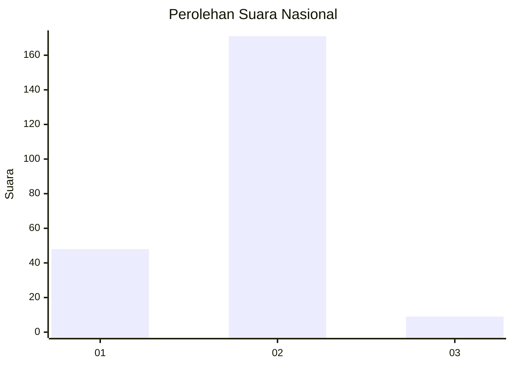

# Hasil

## Grafik

## Tabel

| No. | Nama Paslon    | Suara | Suara (raw) | Persentase |
|:--- |:-------------- | -----:| -----------:| ----------:|
| 1   | ANIES MUHAIMIN | 48    | [48][p-1]   | 21,05      |
| 2   | PRABOWO GIBRAN | 171   | [171][p-2]  | 75,00      |
| 3   | GANJAR MAHFUD  | 9     | [9][p-3]    | 3,95       |

[p-1]: https://github.com/gigit-pemilu/pemilu-2024/blob/main/pilpres/hitung-suara/sub/74-sulawesi-tenggara/sub/02-konawe/sub/05-sampara/sub/1007-rawua/sub/002-tps/sub/paslon-1.txt
[p-2]: https://github.com/gigit-pemilu/pemilu-2024/blob/main/pilpres/hitung-suara/sub/74-sulawesi-tenggara/sub/02-konawe/sub/05-sampara/sub/1007-rawua/sub/002-tps/sub/paslon-2.txt
[p-3]: https://github.com/gigit-pemilu/pemilu-2024/blob/main/pilpres/hitung-suara/sub/74-sulawesi-tenggara/sub/02-konawe/sub/05-sampara/sub/1007-rawua/sub/002-tps/sub/paslon-3.txt

## Foto C Plano

https://sirekap-obj-formc.kpu.go.id/0f9f/pemilu/ppwp/74/02/05/10/07/7402051007002-20240215-071811--549be3cb-87cd-4be5-8fdf-91f6855cb235.jpg

https://sirekap-obj-formc.kpu.go.id/0f9f/pemilu/ppwp/74/02/05/10/07/7402051007002-20240215-072617--86b1b9f5-e2d5-434b-ab47-dec26a156b2e.jpg

https://sirekap-obj-formc.kpu.go.id/0f9f/pemilu/ppwp/74/02/05/10/07/7402051007002-20240215-073011--18faebc6-4b29-4db1-bccb-350ba5eed075.jpg

## Metadata

| Key        | Value               |
| ---------- | ------------------- |
| Time Stamp | 2024-02-25 23:00:00 |

