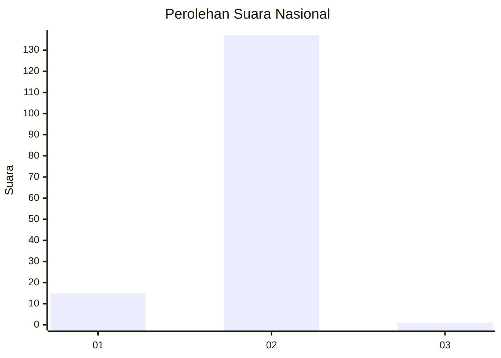
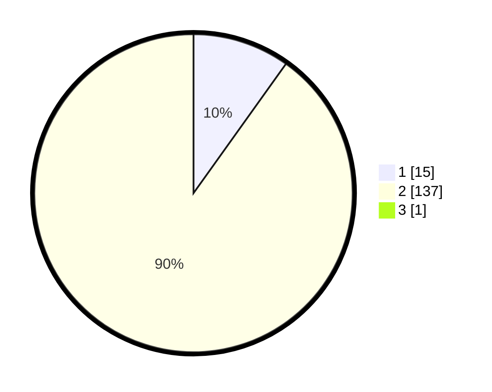

# Hasil

## Grafik

## Tabel

| No. | Nama Paslon    | Suara | Suara (raw) | Persentase |
|:--- |:-------------- | -----:| -----------:| ----------:|
| 1   | ANIES MUHAIMIN | 15    | [15][p-1]   | 9,80       |
| 2   | PRABOWO GIBRAN | 137   | [137][p-2]  | 89,54      |
| 3   | GANJAR MAHFUD  | 1     | [1][p-3]    | 0,65       |

[p-1]: https://github.com/gigit-pemilu/pemilu-2024/blob/main/pilpres/hitung-suara/sub/74-sulawesi-tenggara/sub/02-konawe/sub/05-sampara/sub/2038-polua/sub/002-tps/sub/paslon-1.txt
[p-2]: https://github.com/gigit-pemilu/pemilu-2024/blob/main/pilpres/hitung-suara/sub/74-sulawesi-tenggara/sub/02-konawe/sub/05-sampara/sub/2038-polua/sub/002-tps/sub/paslon-2.txt
[p-3]: https://github.com/gigit-pemilu/pemilu-2024/blob/main/pilpres/hitung-suara/sub/74-sulawesi-tenggara/sub/02-konawe/sub/05-sampara/sub/2038-polua/sub/002-tps/sub/paslon-3.txt

## Foto C Plano

https://sirekap-obj-formc.kpu.go.id/dce8/pemilu/ppwp/74/02/05/20/38/7402052038002-20240215-092952--ab004503-ef32-453f-ab33-411703feb23d.jpg

https://sirekap-obj-formc.kpu.go.id/dce8/pemilu/ppwp/74/02/05/20/38/7402052038002-20240220-130918--2cb2de53-f783-4589-8551-dc56efb45bda.jpg

https://sirekap-obj-formc.kpu.go.id/dce8/pemilu/ppwp/74/02/05/20/38/7402052038002-20240220-131508--36b291c2-6edb-4e20-9dc2-54786a113aec.jpg

## Metadata

| Key        | Value               |
| ---------- | ------------------- |
| Time Stamp | 2024-02-20 14:00:00 |

