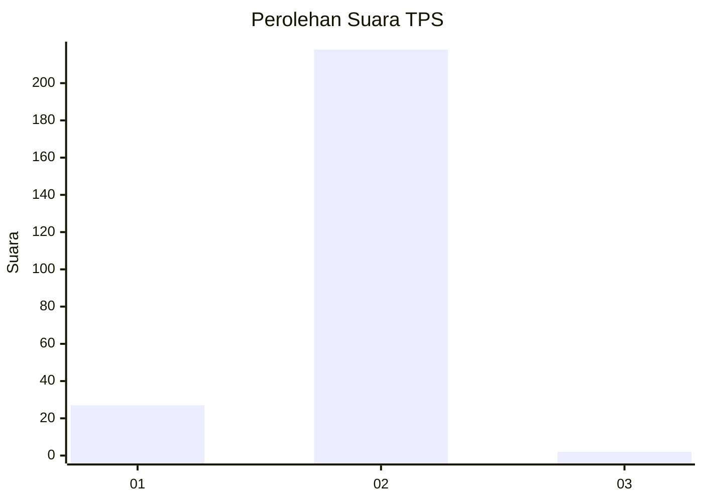
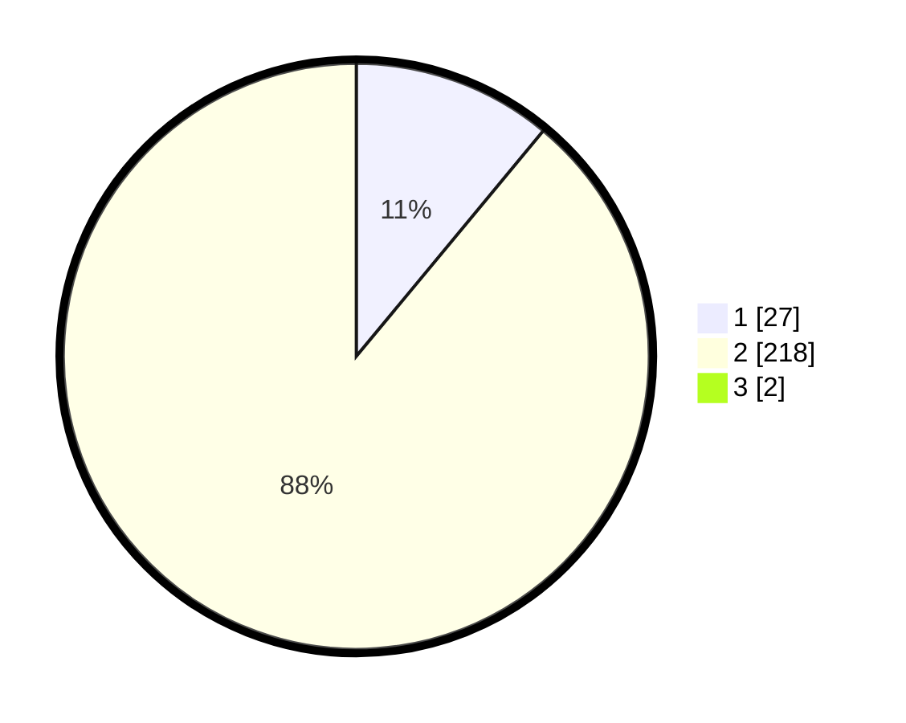

# Hasil

## Grafik

## Tabel

| No. | Nama Paslon    | Suara | Suara (raw) | Persentase |
|:--- |:-------------- | -----:| -----------:| ----------:|
| 1   | ANIES MUHAIMIN | 27    | [27][p-1]   | 10,93      |
| 2   | PRABOWO GIBRAN | 218   | [218][p-2]  | 88,26      |
| 3   | GANJAR MAHFUD  | 2     | [2][p-3]    | 0,81       |

[p-1]: https://github.com/gigit-pemilu/pemilu-2024-74-sulawesi-tenggara/blob/main/pilpres/hitung-suara/sub/74-sulawesi-tenggara/sub/02-konawe/sub/11-soropia/sub/2006-sorue-jaya/sub/001-tps/sub/paslon-1.txt
[p-2]: https://github.com/gigit-pemilu/pemilu-2024-74-sulawesi-tenggara/blob/main/pilpres/hitung-suara/sub/74-sulawesi-tenggara/sub/02-konawe/sub/11-soropia/sub/2006-sorue-jaya/sub/001-tps/sub/paslon-2.txt
[p-3]: https://github.com/gigit-pemilu/pemilu-2024-74-sulawesi-tenggara/blob/main/pilpres/hitung-suara/sub/74-sulawesi-tenggara/sub/02-konawe/sub/11-soropia/sub/2006-sorue-jaya/sub/001-tps/sub/paslon-3.txt

## Foto C Plano

https://sirekap-obj-formc.kpu.go.id/5014/pemilu/ppwp/74/02/11/20/06/7402112006001-20240215-065330--10a0be4e-c244-4cba-b881-c1cd9feb4e33.jpg

https://sirekap-obj-formc.kpu.go.id/5014/pemilu/ppwp/74/02/11/20/06/7402112006001-20240215-065442--eb515d90-6cba-44b6-8e0b-88f289e258fe.jpg

https://sirekap-obj-formc.kpu.go.id/5014/pemilu/ppwp/74/02/11/20/06/7402112006001-20240215-065622--44c6a81e-df55-41f6-af0f-26429209fe4c.jpg

## Metadata

| Key        | Value               |
| ---------- | ------------------- |
| Time Stamp | 2024-02-16 23:30:00 |

