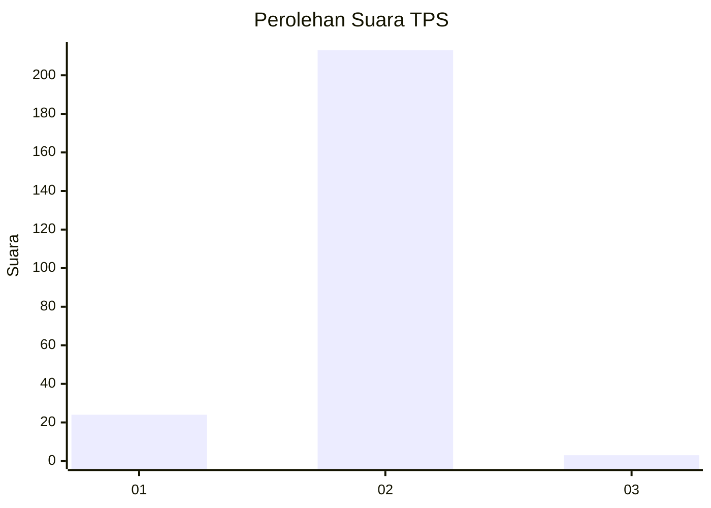
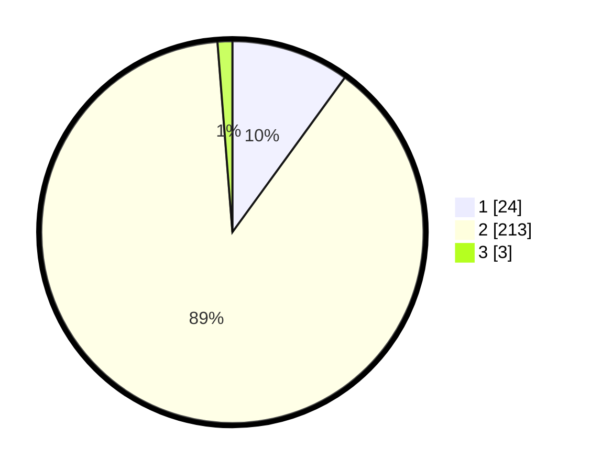

# Hasil

## Grafik

## Tabel

| No. | Nama Paslon    | Suara | Suara (raw) | Persentase |
|:--- |:-------------- | -----:| -----------:| ----------:|
| 1   | ANIES MUHAIMIN | 24    | [24][p-1]   | 10,00      |
| 2   | PRABOWO GIBRAN | 213   | [213][p-2]  | 88,75      |
| 3   | GANJAR MAHFUD  | 3     | [3][p-3]    | 1,25       |

[p-1]: https://github.com/gigit-pemilu/pemilu-2024-74-sulawesi-tenggara/blob/main/pilpres/hitung-suara/sub/74-sulawesi-tenggara/sub/02-konawe/sub/15-tongauna/sub/1002-mata-iwoi/sub/001-tps/sub/paslon-1.txt
[p-2]: https://github.com/gigit-pemilu/pemilu-2024-74-sulawesi-tenggara/blob/main/pilpres/hitung-suara/sub/74-sulawesi-tenggara/sub/02-konawe/sub/15-tongauna/sub/1002-mata-iwoi/sub/001-tps/sub/paslon-2.txt
[p-3]: https://github.com/gigit-pemilu/pemilu-2024-74-sulawesi-tenggara/blob/main/pilpres/hitung-suara/sub/74-sulawesi-tenggara/sub/02-konawe/sub/15-tongauna/sub/1002-mata-iwoi/sub/001-tps/sub/paslon-3.txt

## Foto C Plano

https://sirekap-obj-formc.kpu.go.id/c225/pemilu/ppwp/74/02/15/10/02/7402151002001-20240215-075543--ae7187c8-ff26-42ae-a8d1-827101d097f7.jpg

https://sirekap-obj-formc.kpu.go.id/c225/pemilu/ppwp/74/02/15/10/02/7402151002001-20240216-142431--7fb8faae-dce1-43b0-b85f-fdeb21b16cfe.jpg

https://sirekap-obj-formc.kpu.go.id/c225/pemilu/ppwp/74/02/15/10/02/7402151002001-20240215-051006--f576b979-d09c-42bb-bc03-97eac37dc804.jpg

## Metadata

| Key        | Value               |
| ---------- | ------------------- |
| Time Stamp | 2024-02-21 21:00:04 |

