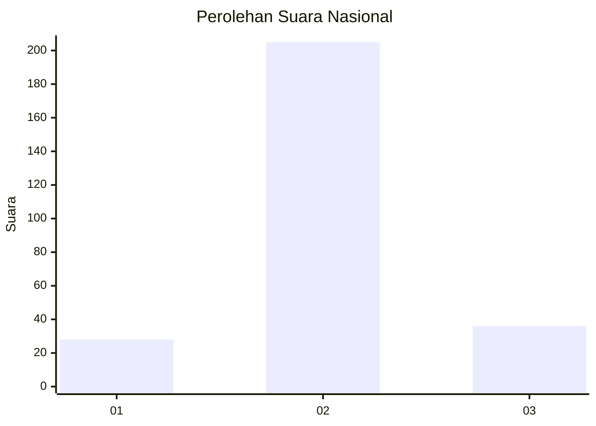
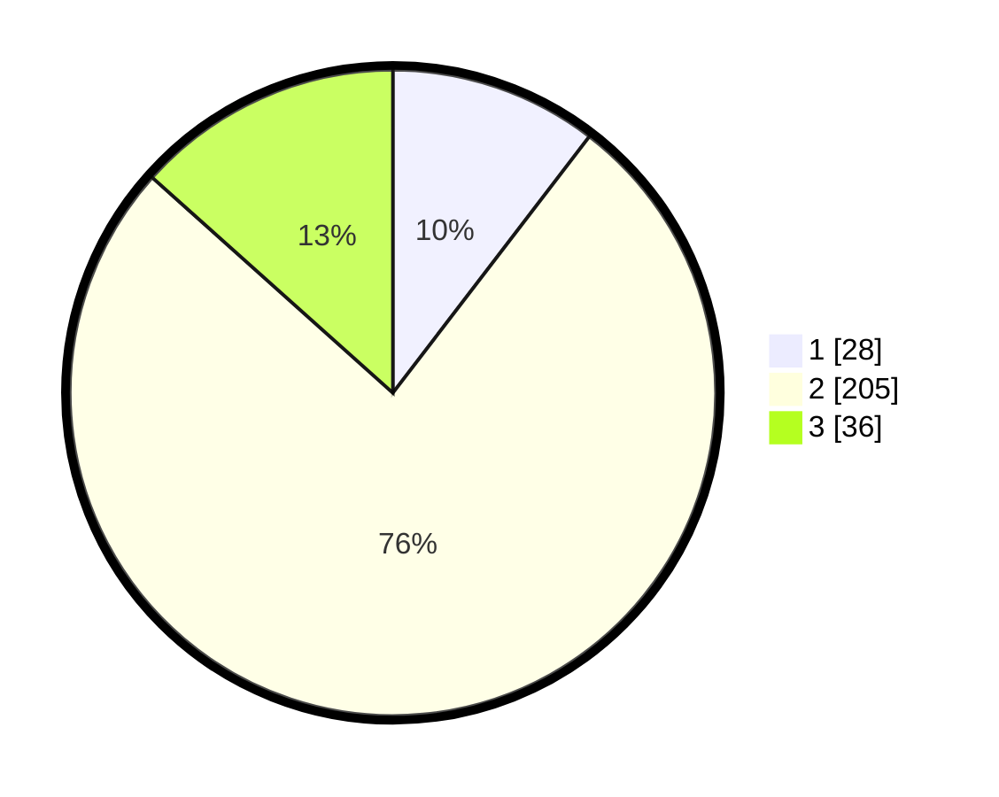

# Hasil

## Grafik

## Tabel

| No. | Nama Paslon    | Suara | Suara (raw) | Persentase |
|:--- |:-------------- | -----:| -----------:| ----------:|
| 1   | ANIES MUHAIMIN | 28    | [28][p-1]   | 10,41      |
| 2   | PRABOWO GIBRAN | 205   | [205][p-2]  | 76,21      |
| 3   | GANJAR MAHFUD  | 36    | [36][p-3]   | 13,38      |

[p-1]: https://github.com/gigit-pemilu/pemilu-2024/blob/main/pilpres/hitung-suara/sub/74-sulawesi-tenggara/sub/02-konawe/sub/15-tongauna/sub/1004-sendang-mulya-sari/sub/002-tps/sub/paslon-1.txt
[p-2]: https://github.com/gigit-pemilu/pemilu-2024/blob/main/pilpres/hitung-suara/sub/74-sulawesi-tenggara/sub/02-konawe/sub/15-tongauna/sub/1004-sendang-mulya-sari/sub/002-tps/sub/paslon-2.txt
[p-3]: https://github.com/gigit-pemilu/pemilu-2024/blob/main/pilpres/hitung-suara/sub/74-sulawesi-tenggara/sub/02-konawe/sub/15-tongauna/sub/1004-sendang-mulya-sari/sub/002-tps/sub/paslon-3.txt

## Foto C Plano

https://sirekap-obj-formc.kpu.go.id/b91f/pemilu/ppwp/74/02/15/10/04/7402151004002-20240215-014648--80cb07f1-648e-47b0-842a-8c9f5840b91f.jpg

https://sirekap-obj-formc.kpu.go.id/b91f/pemilu/ppwp/74/02/15/10/04/7402151004002-20240215-015430--7a115004-e0e7-4892-8dc7-7c065c0e1898.jpg

https://sirekap-obj-formc.kpu.go.id/b91f/pemilu/ppwp/74/02/15/10/04/7402151004002-20240215-015721--83afc321-6441-448a-bc45-1c8299f56a30.jpg

## Metadata

| Key        | Value               |
| ---------- | ------------------- |
| Time Stamp | 2024-02-15 16:00:26 |

