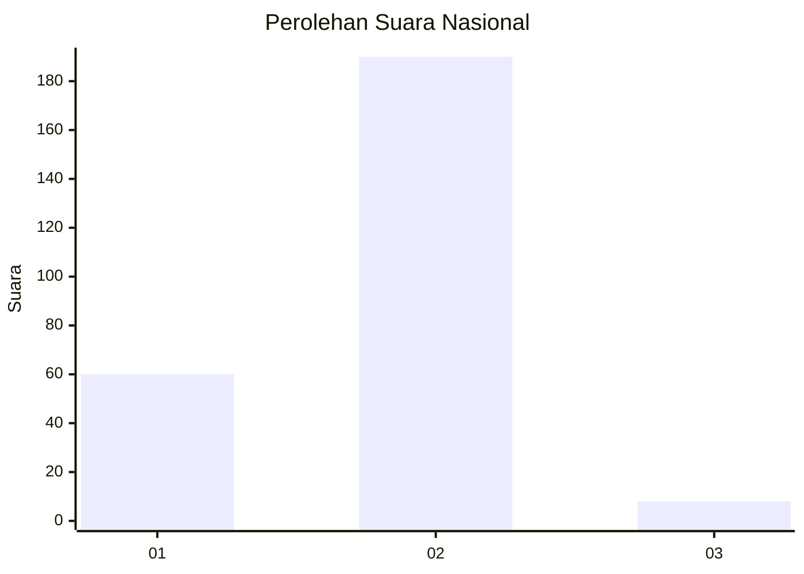

# Hasil

## Grafik

## Tabel

| No. | Nama Paslon    | Suara | Suara (raw) | Persentase |
|:--- |:-------------- | -----:| -----------:| ----------:|
| 1   | ANIES MUHAIMIN | 60    | [60][p-1]   | 23,26      |
| 2   | PRABOWO GIBRAN | 190   | [190][p-2]  | 73,64      |
| 3   | GANJAR MAHFUD  | 8     | [8][p-3]    | 3,10       |

[p-1]: https://github.com/gigit-pemilu/pemilu-2024/blob/main/pilpres/hitung-suara/sub/74-sulawesi-tenggara/sub/02-konawe/sub/18-uepai/sub/2002-ameroro/sub/002-tps/sub/paslon-1.txt
[p-2]: https://github.com/gigit-pemilu/pemilu-2024/blob/main/pilpres/hitung-suara/sub/74-sulawesi-tenggara/sub/02-konawe/sub/18-uepai/sub/2002-ameroro/sub/002-tps/sub/paslon-2.txt
[p-3]: https://github.com/gigit-pemilu/pemilu-2024/blob/main/pilpres/hitung-suara/sub/74-sulawesi-tenggara/sub/02-konawe/sub/18-uepai/sub/2002-ameroro/sub/002-tps/sub/paslon-3.txt

## Foto C Plano

https://sirekap-obj-formc.kpu.go.id/fc5f/pemilu/ppwp/74/02/18/20/02/7402182002002-20240215-120701--85aa1b95-3ad6-42a8-a531-d1507f827b17.jpg

https://sirekap-obj-formc.kpu.go.id/fc5f/pemilu/ppwp/74/02/18/20/02/7402182002002-20240215-120824--ca04522e-3860-4798-8de4-23c875cd9681.jpg

https://sirekap-obj-formc.kpu.go.id/fc5f/pemilu/ppwp/74/02/18/20/02/7402182002002-20240215-084444--80163da8-78e4-4a31-b84a-6e00ba8c4b7f.jpg

## Metadata

| Key        | Value               |
| ---------- | ------------------- |
| Time Stamp | 2024-02-15 22:00:27 |

