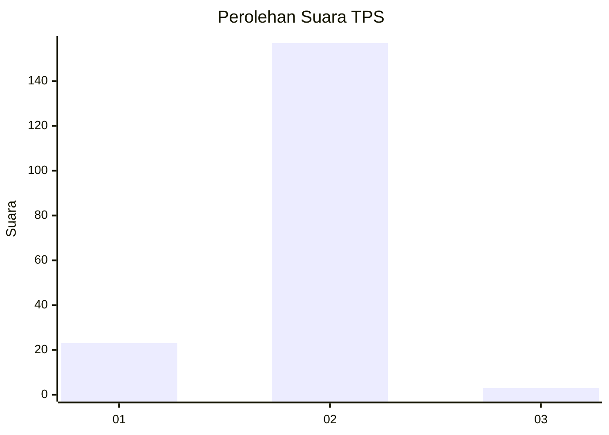
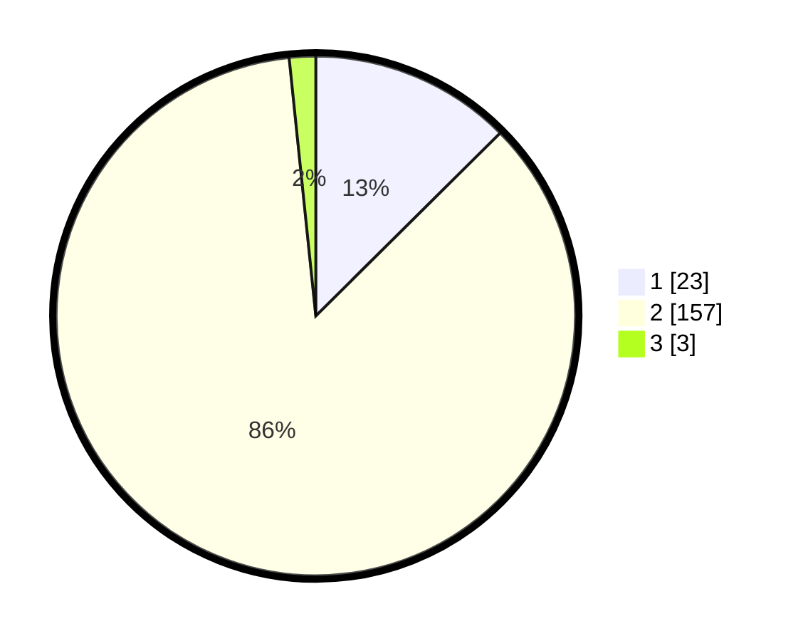

# Hasil

## Grafik

## Tabel

| No. | Nama Paslon    | Suara | Suara (raw) | Persentase |
|:--- |:-------------- | -----:| -----------:| ----------:|
| 1   | ANIES MUHAIMIN | 23    | [23][p-1]   | 12,57      |
| 2   | PRABOWO GIBRAN | 157   | [157][p-2]  | 85,79      |
| 3   | GANJAR MAHFUD  | 3     | [3][p-3]    | 1,64       |

[p-1]: https://github.com/gigit-pemilu/pemilu-2024-74-sulawesi-tenggara/blob/main/pilpres/hitung-suara/sub/74-sulawesi-tenggara/sub/02-konawe/sub/20-besulutu/sub/1003-besulutu/sub/002-tps/sub/paslon-1.txt
[p-2]: https://github.com/gigit-pemilu/pemilu-2024-74-sulawesi-tenggara/blob/main/pilpres/hitung-suara/sub/74-sulawesi-tenggara/sub/02-konawe/sub/20-besulutu/sub/1003-besulutu/sub/002-tps/sub/paslon-2.txt
[p-3]: https://github.com/gigit-pemilu/pemilu-2024-74-sulawesi-tenggara/blob/main/pilpres/hitung-suara/sub/74-sulawesi-tenggara/sub/02-konawe/sub/20-besulutu/sub/1003-besulutu/sub/002-tps/sub/paslon-3.txt

## Foto C Plano

https://sirekap-obj-formc.kpu.go.id/bd24/pemilu/ppwp/74/02/20/10/03/7402201003002-20240215-000834--85b9b1b8-89f2-452b-89d2-6b540cbc0035.jpg

https://sirekap-obj-formc.kpu.go.id/bd24/pemilu/ppwp/74/02/20/10/03/7402201003002-20240215-005645--6168ebd4-2f60-48b6-8037-3dbae32d2b56.jpg

https://sirekap-obj-formc.kpu.go.id/bd24/pemilu/ppwp/74/02/20/10/03/7402201003002-20240215-001210--fd58aa58-4d0f-4fa8-b445-e456f4f4ae8c.jpg

## Metadata

| Key        | Value               |
| ---------- | ------------------- |
| Time Stamp | 2024-02-25 21:00:00 |

