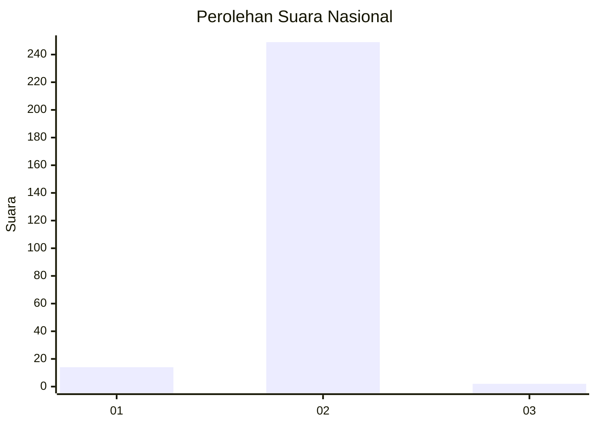
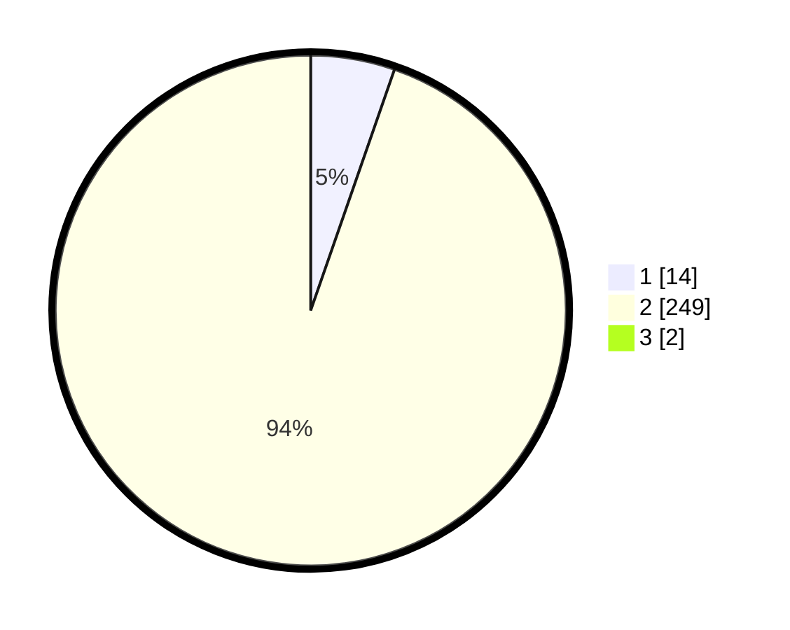

# Hasil

## Grafik

## Tabel

| No. | Nama Paslon    | Suara | Suara (raw) | Persentase |
|:--- |:-------------- | -----:| -----------:| ----------:|
| 1   | ANIES MUHAIMIN | 14    | [14][p-1]   | 5,28       |
| 2   | PRABOWO GIBRAN | 249   | [249][p-2]  | 93,96      |
| 3   | GANJAR MAHFUD  | 2     | [2][p-3]    | 0,75       |

[p-1]: https://github.com/gigit-pemilu/pemilu-2024/blob/main/pilpres/hitung-suara/sub/74-sulawesi-tenggara/sub/02-konawe/sub/20-besulutu/sub/2009-silea/sub/001-tps/sub/paslon-1.txt
[p-2]: https://github.com/gigit-pemilu/pemilu-2024/blob/main/pilpres/hitung-suara/sub/74-sulawesi-tenggara/sub/02-konawe/sub/20-besulutu/sub/2009-silea/sub/001-tps/sub/paslon-2.txt
[p-3]: https://github.com/gigit-pemilu/pemilu-2024/blob/main/pilpres/hitung-suara/sub/74-sulawesi-tenggara/sub/02-konawe/sub/20-besulutu/sub/2009-silea/sub/001-tps/sub/paslon-3.txt

## Foto C Plano

https://sirekap-obj-formc.kpu.go.id/a385/pemilu/ppwp/74/02/20/20/09/7402202009001-20240214-223550--7945430e-d3f8-47b9-b6c7-638534f965df.jpg

https://sirekap-obj-formc.kpu.go.id/a385/pemilu/ppwp/74/02/20/20/09/7402202009001-20240214-223634--93a40006-14ca-42ff-a0c1-3c4868d75831.jpg

https://sirekap-obj-formc.kpu.go.id/a385/pemilu/ppwp/74/02/20/20/09/7402202009001-20240214-223646--c07e5432-b154-4c1f-9d69-e6bcbd2a9cbb.jpg

## Metadata

| Key        | Value               |
| ---------- | ------------------- |
| Time Stamp | 2024-02-25 12:00:00 |

