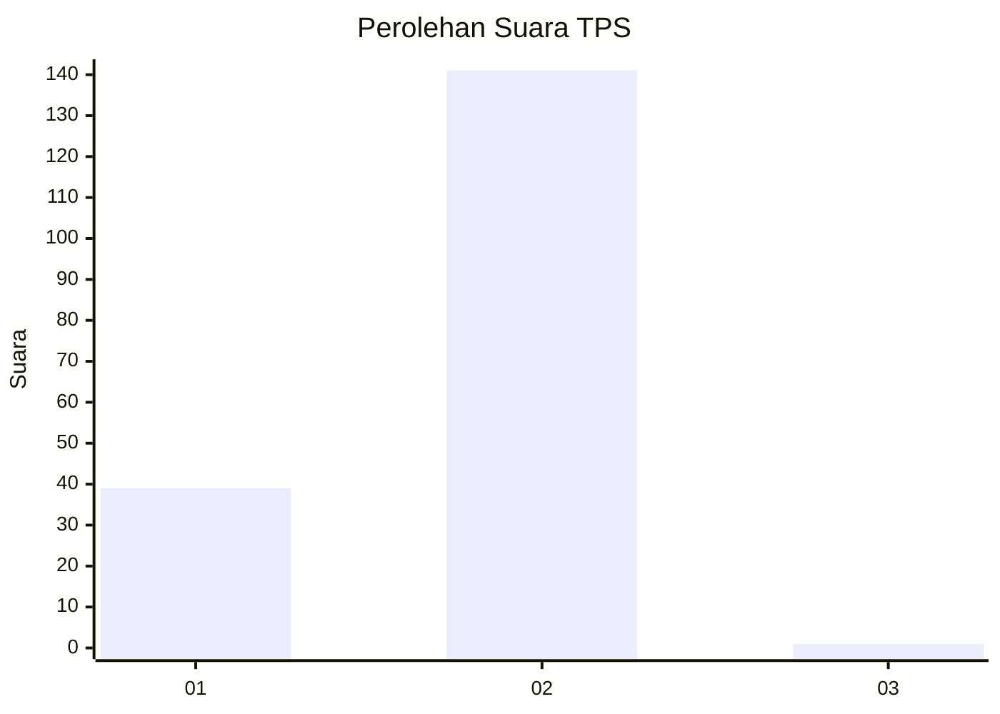
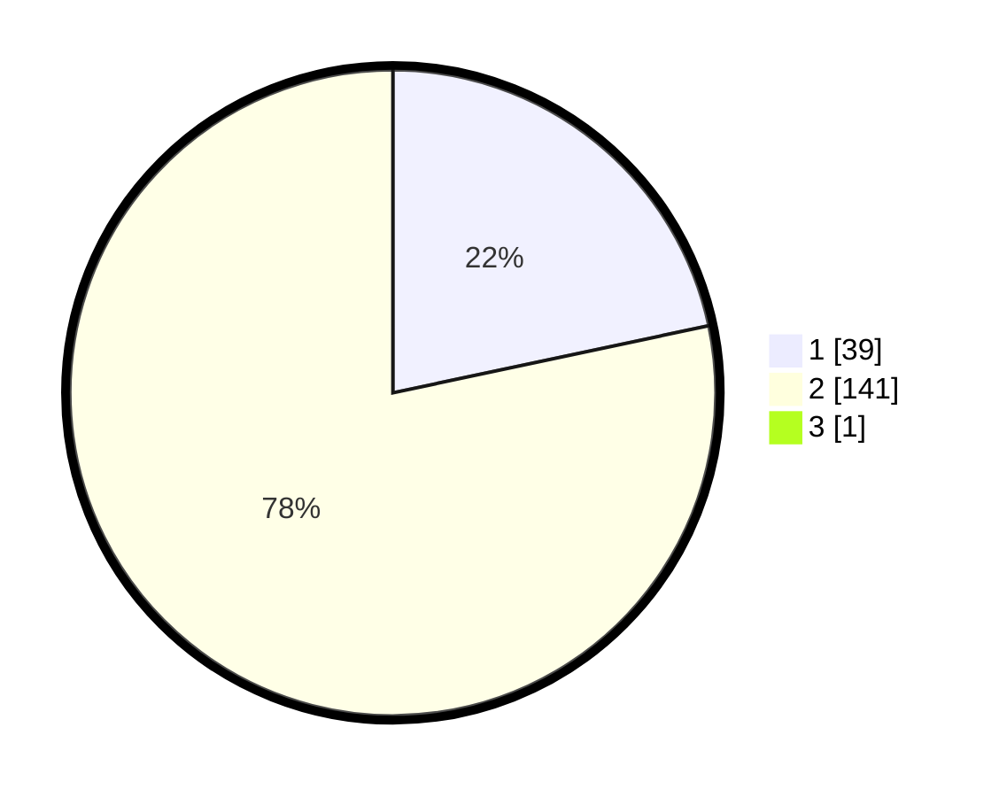

# Hasil

## Grafik

## Tabel

| No. | Nama Paslon    | Suara | Suara (raw) | Persentase |
|:--- |:-------------- | -----:| -----------:| ----------:|
| 1   | ANIES MUHAIMIN | 39    | [39][p-1]   | 21,55      |
| 2   | PRABOWO GIBRAN | 141   | [141][p-2]  | 77,90      |
| 3   | GANJAR MAHFUD  | 1     | [1][p-3]    | 0,55       |

[p-1]: https://github.com/gigit-pemilu/pemilu-2024-74-sulawesi-tenggara/blob/main/pilpres/hitung-suara/sub/74-sulawesi-tenggara/sub/02-konawe/sub/21-bondoala/sub/1003-laosu/sub/002-tps/sub/paslon-1.txt
[p-2]: https://github.com/gigit-pemilu/pemilu-2024-74-sulawesi-tenggara/blob/main/pilpres/hitung-suara/sub/74-sulawesi-tenggara/sub/02-konawe/sub/21-bondoala/sub/1003-laosu/sub/002-tps/sub/paslon-2.txt
[p-3]: https://github.com/gigit-pemilu/pemilu-2024-74-sulawesi-tenggara/blob/main/pilpres/hitung-suara/sub/74-sulawesi-tenggara/sub/02-konawe/sub/21-bondoala/sub/1003-laosu/sub/002-tps/sub/paslon-3.txt

## Foto C Plano

https://sirekap-obj-formc.kpu.go.id/110d/pemilu/ppwp/74/02/21/10/03/7402211003002-20240215-080956--3e1fff52-73fb-4249-bba3-5d4d515dc3c7.jpg

https://sirekap-obj-formc.kpu.go.id/110d/pemilu/ppwp/74/02/21/10/03/7402211003002-20240215-081100--70c1e365-20ac-4ab5-b2dc-fc58666e7fda.jpg

https://sirekap-obj-formc.kpu.go.id/110d/pemilu/ppwp/74/02/21/10/03/7402211003002-20240215-090102--e9c280db-f297-48f3-895a-e28b7429c997.jpg

## Metadata

| Key        | Value               |
| ---------- | ------------------- |
| Time Stamp | 2024-02-24 22:31:28 |

