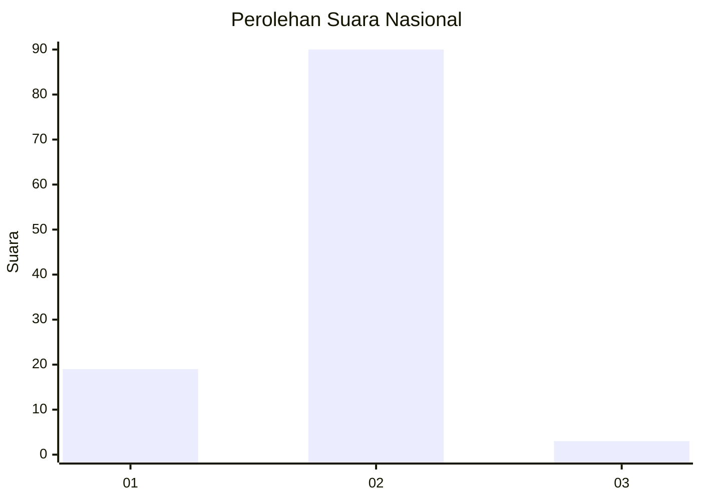
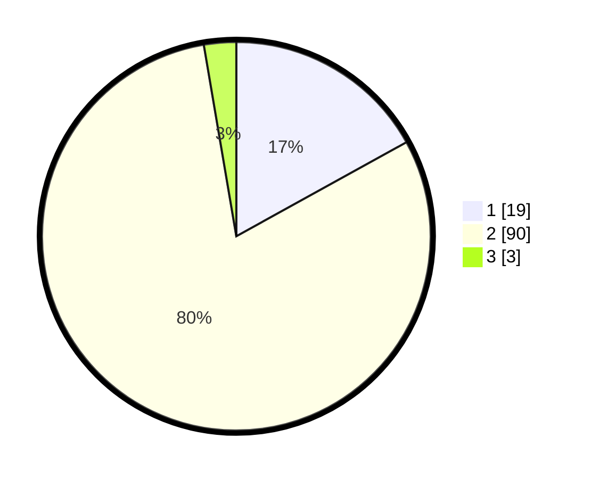

# Hasil

## Grafik

## Tabel

| No. | Nama Paslon    | Suara | Suara (raw) | Persentase |
|:--- |:-------------- | -----:| -----------:| ----------:|
| 1   | ANIES MUHAIMIN | 19    | [19][p-1]   | 16,96      |
| 2   | PRABOWO GIBRAN | 90    | [90][p-2]   | 80,36      |
| 3   | GANJAR MAHFUD  | 3     | [3][p-3]    | 2,68       |

[p-1]: https://github.com/gigit-pemilu/pemilu-2024/blob/main/pilpres/hitung-suara/sub/74-sulawesi-tenggara/sub/02-konawe/sub/21-bondoala/sub/2018-pebunooha-dalam/sub/001-tps/sub/paslon-1.txt
[p-2]: https://github.com/gigit-pemilu/pemilu-2024/blob/main/pilpres/hitung-suara/sub/74-sulawesi-tenggara/sub/02-konawe/sub/21-bondoala/sub/2018-pebunooha-dalam/sub/001-tps/sub/paslon-2.txt
[p-3]: https://github.com/gigit-pemilu/pemilu-2024/blob/main/pilpres/hitung-suara/sub/74-sulawesi-tenggara/sub/02-konawe/sub/21-bondoala/sub/2018-pebunooha-dalam/sub/001-tps/sub/paslon-3.txt

## Foto C Plano

https://sirekap-obj-formc.kpu.go.id/8126/pemilu/ppwp/74/02/21/20/18/7402212018001-20240215-000534--3cfbc920-c932-4b50-b71f-13dc55f27dc2.jpg

https://sirekap-obj-formc.kpu.go.id/8126/pemilu/ppwp/74/02/21/20/18/7402212018001-20240215-000737--2d9e2dbf-94a3-4c5b-8218-c808548e5af9.jpg

https://sirekap-obj-formc.kpu.go.id/8126/pemilu/ppwp/74/02/21/20/18/7402212018001-20240214-233648--bcb3fc90-781b-45f6-8f0f-82c025265ec0.jpg

## Metadata

| Key        | Value               |
| ---------- | ------------------- |
| Time Stamp | 2024-02-15 15:00:29 |

