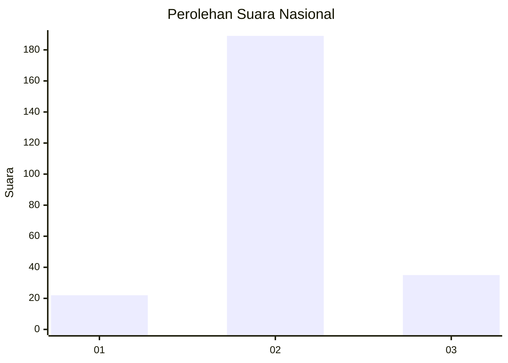

# Hasil

## Grafik

## Tabel

| No. | Nama Paslon    | Suara | Suara (raw) | Persentase |
|:--- |:-------------- | -----:| -----------:| ----------:|
| 1   | ANIES MUHAIMIN | 22    | [22][p-1]   | 8,94       |
| 2   | PRABOWO GIBRAN | 189   | [189][p-2]  | 76,83      |
| 3   | GANJAR MAHFUD  | 35    | [35][p-3]   | 14,23      |

[p-1]: https://github.com/gigit-pemilu/pemilu-2024/blob/main/pilpres/hitung-suara/sub/74-sulawesi-tenggara/sub/02-konawe/sub/25-meluhu/sub/2001-woerahi/sub/001-tps/sub/paslon-1.txt
[p-2]: https://github.com/gigit-pemilu/pemilu-2024/blob/main/pilpres/hitung-suara/sub/74-sulawesi-tenggara/sub/02-konawe/sub/25-meluhu/sub/2001-woerahi/sub/001-tps/sub/paslon-2.txt
[p-3]: https://github.com/gigit-pemilu/pemilu-2024/blob/main/pilpres/hitung-suara/sub/74-sulawesi-tenggara/sub/02-konawe/sub/25-meluhu/sub/2001-woerahi/sub/001-tps/sub/paslon-3.txt

## Foto C Plano

https://sirekap-obj-formc.kpu.go.id/3bc8/pemilu/ppwp/74/02/25/20/01/7402252001001-20240215-062548--385297fe-8e98-4f1e-a2db-60ad5bee440f.jpg

https://sirekap-obj-formc.kpu.go.id/3bc8/pemilu/ppwp/74/02/25/20/01/7402252001001-20240215-062843--6d8145e2-13dc-4a50-8baf-a6e10deb3843.jpg

https://sirekap-obj-formc.kpu.go.id/3bc8/pemilu/ppwp/74/02/25/20/01/7402252001001-20240215-063032--bee39b9f-000c-4cc7-8f10-b7fa22c3c09c.jpg

## Metadata

| Key        | Value               |
| ---------- | ------------------- |
| Time Stamp | 2024-02-25 13:00:00 |

