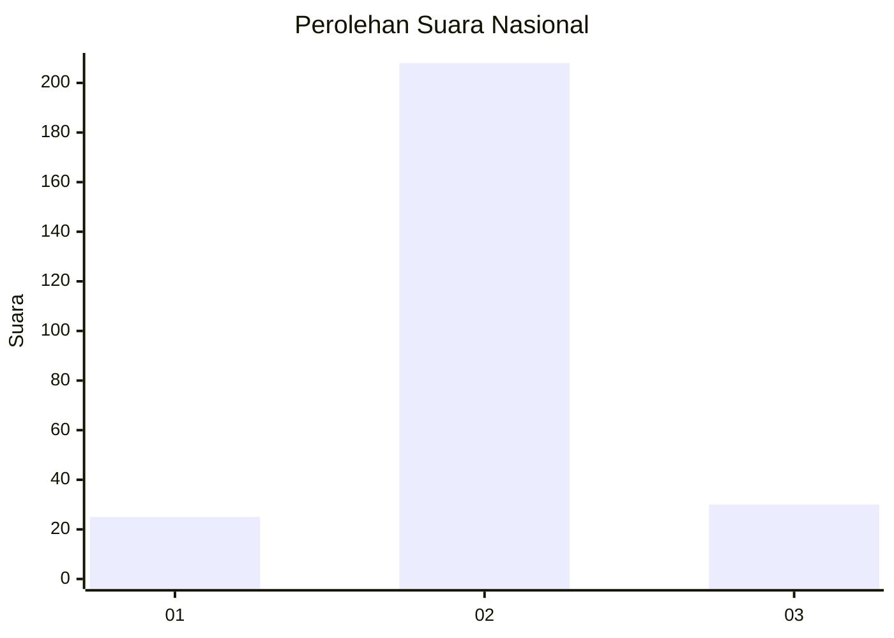
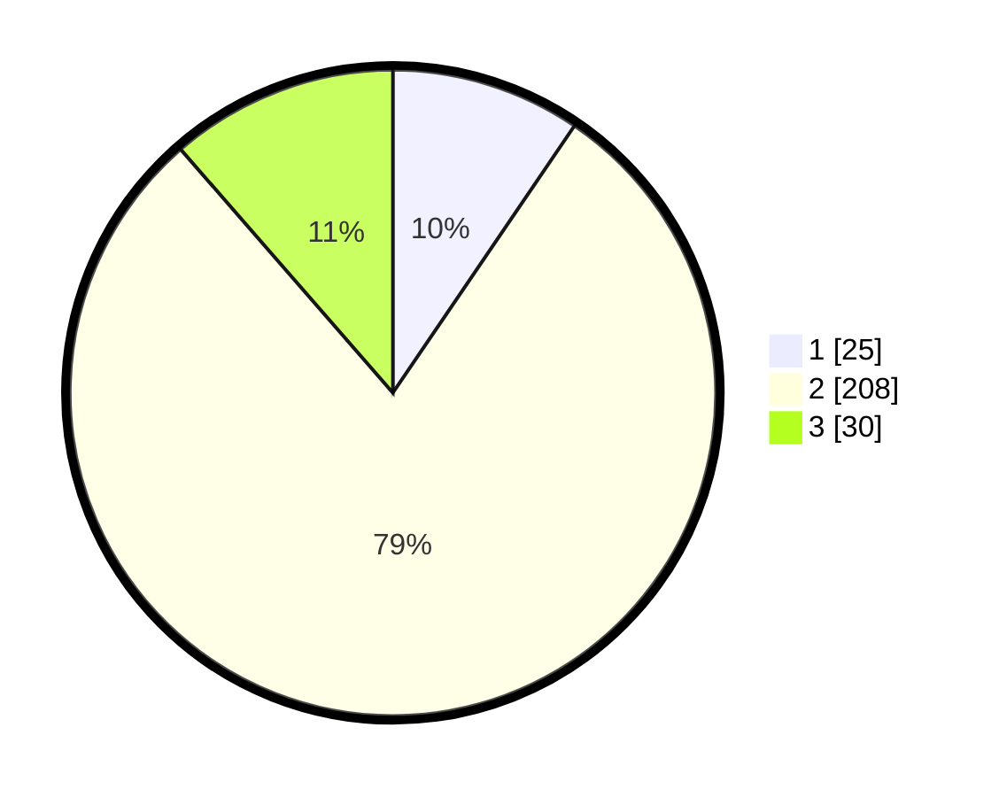

# Hasil

## Grafik

## Tabel

| No. | Nama Paslon    | Suara | Suara (raw) | Persentase |
|:--- |:-------------- | -----:| -----------:| ----------:|
| 1   | ANIES MUHAIMIN | 25    | [25][p-1]   | 9,51       |
| 2   | PRABOWO GIBRAN | 208   | [208][p-2]  | 79,09      |
| 3   | GANJAR MAHFUD  | 30    | [30][p-3]   | 11,41      |

[p-1]: https://github.com/gigit-pemilu/pemilu-2024/blob/main/pilpres/hitung-suara/sub/74-sulawesi-tenggara/sub/02-konawe/sub/25-meluhu/sub/2007-ahuloa/sub/002-tps/sub/paslon-1.txt
[p-2]: https://github.com/gigit-pemilu/pemilu-2024/blob/main/pilpres/hitung-suara/sub/74-sulawesi-tenggara/sub/02-konawe/sub/25-meluhu/sub/2007-ahuloa/sub/002-tps/sub/paslon-2.txt
[p-3]: https://github.com/gigit-pemilu/pemilu-2024/blob/main/pilpres/hitung-suara/sub/74-sulawesi-tenggara/sub/02-konawe/sub/25-meluhu/sub/2007-ahuloa/sub/002-tps/sub/paslon-3.txt

## Foto C Plano

https://sirekap-obj-formc.kpu.go.id/3767/pemilu/ppwp/74/02/25/20/07/7402252007002-20240214-232648--31f783a6-3b39-4573-8d38-504730239240.jpg

https://sirekap-obj-formc.kpu.go.id/3767/pemilu/ppwp/74/02/25/20/07/7402252007002-20240214-141216--a8907665-6006-4f57-84fc-94429164a70b.jpg

https://sirekap-obj-formc.kpu.go.id/3767/pemilu/ppwp/74/02/25/20/07/7402252007002-20240214-141331--d5d823ee-4de2-4648-8046-586390bfb9d3.jpg

## Metadata

| Key        | Value               |
| ---------- | ------------------- |
| Time Stamp | 2024-02-15 15:00:29 |

