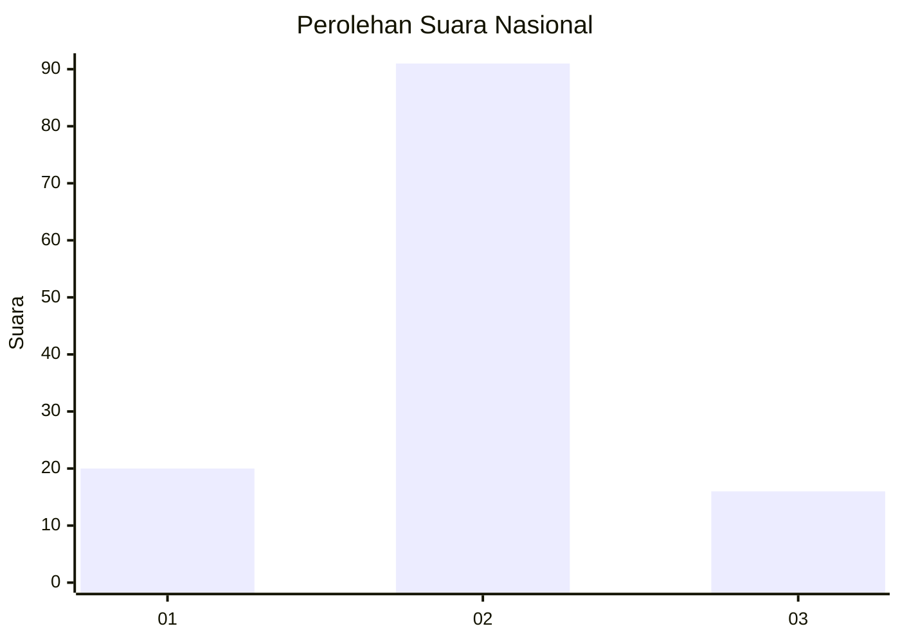
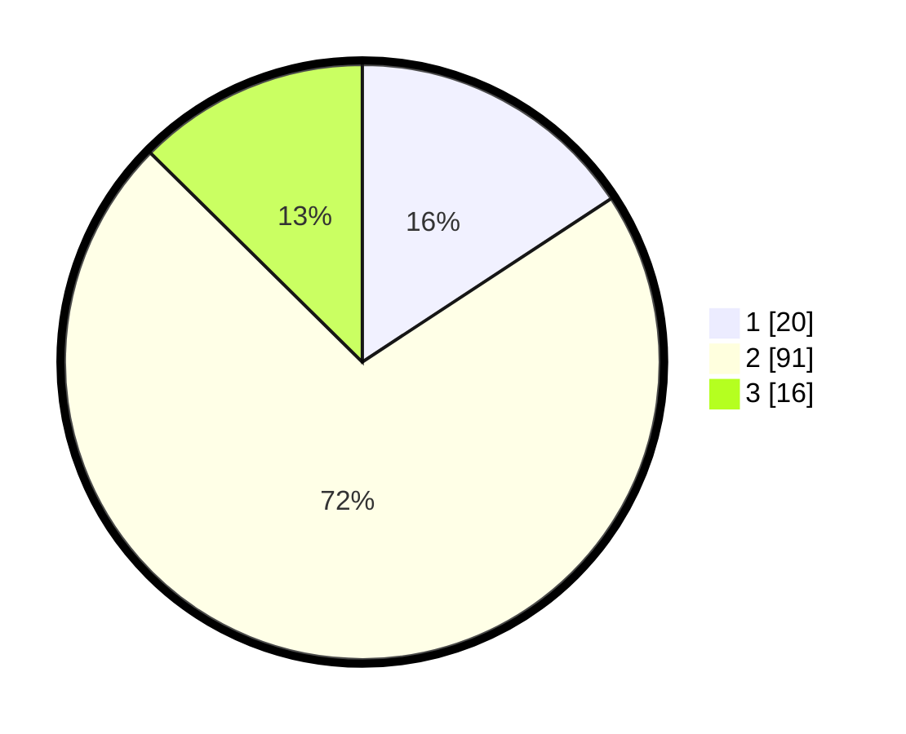

# Hasil

## Grafik

## Tabel

| No. | Nama Paslon    | Suara | Suara (raw) | Persentase |
|:--- |:-------------- | -----:| -----------:| ----------:|
| 1   | ANIES MUHAIMIN | 20    | [20][p-1]   | 15,75      |
| 2   | PRABOWO GIBRAN | 91    | [91][p-2]   | 71,65      |
| 3   | GANJAR MAHFUD  | 16    | [16][p-3]   | 12,60      |

[p-1]: https://github.com/gigit-pemilu/pemilu-2024/blob/main/pilpres/hitung-suara/sub/74-sulawesi-tenggara/sub/02-konawe/sub/25-meluhu/sub/2009-lalopisi/sub/002-tps/sub/paslon-1.txt
[p-2]: https://github.com/gigit-pemilu/pemilu-2024/blob/main/pilpres/hitung-suara/sub/74-sulawesi-tenggara/sub/02-konawe/sub/25-meluhu/sub/2009-lalopisi/sub/002-tps/sub/paslon-2.txt
[p-3]: https://github.com/gigit-pemilu/pemilu-2024/blob/main/pilpres/hitung-suara/sub/74-sulawesi-tenggara/sub/02-konawe/sub/25-meluhu/sub/2009-lalopisi/sub/002-tps/sub/paslon-3.txt

## Foto C Plano

https://sirekap-obj-formc.kpu.go.id/9318/pemilu/ppwp/74/02/25/20/09/7402252009002-20240214-232211--486aa4de-1298-41cb-a665-42430f936aa8.jpg

https://sirekap-obj-formc.kpu.go.id/9318/pemilu/ppwp/74/02/25/20/09/7402252009002-20240214-232523--e3915925-7798-4443-88f8-bcc7274a5a8a.jpg

https://sirekap-obj-formc.kpu.go.id/9318/pemilu/ppwp/74/02/25/20/09/7402252009002-20240214-232858--7e30e419-5670-4bc6-ba8c-a9ac186fb2e3.jpg

## Metadata

| Key        | Value               |
| ---------- | ------------------- |
| Time Stamp | 2024-02-15 22:30:27 |

