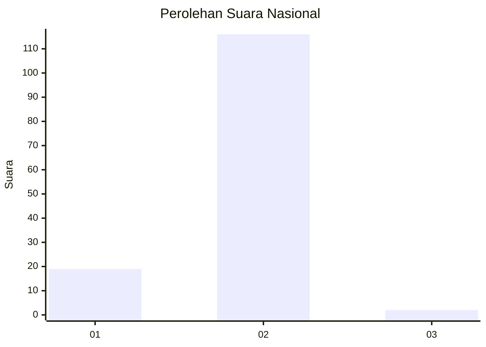
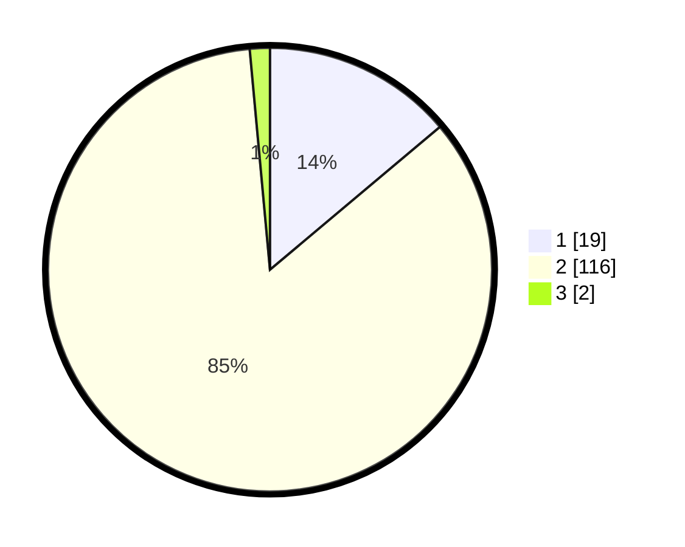

# Hasil

## Grafik

## Tabel

| No. | Nama Paslon    | Suara | Suara (raw) | Persentase |
|:--- |:-------------- | -----:| -----------:| ----------:|
| 1   | ANIES MUHAIMIN | 19    | [19][p-1]   | 13,87      |
| 2   | PRABOWO GIBRAN | 116   | [116][p-2]  | 84,67      |
| 3   | GANJAR MAHFUD  | 2     | [2][p-3]    | 1,46       |

[p-1]: https://github.com/gigit-pemilu/pemilu-2024/blob/main/pilpres/hitung-suara/sub/74-sulawesi-tenggara/sub/02-konawe/sub/33-kapoiala/sub/2003-labotoy/sub/001-tps/sub/paslon-1.txt
[p-2]: https://github.com/gigit-pemilu/pemilu-2024/blob/main/pilpres/hitung-suara/sub/74-sulawesi-tenggara/sub/02-konawe/sub/33-kapoiala/sub/2003-labotoy/sub/001-tps/sub/paslon-2.txt
[p-3]: https://github.com/gigit-pemilu/pemilu-2024/blob/main/pilpres/hitung-suara/sub/74-sulawesi-tenggara/sub/02-konawe/sub/33-kapoiala/sub/2003-labotoy/sub/001-tps/sub/paslon-3.txt

## Foto C Plano

https://sirekap-obj-formc.kpu.go.id/8d72/pemilu/ppwp/74/02/33/20/03/7402332003001-20240215-063949--f7da00d5-e4ea-4974-ae47-872e2e74aa1b.jpg

https://sirekap-obj-formc.kpu.go.id/8d72/pemilu/ppwp/74/02/33/20/03/7402332003001-20240215-064347--2905c341-8096-4db5-a727-6f5e72c6f2d0.jpg

https://sirekap-obj-formc.kpu.go.id/8d72/pemilu/ppwp/74/02/33/20/03/7402332003001-20240215-064603--44f2f00b-b569-4090-b8ec-f81b716d1f20.jpg

## Metadata

| Key        | Value               |
| ---------- | ------------------- |
| Time Stamp | 2024-02-25 11:00:00 |

