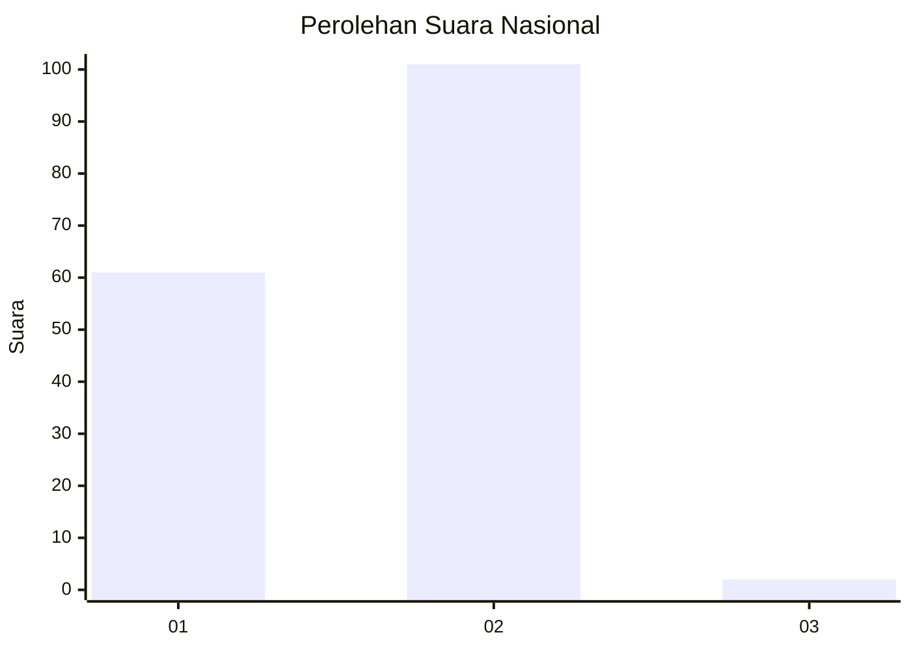
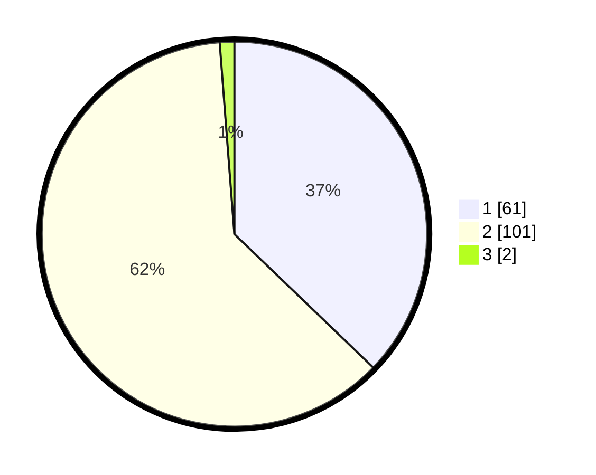

# Hasil

## Grafik

## Tabel

| No. | Nama Paslon    | Suara | Suara (raw) | Persentase |
|:--- |:-------------- | -----:| -----------:| ----------:|
| 1   | ANIES MUHAIMIN | 61    | [61][p-1]   | 37,20      |
| 2   | PRABOWO GIBRAN | 101   | [101][p-2]  | 61,59      |
| 3   | GANJAR MAHFUD  | 2     | [2][p-3]    | 1,22       |

[p-1]: https://github.com/gigit-pemilu/pemilu-2024/blob/main/pilpres/hitung-suara/sub/74-sulawesi-tenggara/sub/02-konawe/sub/36-lalonggasumeeto/sub/2001-toli-toli/sub/001-tps/sub/paslon-1.txt
[p-2]: https://github.com/gigit-pemilu/pemilu-2024/blob/main/pilpres/hitung-suara/sub/74-sulawesi-tenggara/sub/02-konawe/sub/36-lalonggasumeeto/sub/2001-toli-toli/sub/001-tps/sub/paslon-2.txt
[p-3]: https://github.com/gigit-pemilu/pemilu-2024/blob/main/pilpres/hitung-suara/sub/74-sulawesi-tenggara/sub/02-konawe/sub/36-lalonggasumeeto/sub/2001-toli-toli/sub/001-tps/sub/paslon-3.txt

## Foto C Plano

https://sirekap-obj-formc.kpu.go.id/701c/pemilu/ppwp/74/02/36/20/01/7402362001001-20240215-001131--b5a6bd17-7112-4684-9c58-afcf00834257.jpg

https://sirekap-obj-formc.kpu.go.id/701c/pemilu/ppwp/74/02/36/20/01/7402362001001-20240214-235017--d19d6e5e-fd9d-4bf8-8469-d5856962a6b0.jpg

https://sirekap-obj-formc.kpu.go.id/701c/pemilu/ppwp/74/02/36/20/01/7402362001001-20240214-235113--9098bd5e-27c7-441a-9b2f-7eef19fe4e47.jpg

## Metadata

| Key        | Value               |
| ---------- | ------------------- |
| Time Stamp | 2024-02-25 12:00:00 |

