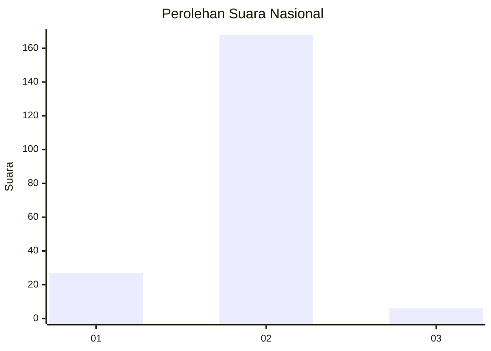
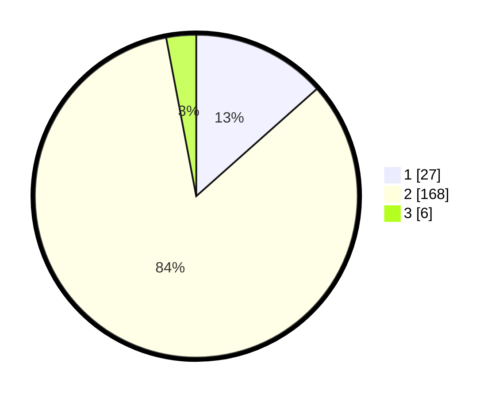

# Hasil

## Grafik

## Tabel

| No. | Nama Paslon    | Suara | Suara (raw) | Persentase |
|:--- |:-------------- | -----:| -----------:| ----------:|
| 1   | ANIES MUHAIMIN | 27    | [27][p-1]   | 13,43      |
| 2   | PRABOWO GIBRAN | 168   | [168][p-2]  | 83,58      |
| 3   | GANJAR MAHFUD  | 6     | [6][p-3]    | 2,99       |

[p-1]: https://github.com/gigit-pemilu/pemilu-2024/blob/main/pilpres/hitung-suara/sub/74-sulawesi-tenggara/sub/02-konawe/sub/36-lalonggasumeeto/sub/2003-rapambinopaka/sub/001-tps/sub/paslon-1.txt
[p-2]: https://github.com/gigit-pemilu/pemilu-2024/blob/main/pilpres/hitung-suara/sub/74-sulawesi-tenggara/sub/02-konawe/sub/36-lalonggasumeeto/sub/2003-rapambinopaka/sub/001-tps/sub/paslon-2.txt
[p-3]: https://github.com/gigit-pemilu/pemilu-2024/blob/main/pilpres/hitung-suara/sub/74-sulawesi-tenggara/sub/02-konawe/sub/36-lalonggasumeeto/sub/2003-rapambinopaka/sub/001-tps/sub/paslon-3.txt

## Foto C Plano

https://sirekap-obj-formc.kpu.go.id/8126/pemilu/ppwp/74/02/36/20/03/7402362003001-20240214-225635--5fa76720-63f9-411f-9e36-4d8c05e29f69.jpg

https://sirekap-obj-formc.kpu.go.id/8126/pemilu/ppwp/74/02/36/20/03/7402362003001-20240214-225800--c3258998-1e41-4d3a-973c-397a8e85e629.jpg

https://sirekap-obj-formc.kpu.go.id/8126/pemilu/ppwp/74/02/36/20/03/7402362003001-20240215-072756--db95cf2b-96f5-442c-8416-8072febc7916.jpg

## Metadata

| Key        | Value               |
| ---------- | ------------------- |
| Time Stamp | 2024-02-26 02:00:00 |

