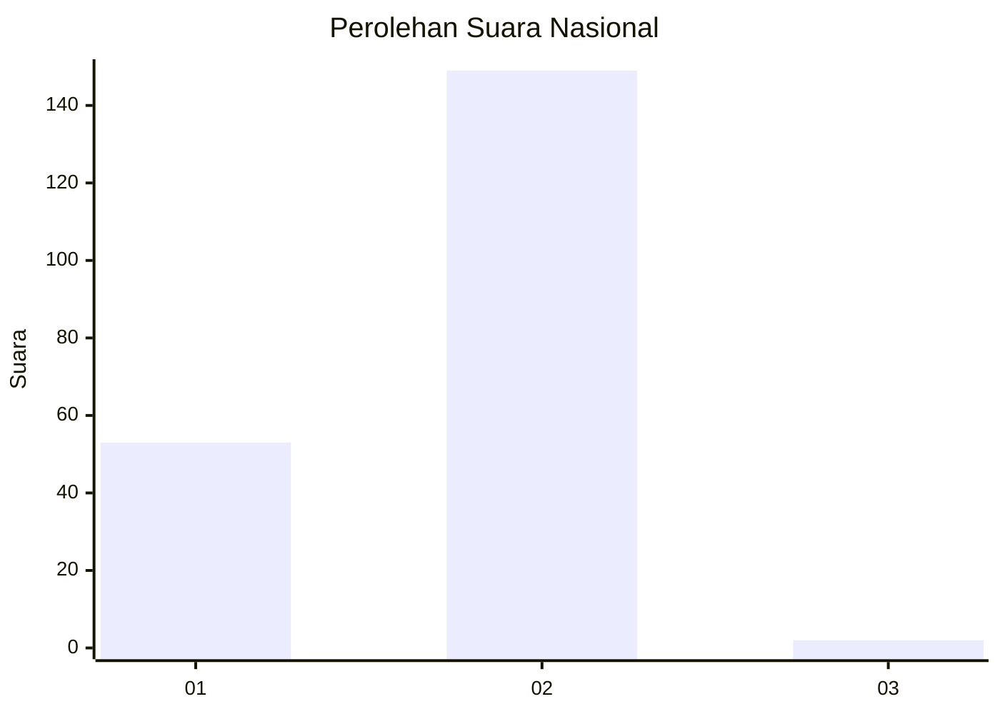
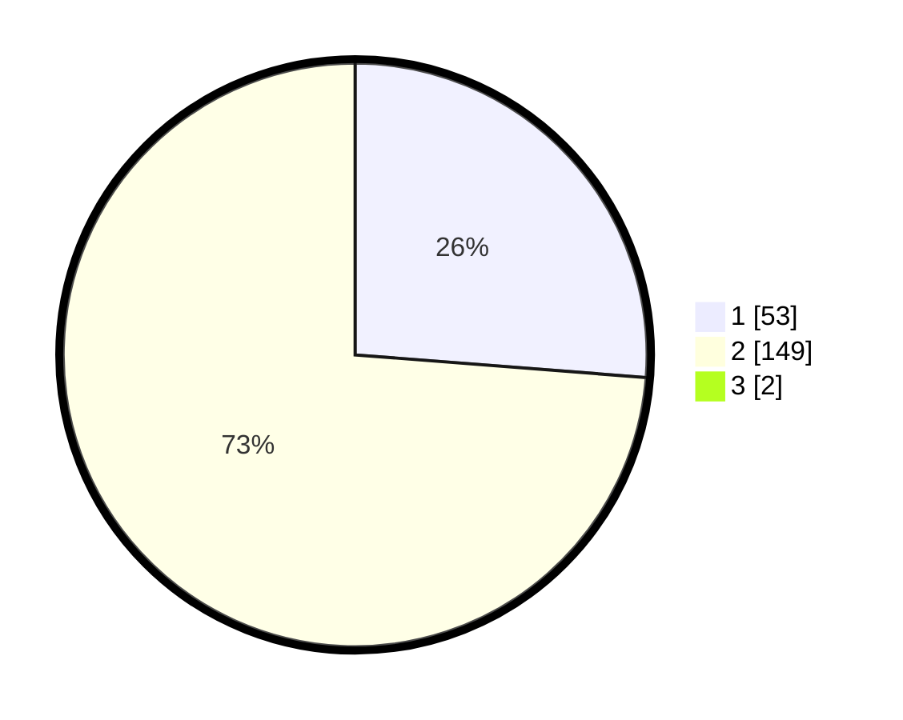

# Hasil

## Grafik

## Tabel

| No. | Nama Paslon    | Suara | Suara (raw) | Persentase |
|:--- |:-------------- | -----:| -----------:| ----------:|
| 1   | ANIES MUHAIMIN | 53    | [53][p-1]   | 25,98      |
| 2   | PRABOWO GIBRAN | 149   | [149][p-2]  | 73,04      |
| 3   | GANJAR MAHFUD  | 2     | [2][p-3]    | 0,98       |

[p-1]: https://github.com/gigit-pemilu/pemilu-2024/blob/main/pilpres/hitung-suara/sub/74-sulawesi-tenggara/sub/02-konawe/sub/36-lalonggasumeeto/sub/2003-rapambinopaka/sub/002-tps/sub/paslon-1.txt
[p-2]: https://github.com/gigit-pemilu/pemilu-2024/blob/main/pilpres/hitung-suara/sub/74-sulawesi-tenggara/sub/02-konawe/sub/36-lalonggasumeeto/sub/2003-rapambinopaka/sub/002-tps/sub/paslon-2.txt
[p-3]: https://github.com/gigit-pemilu/pemilu-2024/blob/main/pilpres/hitung-suara/sub/74-sulawesi-tenggara/sub/02-konawe/sub/36-lalonggasumeeto/sub/2003-rapambinopaka/sub/002-tps/sub/paslon-3.txt

## Foto C Plano

https://sirekap-obj-formc.kpu.go.id/cf1b/pemilu/ppwp/74/02/36/20/03/7402362003002-20240215-003440--4cd21505-1af2-4409-b7fa-8047392dcba9.jpg

https://sirekap-obj-formc.kpu.go.id/cf1b/pemilu/ppwp/74/02/36/20/03/7402362003002-20240215-012326--75eceb2c-e456-496e-8b60-44cbccb96db4.jpg

https://sirekap-obj-formc.kpu.go.id/cf1b/pemilu/ppwp/74/02/36/20/03/7402362003002-20240215-012720--5fb8829e-ae4d-46e7-a752-5ff4812aafab.jpg

## Metadata

| Key        | Value               |
| ---------- | ------------------- |
| Time Stamp | 2024-02-15 15:00:29 |

