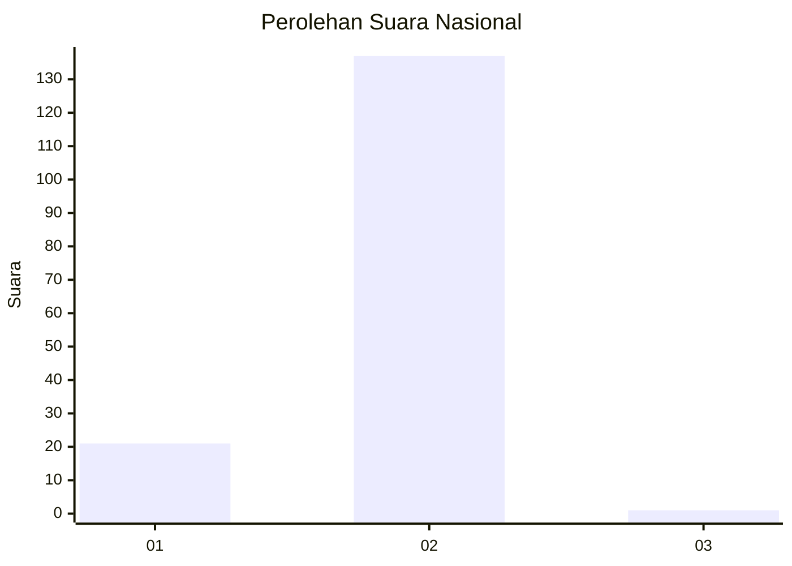
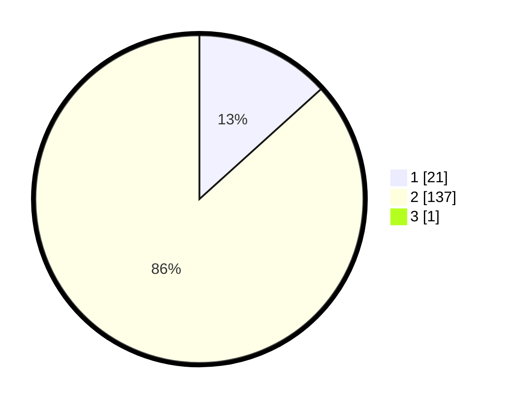

# Hasil

## Grafik

## Tabel

| No. | Nama Paslon    | Suara | Suara (raw) | Persentase |
|:--- |:-------------- | -----:| -----------:| ----------:|
| 1   | ANIES MUHAIMIN | 21    | [21][p-1]   | 13,21      |
| 2   | PRABOWO GIBRAN | 137   | [137][p-2]  | 86,16      |
| 3   | GANJAR MAHFUD  | 1     | [1][p-3]    | 0,63       |

[p-1]: https://github.com/gigit-pemilu/pemilu-2024/blob/main/pilpres/hitung-suara/sub/74-sulawesi-tenggara/sub/02-konawe/sub/36-lalonggasumeeto/sub/2011-batu-gong/sub/001-tps/sub/paslon-1.txt
[p-2]: https://github.com/gigit-pemilu/pemilu-2024/blob/main/pilpres/hitung-suara/sub/74-sulawesi-tenggara/sub/02-konawe/sub/36-lalonggasumeeto/sub/2011-batu-gong/sub/001-tps/sub/paslon-2.txt
[p-3]: https://github.com/gigit-pemilu/pemilu-2024/blob/main/pilpres/hitung-suara/sub/74-sulawesi-tenggara/sub/02-konawe/sub/36-lalonggasumeeto/sub/2011-batu-gong/sub/001-tps/sub/paslon-3.txt

## Foto C Plano

https://sirekap-obj-formc.kpu.go.id/46ea/pemilu/ppwp/74/02/36/20/11/7402362011001-20240215-004436--a2f650f7-7144-490e-a799-4592a14796bf.jpg

https://sirekap-obj-formc.kpu.go.id/46ea/pemilu/ppwp/74/02/36/20/11/7402362011001-20240215-004532--e99b66d8-6ada-47e0-9b74-4469219bf1ac.jpg

https://sirekap-obj-formc.kpu.go.id/46ea/pemilu/ppwp/74/02/36/20/11/7402362011001-20240215-004614--6aa49a55-d7d8-4030-8115-70d61d7695c1.jpg

## Metadata

| Key        | Value               |
| ---------- | ------------------- |
| Time Stamp | 2024-02-15 09:00:24 |

