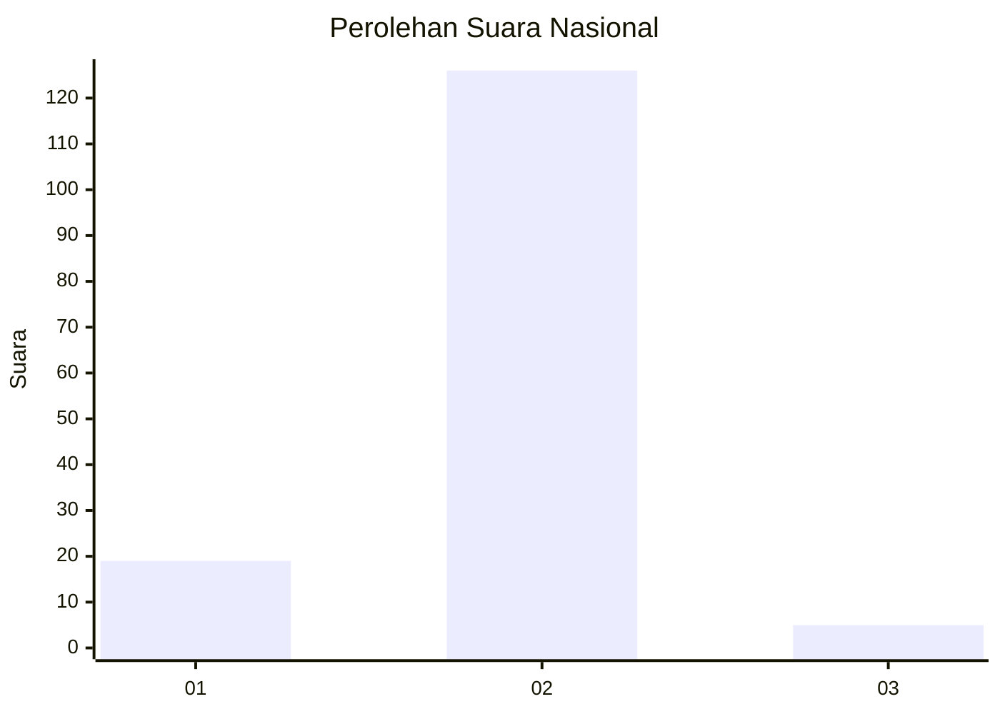
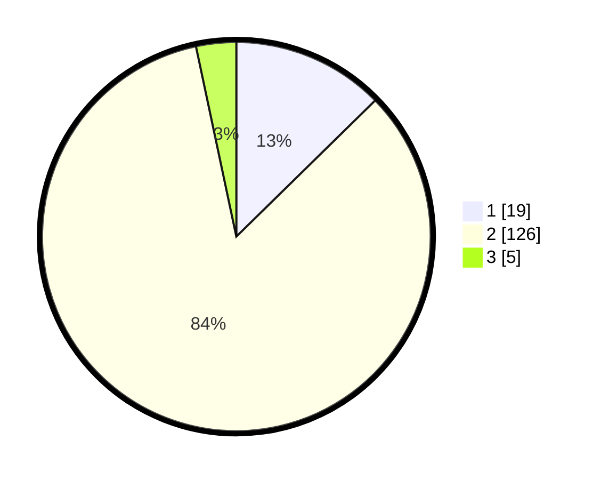

# Hasil

## Grafik

## Tabel

| No. | Nama Paslon    | Suara | Suara (raw) | Persentase |
|:--- |:-------------- | -----:| -----------:| ----------:|
| 1   | ANIES MUHAIMIN | 19    | [19][p-1]   | 12,67      |
| 2   | PRABOWO GIBRAN | 126   | [126][p-2]  | 84,00      |
| 3   | GANJAR MAHFUD  | 5     | [5][p-3]    | 3,33       |

[p-1]: https://github.com/gigit-pemilu/pemilu-2024/blob/main/pilpres/hitung-suara/sub/74-sulawesi-tenggara/sub/02-konawe/sub/40-anggalomoare/sub/2001-anggalomoare/sub/002-tps/sub/paslon-1.txt
[p-2]: https://github.com/gigit-pemilu/pemilu-2024/blob/main/pilpres/hitung-suara/sub/74-sulawesi-tenggara/sub/02-konawe/sub/40-anggalomoare/sub/2001-anggalomoare/sub/002-tps/sub/paslon-2.txt
[p-3]: https://github.com/gigit-pemilu/pemilu-2024/blob/main/pilpres/hitung-suara/sub/74-sulawesi-tenggara/sub/02-konawe/sub/40-anggalomoare/sub/2001-anggalomoare/sub/002-tps/sub/paslon-3.txt

## Foto C Plano

https://sirekap-obj-formc.kpu.go.id/bb31/pemilu/ppwp/74/02/40/20/01/7402402001002-20240215-075057--ed03c87e-9541-4dd6-97b2-d7c38f8b24e7.jpg

https://sirekap-obj-formc.kpu.go.id/bb31/pemilu/ppwp/74/02/40/20/01/7402402001002-20240214-223726--d2afa432-d418-4419-9c75-fa957ceadd0b.jpg

https://sirekap-obj-formc.kpu.go.id/bb31/pemilu/ppwp/74/02/40/20/01/7402402001002-20240214-221527--8ac9ffba-4075-44d8-894d-7cf751d9c328.jpg

## Metadata

| Key        | Value               |
| ---------- | ------------------- |
| Time Stamp | 2024-02-15 19:30:26 |

