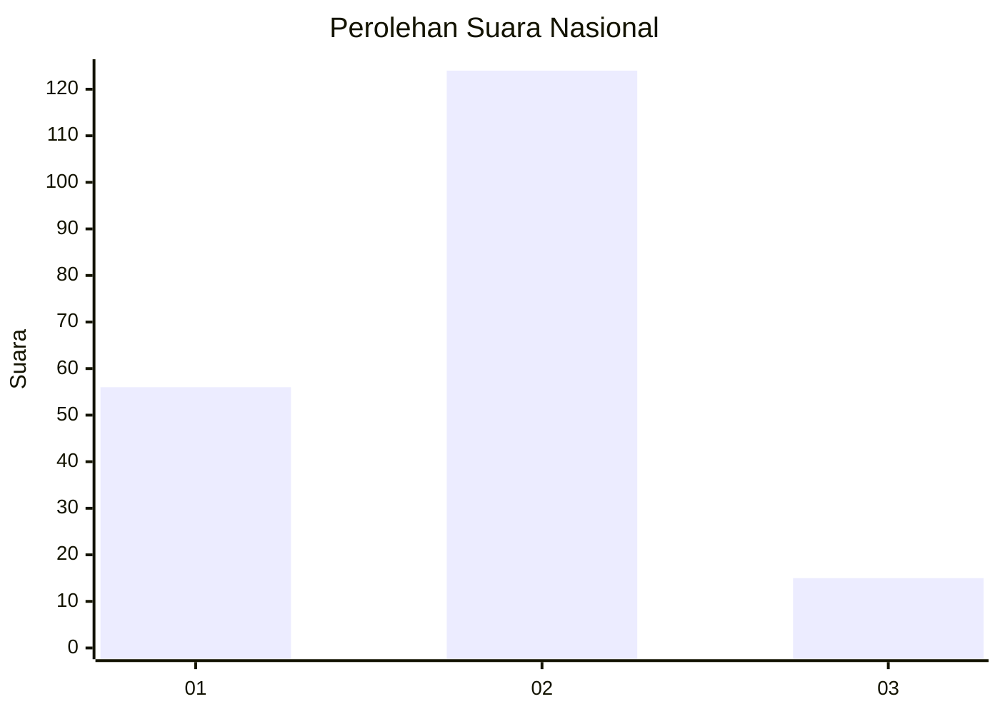
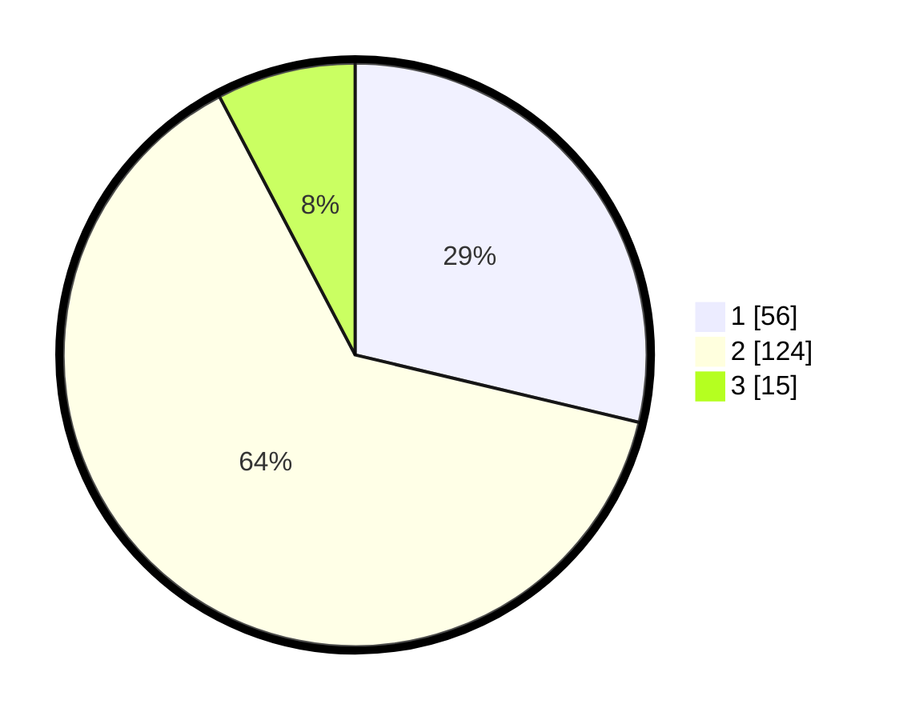

# Hasil

## Grafik

## Tabel

| No. | Nama Paslon    | Suara | Suara (raw) | Persentase |
|:--- |:-------------- | -----:| -----------:| ----------:|
| 1   | ANIES MUHAIMIN | 56    | [56][p-1]   | 28,72      |
| 2   | PRABOWO GIBRAN | 124   | [124][p-2]  | 63,59      |
| 3   | GANJAR MAHFUD  | 15    | [15][p-3]   | 7,69       |

[p-1]: https://github.com/gigit-pemilu/pemilu-2024/blob/main/pilpres/hitung-suara/sub/74-sulawesi-tenggara/sub/03-muna/sub/06-napabalano/sub/1004-napabalano/sub/005-tps/sub/paslon-1.txt
[p-2]: https://github.com/gigit-pemilu/pemilu-2024/blob/main/pilpres/hitung-suara/sub/74-sulawesi-tenggara/sub/03-muna/sub/06-napabalano/sub/1004-napabalano/sub/005-tps/sub/paslon-2.txt
[p-3]: https://github.com/gigit-pemilu/pemilu-2024/blob/main/pilpres/hitung-suara/sub/74-sulawesi-tenggara/sub/03-muna/sub/06-napabalano/sub/1004-napabalano/sub/005-tps/sub/paslon-3.txt

## Foto C Plano

https://sirekap-obj-formc.kpu.go.id/abf7/pemilu/ppwp/74/03/06/10/04/7403061004005-20240215-045704--80eb3976-cce7-4b96-a735-7c948216572e.jpg

https://sirekap-obj-formc.kpu.go.id/abf7/pemilu/ppwp/74/03/06/10/04/7403061004005-20240215-032300--8e172302-3288-4cfe-80e2-3c8bdd1a3b50.jpg

https://sirekap-obj-formc.kpu.go.id/abf7/pemilu/ppwp/74/03/06/10/04/7403061004005-20240215-051220--4bec7124-3c52-4f3f-b5a7-de9f6b5d0430.jpg

## Metadata

| Key        | Value               |
| ---------- | ------------------- |
| Time Stamp | 2024-02-15 15:00:29 |

