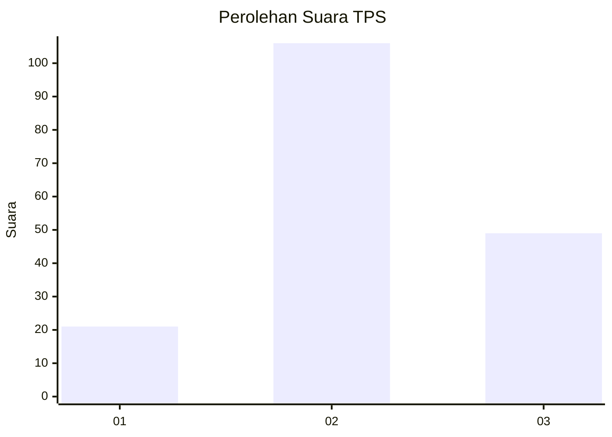
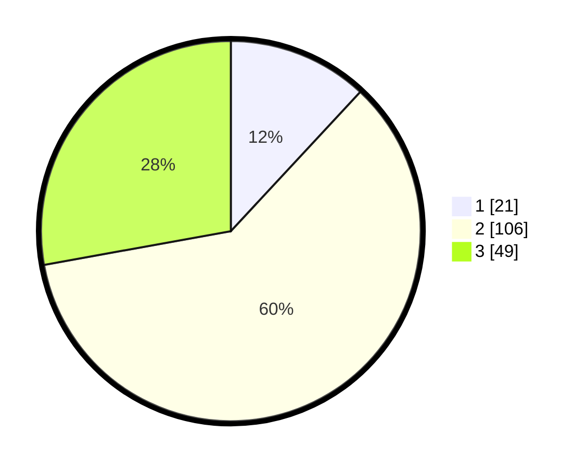

# Hasil

## Grafik

## Tabel

| No. | Nama Paslon    | Suara | Suara (raw) | Persentase |
|:--- |:-------------- | -----:| -----------:| ----------:|
| 1   | ANIES MUHAIMIN | 21    | [21][p-1]   | 11,93      |
| 2   | PRABOWO GIBRAN | 106   | [106][p-2]  | 60,23      |
| 3   | GANJAR MAHFUD  | 49    | [49][p-3]   | 27,84      |

[p-1]: https://github.com/gigit-pemilu/pemilu-2024-74-sulawesi-tenggara/blob/main/pilpres/hitung-suara/sub/74-sulawesi-tenggara/sub/03-muna/sub/07-maligano/sub/2002-latompa/sub/001-tps/sub/paslon-1.txt
[p-2]: https://github.com/gigit-pemilu/pemilu-2024-74-sulawesi-tenggara/blob/main/pilpres/hitung-suara/sub/74-sulawesi-tenggara/sub/03-muna/sub/07-maligano/sub/2002-latompa/sub/001-tps/sub/paslon-2.txt
[p-3]: https://github.com/gigit-pemilu/pemilu-2024-74-sulawesi-tenggara/blob/main/pilpres/hitung-suara/sub/74-sulawesi-tenggara/sub/03-muna/sub/07-maligano/sub/2002-latompa/sub/001-tps/sub/paslon-3.txt

## Foto C Plano

https://sirekap-obj-formc.kpu.go.id/5937/pemilu/ppwp/74/03/07/20/02/7403072002001-20240215-144550--224851b1-b28c-4469-ad11-d4ac67635a80.jpg

https://sirekap-obj-formc.kpu.go.id/5937/pemilu/ppwp/74/03/07/20/02/7403072002001-20240215-144808--2cb6b453-6f98-40cb-821e-74195dc10d42.jpg

https://sirekap-obj-formc.kpu.go.id/5937/pemilu/ppwp/74/03/07/20/02/7403072002001-20240215-145016--d6ebdaff-c0ff-463c-b8d0-0e9ac269bde0.jpg

## Metadata

| Key        | Value               |
| ---------- | ------------------- |
| Time Stamp | 2024-02-15 15:30:25 |

