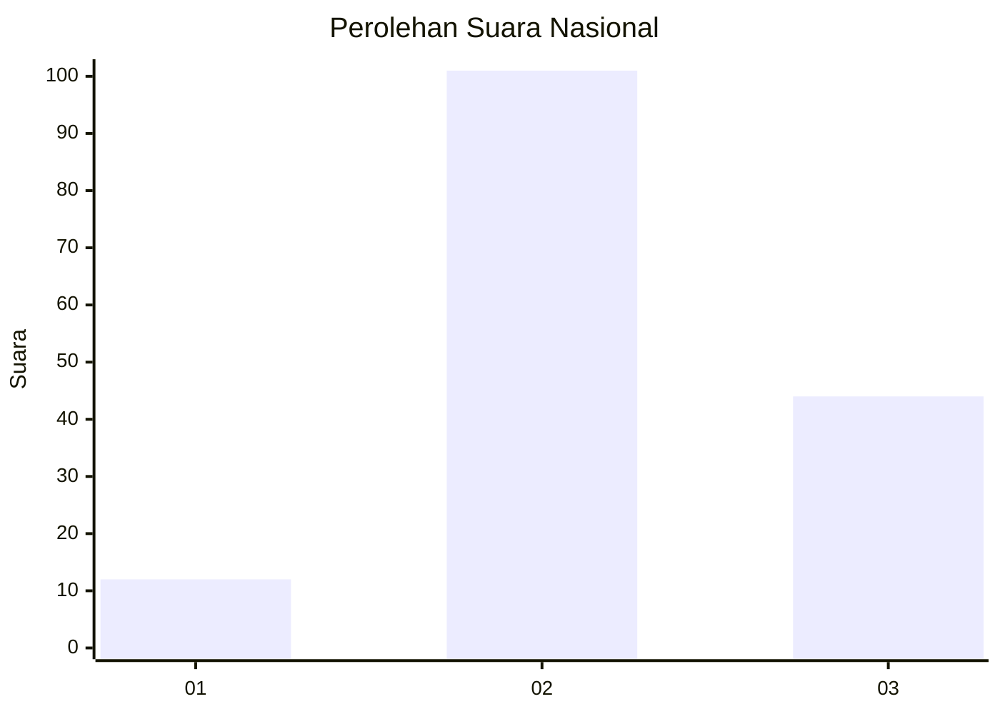

# Hasil

## Grafik

## Tabel

| No. | Nama Paslon    | Suara | Suara (raw) | Persentase |
|:--- |:-------------- | -----:| -----------:| ----------:|
| 1   | ANIES MUHAIMIN | 12    | [12][p-1]   | 7,64       |
| 2   | PRABOWO GIBRAN | 101   | [101][p-2]  | 64,33      |
| 3   | GANJAR MAHFUD  | 44    | [44][p-3]   | 28,03      |

[p-1]: https://github.com/gigit-pemilu/pemilu-2024/blob/main/pilpres/hitung-suara/sub/74-sulawesi-tenggara/sub/03-muna/sub/07-maligano/sub/2002-latompa/sub/002-tps/sub/paslon-1.txt
[p-2]: https://github.com/gigit-pemilu/pemilu-2024/blob/main/pilpres/hitung-suara/sub/74-sulawesi-tenggara/sub/03-muna/sub/07-maligano/sub/2002-latompa/sub/002-tps/sub/paslon-2.txt
[p-3]: https://github.com/gigit-pemilu/pemilu-2024/blob/main/pilpres/hitung-suara/sub/74-sulawesi-tenggara/sub/03-muna/sub/07-maligano/sub/2002-latompa/sub/002-tps/sub/paslon-3.txt

## Foto C Plano

https://sirekap-obj-formc.kpu.go.id/2469/pemilu/ppwp/74/03/07/20/02/7403072002002-20240215-094523--1aff1b08-f713-44a2-90d7-0e3516b3f460.jpg

https://sirekap-obj-formc.kpu.go.id/2469/pemilu/ppwp/74/03/07/20/02/7403072002002-20240215-175105--a04b0ab5-6926-4769-9308-e97af098f639.jpg

https://sirekap-obj-formc.kpu.go.id/2469/pemilu/ppwp/74/03/07/20/02/7403072002002-20240216-093746--3c0a561b-c56d-49cf-8e1e-b7c30be89342.jpg

## Metadata

| Key        | Value               |
| ---------- | ------------------- |
| Time Stamp | 2024-02-16 10:00:28 |

