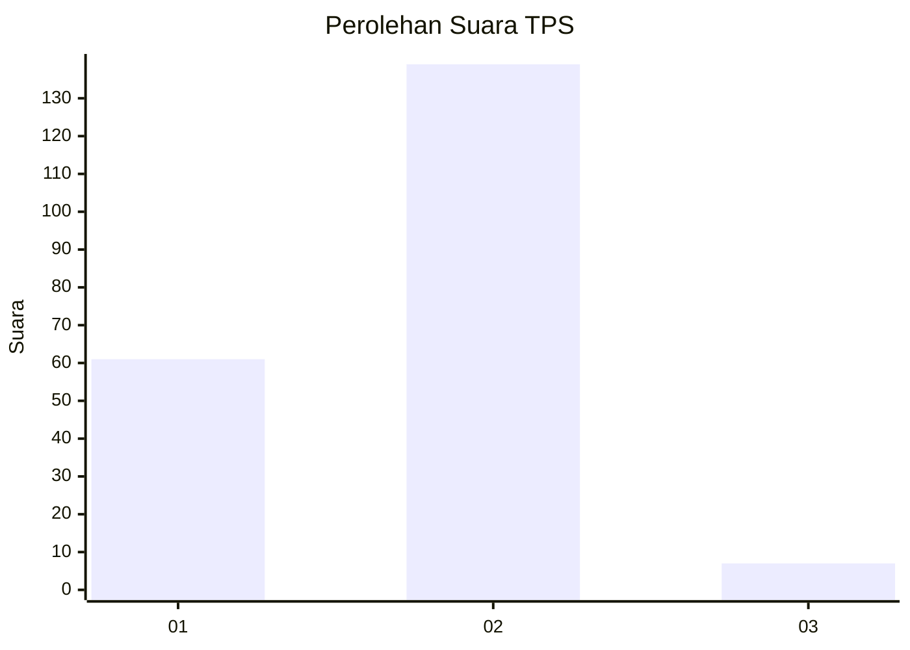
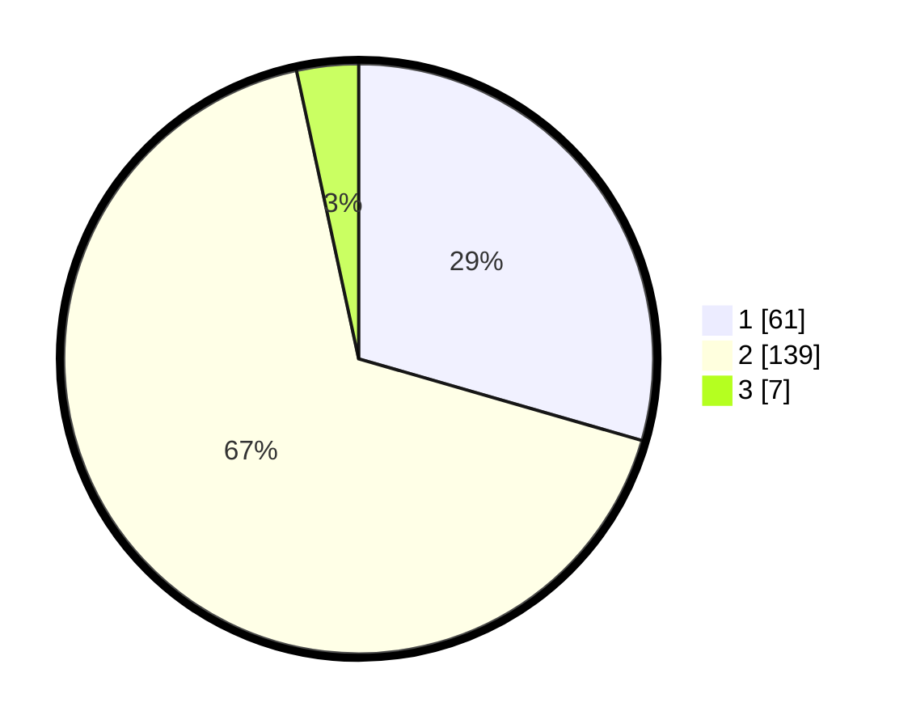

# Hasil

## Grafik

## Tabel

| No. | Nama Paslon    | Suara | Suara (raw) | Persentase |
|:--- |:-------------- | -----:| -----------:| ----------:|
| 1   | ANIES MUHAIMIN | 61    | [61][p-1]   | 29,47      |
| 2   | PRABOWO GIBRAN | 139   | [139][p-2]  | 67,15      |
| 3   | GANJAR MAHFUD  | 7     | [7][p-3]    | 3,38       |

[p-1]: https://github.com/gigit-pemilu/pemilu-2024-74-sulawesi-tenggara/blob/main/pilpres/hitung-suara/sub/74-sulawesi-tenggara/sub/03-muna/sub/13-wakorumba-selatan/sub/2001-wambona/sub/001-tps/sub/paslon-1.txt
[p-2]: https://github.com/gigit-pemilu/pemilu-2024-74-sulawesi-tenggara/blob/main/pilpres/hitung-suara/sub/74-sulawesi-tenggara/sub/03-muna/sub/13-wakorumba-selatan/sub/2001-wambona/sub/001-tps/sub/paslon-2.txt
[p-3]: https://github.com/gigit-pemilu/pemilu-2024-74-sulawesi-tenggara/blob/main/pilpres/hitung-suara/sub/74-sulawesi-tenggara/sub/03-muna/sub/13-wakorumba-selatan/sub/2001-wambona/sub/001-tps/sub/paslon-3.txt

## Foto C Plano

https://sirekap-obj-formc.kpu.go.id/596d/pemilu/ppwp/74/03/13/20/01/7403132001001-20240215-155706--f77879f6-009d-4a06-906d-ed271b053b7f.jpg

https://sirekap-obj-formc.kpu.go.id/596d/pemilu/ppwp/74/03/13/20/01/7403132001001-20240215-155840--dd109350-6d9c-4c73-9026-f5a1c7f2e319.jpg

https://sirekap-obj-formc.kpu.go.id/596d/pemilu/ppwp/74/03/13/20/01/7403132001001-20240215-160531--51519ade-dabe-4ab3-8f06-c73209d804f6.jpg

## Metadata

| Key        | Value               |
| ---------- | ------------------- |
| Time Stamp | 2024-02-15 16:30:25 |

