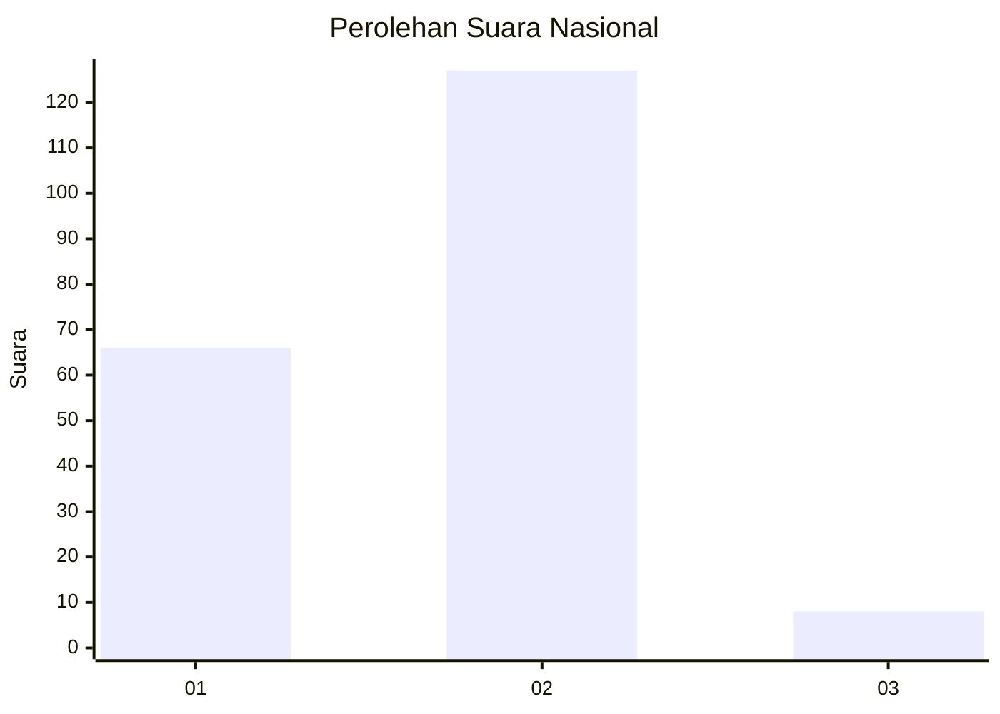
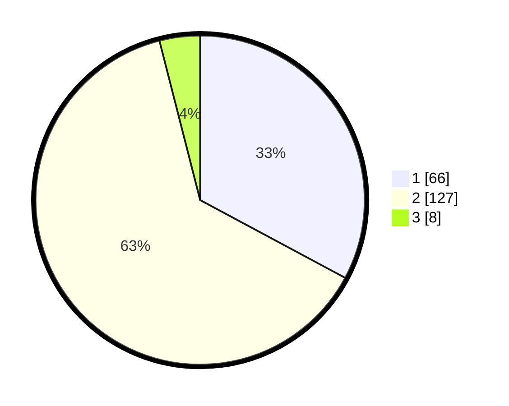

# Hasil

## Grafik

## Tabel

| No. | Nama Paslon    | Suara | Suara (raw) | Persentase |
|:--- |:-------------- | -----:| -----------:| ----------:|
| 1   | ANIES MUHAIMIN | 66    | [66][p-1]   | 32,84      |
| 2   | PRABOWO GIBRAN | 127   | [127][p-2]  | 63,18      |
| 3   | GANJAR MAHFUD  | 8     | [8][p-3]    | 3,98       |

[p-1]: https://github.com/gigit-pemilu/pemilu-2024/blob/main/pilpres/hitung-suara/sub/74-sulawesi-tenggara/sub/03-muna/sub/15-batalaiworu/sub/1003-sidodadi/sub/004-tps/sub/paslon-1.txt
[p-2]: https://github.com/gigit-pemilu/pemilu-2024/blob/main/pilpres/hitung-suara/sub/74-sulawesi-tenggara/sub/03-muna/sub/15-batalaiworu/sub/1003-sidodadi/sub/004-tps/sub/paslon-2.txt
[p-3]: https://github.com/gigit-pemilu/pemilu-2024/blob/main/pilpres/hitung-suara/sub/74-sulawesi-tenggara/sub/03-muna/sub/15-batalaiworu/sub/1003-sidodadi/sub/004-tps/sub/paslon-3.txt

## Foto C Plano

https://sirekap-obj-formc.kpu.go.id/e6c7/pemilu/ppwp/74/03/15/10/03/7403151003004-20240215-030028--c6860aee-cdfd-4a44-99b2-9151baabbd3f.jpg

https://sirekap-obj-formc.kpu.go.id/e6c7/pemilu/ppwp/74/03/15/10/03/7403151003004-20240215-050537--67fe0ac8-9221-474e-a7cb-0c7be948c4e1.jpg

https://sirekap-obj-formc.kpu.go.id/e6c7/pemilu/ppwp/74/03/15/10/03/7403151003004-20240215-050911--4e4a8860-ddef-4efd-b134-328b92dfa996.jpg

## Metadata

| Key        | Value               |
| ---------- | ------------------- |
| Time Stamp | 2024-02-15 15:00:29 |

