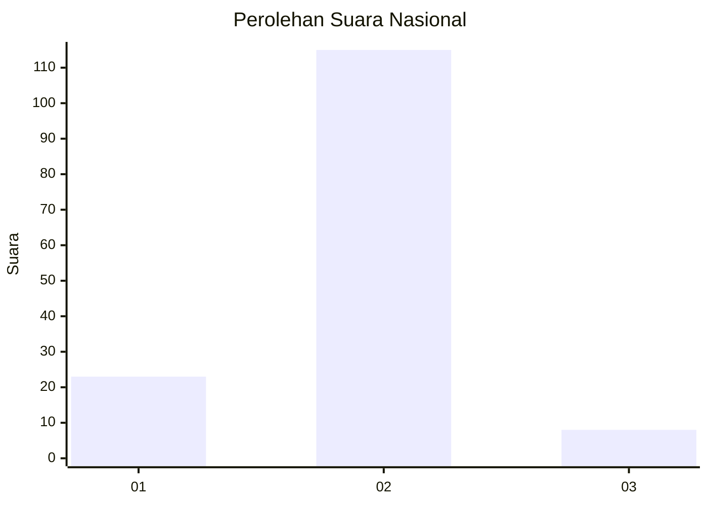
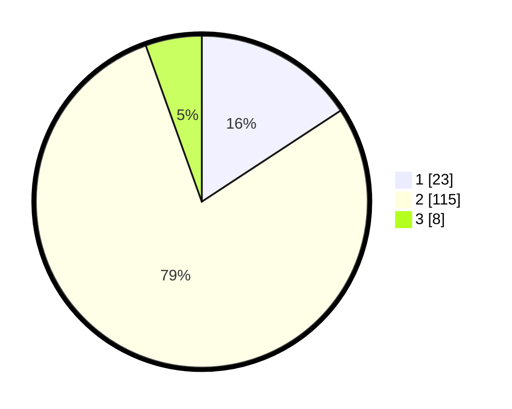

# Hasil

## Grafik

## Tabel

| No. | Nama Paslon    | Suara | Suara (raw) | Persentase |
|:--- |:-------------- | -----:| -----------:| ----------:|
| 1   | ANIES MUHAIMIN | 23    | [23][p-1]   | 15,75      |
| 2   | PRABOWO GIBRAN | 115   | [115][p-2]  | 78,77      |
| 3   | GANJAR MAHFUD  | 8     | [8][p-3]    | 5,48       |

[p-1]: https://github.com/gigit-pemilu/pemilu-2024/blob/main/pilpres/hitung-suara/sub/74-sulawesi-tenggara/sub/03-muna/sub/15-batalaiworu/sub/2001-wawesa/sub/006-tps/sub/paslon-1.txt
[p-2]: https://github.com/gigit-pemilu/pemilu-2024/blob/main/pilpres/hitung-suara/sub/74-sulawesi-tenggara/sub/03-muna/sub/15-batalaiworu/sub/2001-wawesa/sub/006-tps/sub/paslon-2.txt
[p-3]: https://github.com/gigit-pemilu/pemilu-2024/blob/main/pilpres/hitung-suara/sub/74-sulawesi-tenggara/sub/03-muna/sub/15-batalaiworu/sub/2001-wawesa/sub/006-tps/sub/paslon-3.txt

## Foto C Plano

https://sirekap-obj-formc.kpu.go.id/d85f/pemilu/ppwp/74/03/15/20/01/7403152001006-20240214-211024--e4f4bed7-0bb4-4f3e-8bcf-2d26f262ec38.jpg

https://sirekap-obj-formc.kpu.go.id/d85f/pemilu/ppwp/74/03/15/20/01/7403152001006-20240214-211408--28ca3329-199f-412f-bf0f-dea304495c2f.jpg

https://sirekap-obj-formc.kpu.go.id/d85f/pemilu/ppwp/74/03/15/20/01/7403152001006-20240214-195545--fb4d62d5-dc5f-4339-8b43-09718152ebed.jpg

## Metadata

| Key        | Value               |
| ---------- | ------------------- |
| Time Stamp | 2024-02-16 09:30:28 |

