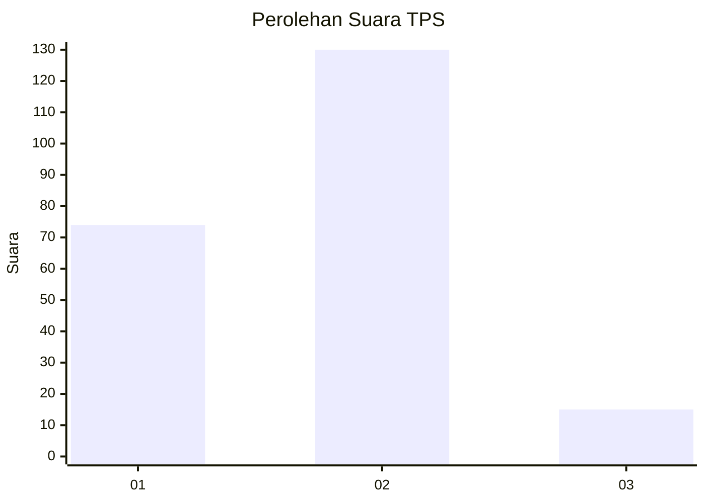
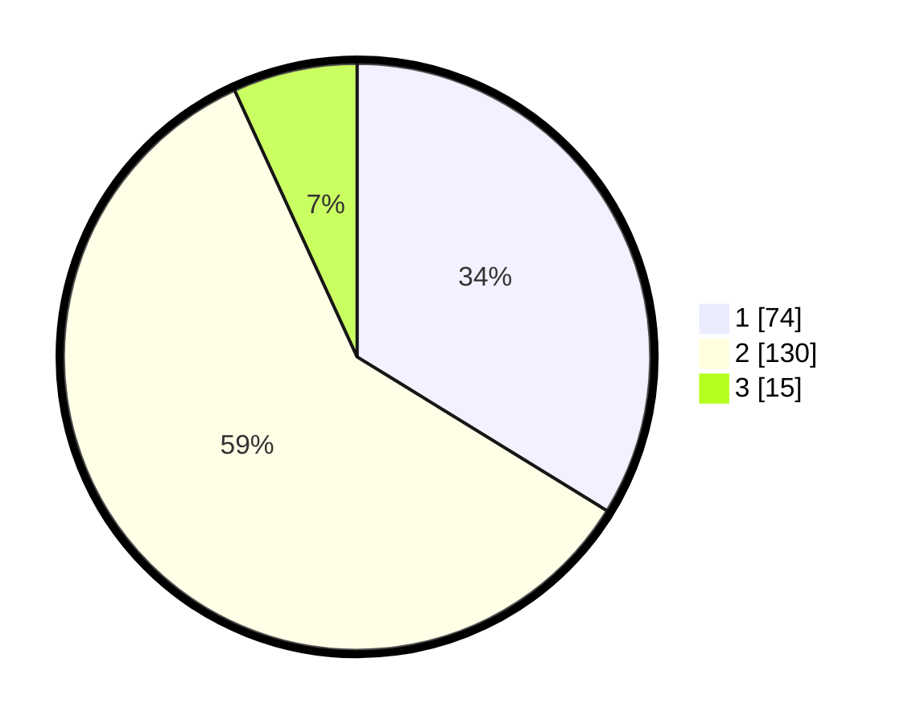

# Hasil

## Grafik

## Tabel

| No. | Nama Paslon    | Suara | Suara (raw) | Persentase |
|:--- |:-------------- | -----:| -----------:| ----------:|
| 1   | ANIES MUHAIMIN | 74    | [74][p-1]   | 33,79      |
| 2   | PRABOWO GIBRAN | 130   | [130][p-2]  | 59,36      |
| 3   | GANJAR MAHFUD  | 15    | [15][p-3]   | 6,85       |

[p-1]: https://github.com/gigit-pemilu/pemilu-2024-74-sulawesi-tenggara/blob/main/pilpres/hitung-suara/sub/74-sulawesi-tenggara/sub/03-muna/sub/17-duruka/sub/1002-palangga/sub/004-tps/sub/paslon-1.txt
[p-2]: https://github.com/gigit-pemilu/pemilu-2024-74-sulawesi-tenggara/blob/main/pilpres/hitung-suara/sub/74-sulawesi-tenggara/sub/03-muna/sub/17-duruka/sub/1002-palangga/sub/004-tps/sub/paslon-2.txt
[p-3]: https://github.com/gigit-pemilu/pemilu-2024-74-sulawesi-tenggara/blob/main/pilpres/hitung-suara/sub/74-sulawesi-tenggara/sub/03-muna/sub/17-duruka/sub/1002-palangga/sub/004-tps/sub/paslon-3.txt

## Foto C Plano

https://sirekap-obj-formc.kpu.go.id/d1e6/pemilu/ppwp/74/03/17/10/02/7403171002004-20240215-042438--5cc9b0e5-dc5b-43d1-ae17-40bd8d33df46.jpg

https://sirekap-obj-formc.kpu.go.id/d1e6/pemilu/ppwp/74/03/17/10/02/7403171002004-20240215-042555--c1f9cb45-cb38-4ade-b01a-cb7e226bffc1.jpg

https://sirekap-obj-formc.kpu.go.id/d1e6/pemilu/ppwp/74/03/17/10/02/7403171002004-20240215-042709--d55ef17d-c247-488e-90e9-e3d6dfa9b0ad.jpg

## Metadata

| Key        | Value               |
| ---------- | ------------------- |
| Time Stamp | 2024-02-16 12:51:22 |

