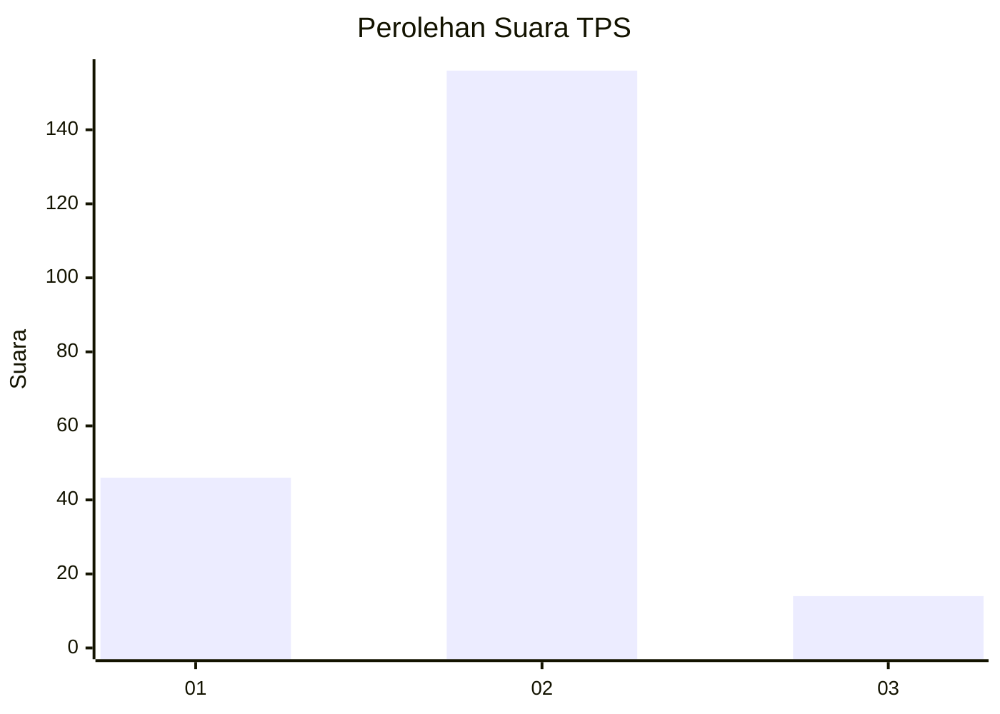

# Hasil

## Grafik

## Tabel

| No. | Nama Paslon    | Suara | Suara (raw) | Persentase |
|:--- |:-------------- | -----:| -----------:| ----------:|
| 1   | ANIES MUHAIMIN | 46    | [46][p-1]   | 21,30      |
| 2   | PRABOWO GIBRAN | 156   | [156][p-2]  | 72,22      |
| 3   | GANJAR MAHFUD  | 14    | [14][p-3]   | 6,48       |

[p-1]: https://github.com/gigit-pemilu/pemilu-2024-74-sulawesi-tenggara/blob/main/pilpres/hitung-suara/sub/74-sulawesi-tenggara/sub/03-muna/sub/18-lohia/sub/2001-liangkobori/sub/001-tps/sub/paslon-1.txt
[p-2]: https://github.com/gigit-pemilu/pemilu-2024-74-sulawesi-tenggara/blob/main/pilpres/hitung-suara/sub/74-sulawesi-tenggara/sub/03-muna/sub/18-lohia/sub/2001-liangkobori/sub/001-tps/sub/paslon-2.txt
[p-3]: https://github.com/gigit-pemilu/pemilu-2024-74-sulawesi-tenggara/blob/main/pilpres/hitung-suara/sub/74-sulawesi-tenggara/sub/03-muna/sub/18-lohia/sub/2001-liangkobori/sub/001-tps/sub/paslon-3.txt

## Foto C Plano

https://sirekap-obj-formc.kpu.go.id/7657/pemilu/ppwp/74/03/18/20/01/7403182001001-20240215-094120--3155ad1c-bc87-458b-a724-3af42d719aa8.jpg

https://sirekap-obj-formc.kpu.go.id/7657/pemilu/ppwp/74/03/18/20/01/7403182001001-20240215-094059--1a619eb4-13eb-43ab-9d40-f46bd0a0f31f.jpg

https://sirekap-obj-formc.kpu.go.id/7657/pemilu/ppwp/74/03/18/20/01/7403182001001-20240215-094039--4232ffff-f3bd-4b12-8b95-8e4a7ef0516b.jpg

## Metadata

| Key        | Value               |
| ---------- | ------------------- |
| Time Stamp | 2024-02-16 12:51:22 |

