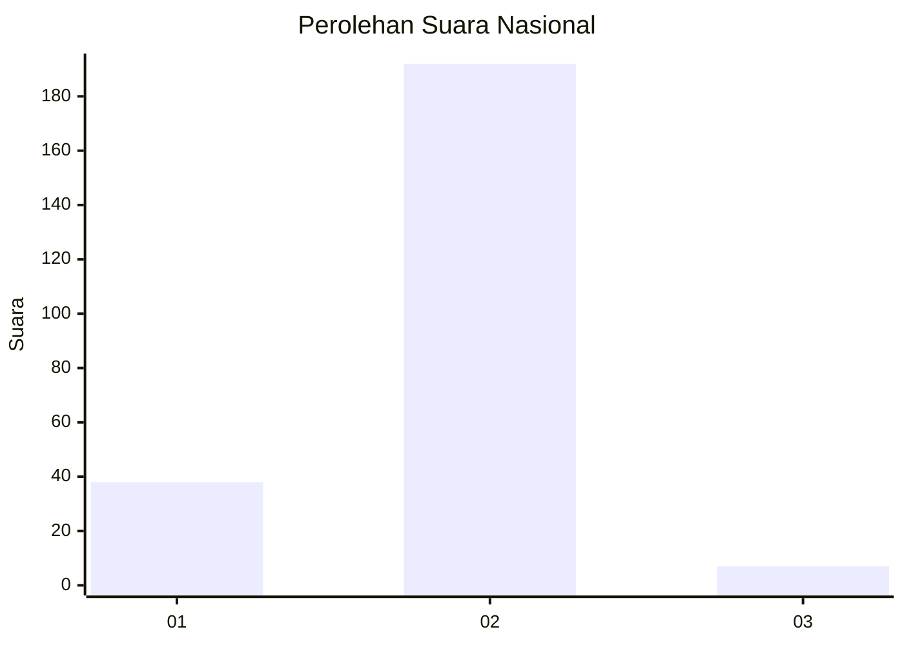
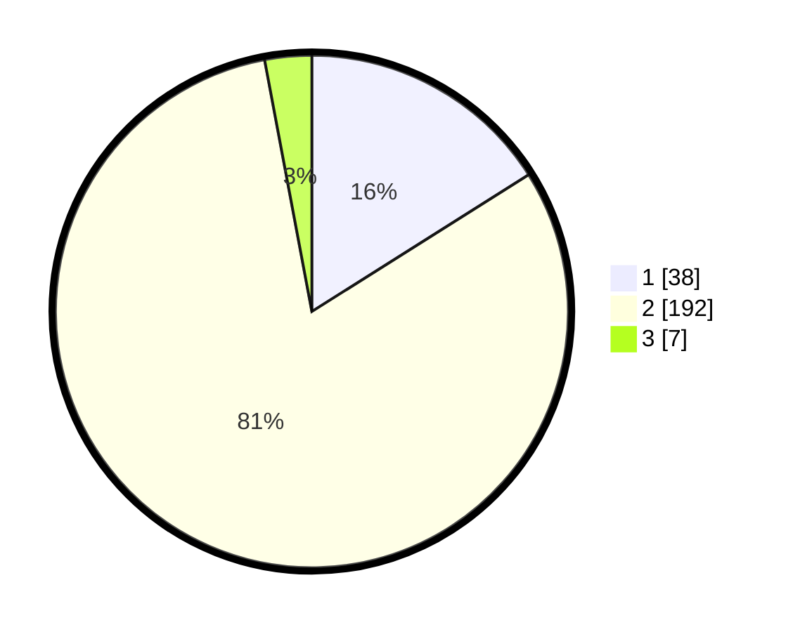

# Hasil

## Grafik

## Tabel

| No. | Nama Paslon    | Suara | Suara (raw) | Persentase |
|:--- |:-------------- | -----:| -----------:| ----------:|
| 1   | ANIES MUHAIMIN | 38    | [38][p-1]   | 16,03      |
| 2   | PRABOWO GIBRAN | 192   | [192][p-2]  | 81,01      |
| 3   | GANJAR MAHFUD  | 7     | [7][p-3]    | 2,95       |

[p-1]: https://github.com/gigit-pemilu/pemilu-2024/blob/main/pilpres/hitung-suara/sub/74-sulawesi-tenggara/sub/03-muna/sub/18-lohia/sub/2001-liangkobori/sub/002-tps/sub/paslon-1.txt
[p-2]: https://github.com/gigit-pemilu/pemilu-2024/blob/main/pilpres/hitung-suara/sub/74-sulawesi-tenggara/sub/03-muna/sub/18-lohia/sub/2001-liangkobori/sub/002-tps/sub/paslon-2.txt
[p-3]: https://github.com/gigit-pemilu/pemilu-2024/blob/main/pilpres/hitung-suara/sub/74-sulawesi-tenggara/sub/03-muna/sub/18-lohia/sub/2001-liangkobori/sub/002-tps/sub/paslon-3.txt

## Foto C Plano

https://sirekap-obj-formc.kpu.go.id/aa5d/pemilu/ppwp/74/03/18/20/01/7403182001002-20240215-060031--ae1927ca-b6a5-474b-84de-52d56e305c68.jpg

https://sirekap-obj-formc.kpu.go.id/aa5d/pemilu/ppwp/74/03/18/20/01/7403182001002-20240215-060142--343ba7b1-b2ab-4833-91e0-75067c41c128.jpg

https://sirekap-obj-formc.kpu.go.id/aa5d/pemilu/ppwp/74/03/18/20/01/7403182001002-20240215-060257--c929545c-2145-4e1f-95b1-41dd9bcc360f.jpg

## Metadata

| Key        | Value               |
| ---------- | ------------------- |
| Time Stamp | 2024-02-16 13:30:32 |

