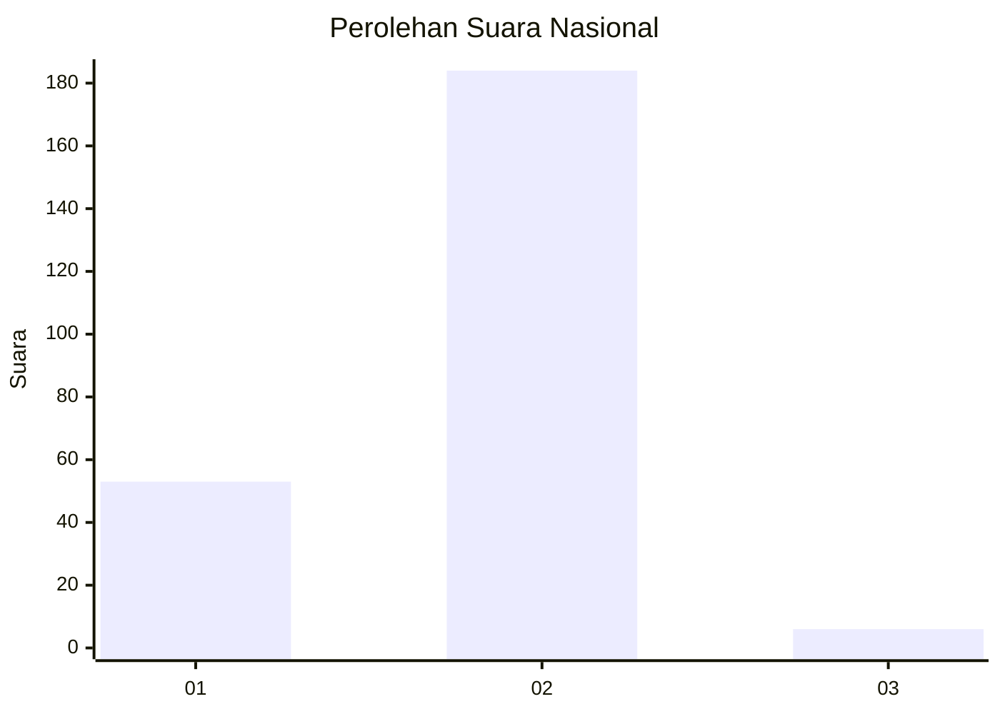
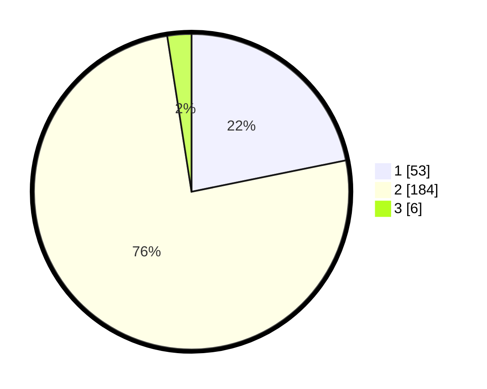

# Hasil

## Grafik

## Tabel

| No. | Nama Paslon    | Suara | Suara (raw) | Persentase |
|:--- |:-------------- | -----:| -----------:| ----------:|
| 1   | ANIES MUHAIMIN | 53    | [53][p-1]   | 21,81      |
| 2   | PRABOWO GIBRAN | 184   | [184][p-2]  | 75,72      |
| 3   | GANJAR MAHFUD  | 6     | [6][p-3]    | 2,47       |

[p-1]: https://github.com/gigit-pemilu/pemilu-2024/blob/main/pilpres/hitung-suara/sub/74-sulawesi-tenggara/sub/03-muna/sub/18-lohia/sub/2001-liangkobori/sub/003-tps/sub/paslon-1.txt
[p-2]: https://github.com/gigit-pemilu/pemilu-2024/blob/main/pilpres/hitung-suara/sub/74-sulawesi-tenggara/sub/03-muna/sub/18-lohia/sub/2001-liangkobori/sub/003-tps/sub/paslon-2.txt
[p-3]: https://github.com/gigit-pemilu/pemilu-2024/blob/main/pilpres/hitung-suara/sub/74-sulawesi-tenggara/sub/03-muna/sub/18-lohia/sub/2001-liangkobori/sub/003-tps/sub/paslon-3.txt

## Foto C Plano

https://sirekap-obj-formc.kpu.go.id/0d13/pemilu/ppwp/74/03/18/20/01/7403182001003-20240215-023540--deedd157-468b-46e8-8357-33f381f3577e.jpg

https://sirekap-obj-formc.kpu.go.id/0d13/pemilu/ppwp/74/03/18/20/01/7403182001003-20240215-023709--839f84b9-58d0-4e04-b900-f1313791a71d.jpg

https://sirekap-obj-formc.kpu.go.id/0d13/pemilu/ppwp/74/03/18/20/01/7403182001003-20240215-023859--07eadb25-a94a-48ac-851c-70f981659c84.jpg

## Metadata

| Key        | Value               |
| ---------- | ------------------- |
| Time Stamp | 2024-02-16 13:30:32 |

