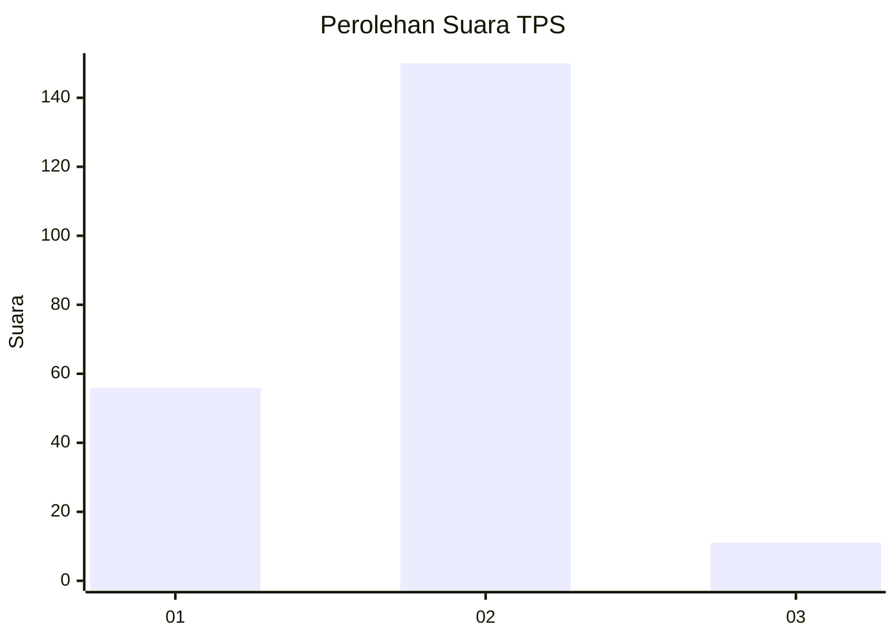
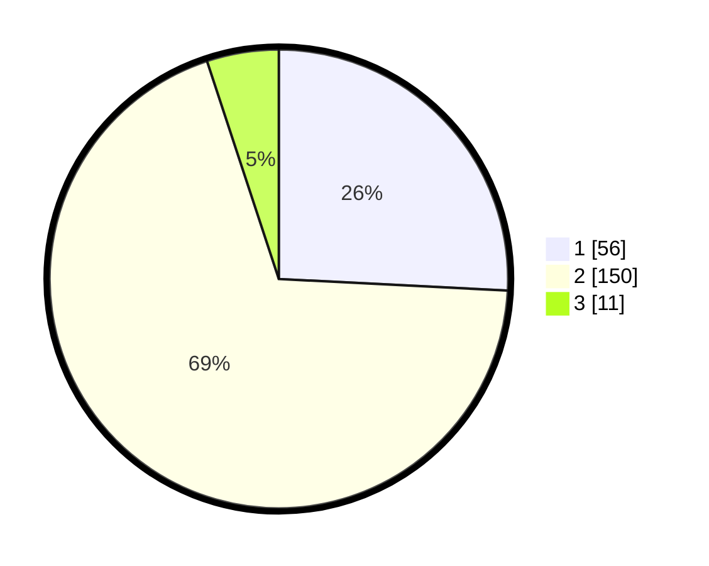

# Hasil

## Grafik

## Tabel

| No. | Nama Paslon    | Suara | Suara (raw) | Persentase |
|:--- |:-------------- | -----:| -----------:| ----------:|
| 1   | ANIES MUHAIMIN | 56    | [56][p-1]   | 25,81      |
| 2   | PRABOWO GIBRAN | 150   | [150][p-2]  | 69,12      |
| 3   | GANJAR MAHFUD  | 11    | [11][p-3]   | 5,07       |

[p-1]: https://github.com/gigit-pemilu/pemilu-2024-74-sulawesi-tenggara/blob/main/pilpres/hitung-suara/sub/74-sulawesi-tenggara/sub/03-muna/sub/18-lohia/sub/2001-liangkobori/sub/004-tps/sub/paslon-1.txt
[p-2]: https://github.com/gigit-pemilu/pemilu-2024-74-sulawesi-tenggara/blob/main/pilpres/hitung-suara/sub/74-sulawesi-tenggara/sub/03-muna/sub/18-lohia/sub/2001-liangkobori/sub/004-tps/sub/paslon-2.txt
[p-3]: https://github.com/gigit-pemilu/pemilu-2024-74-sulawesi-tenggara/blob/main/pilpres/hitung-suara/sub/74-sulawesi-tenggara/sub/03-muna/sub/18-lohia/sub/2001-liangkobori/sub/004-tps/sub/paslon-3.txt

## Foto C Plano

https://sirekap-obj-formc.kpu.go.id/0945/pemilu/ppwp/74/03/18/20/01/7403182001004-20240215-012919--2759166e-260c-4bd0-aa62-198d00235d70.jpg

https://sirekap-obj-formc.kpu.go.id/0945/pemilu/ppwp/74/03/18/20/01/7403182001004-20240215-013706--f5fade07-c491-4996-9927-c1995a4f4ef2.jpg

https://sirekap-obj-formc.kpu.go.id/0945/pemilu/ppwp/74/03/18/20/01/7403182001004-20240215-013848--e7b1294c-b59a-4da2-b647-b70c52a4873d.jpg

## Metadata

| Key        | Value               |
| ---------- | ------------------- |
| Time Stamp | 2024-02-16 13:30:32 |

