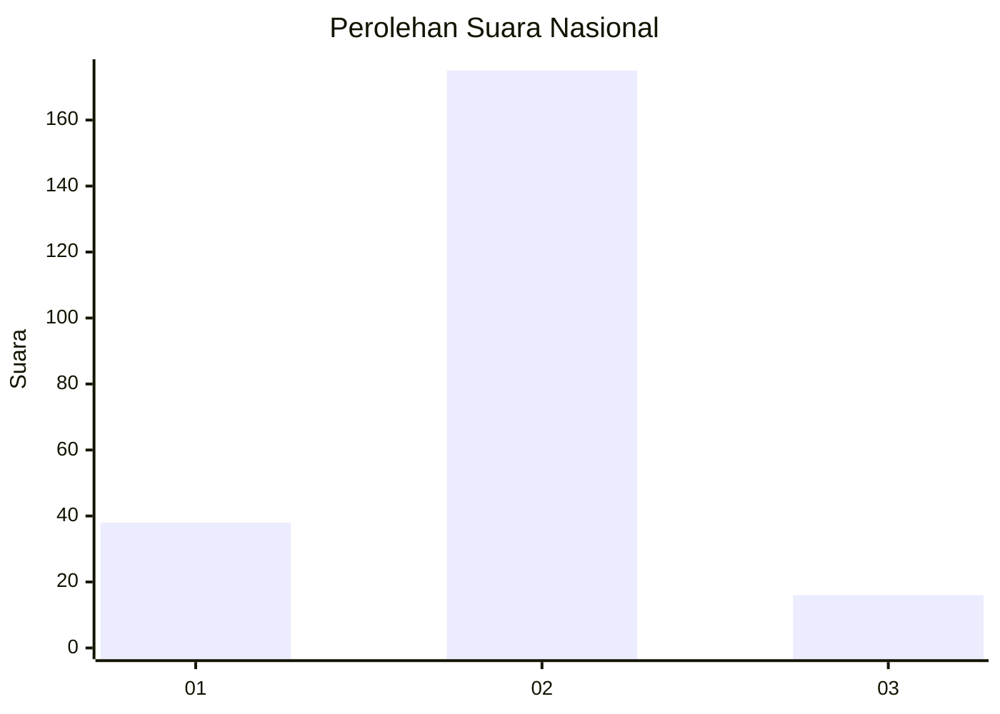
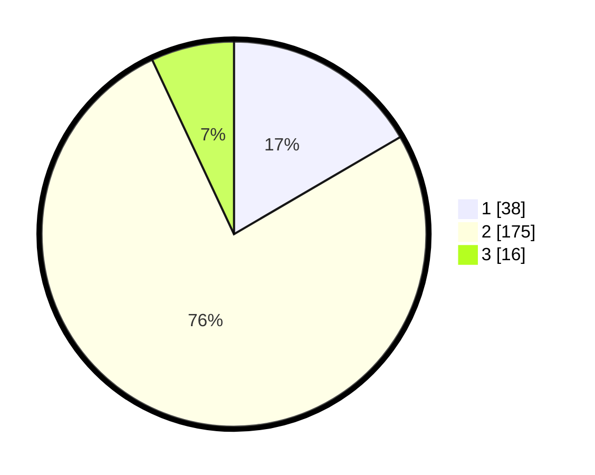

# Hasil

## Grafik

## Tabel

| No. | Nama Paslon    | Suara | Suara (raw) | Persentase |
|:--- |:-------------- | -----:| -----------:| ----------:|
| 1   | ANIES MUHAIMIN | 38    | [38][p-1]   | 16,59      |
| 2   | PRABOWO GIBRAN | 175   | [175][p-2]  | 76,42      |
| 3   | GANJAR MAHFUD  | 16    | [16][p-3]   | 6,99       |

[p-1]: https://github.com/gigit-pemilu/pemilu-2024/blob/main/pilpres/hitung-suara/sub/74-sulawesi-tenggara/sub/03-muna/sub/18-lohia/sub/2002-mabolu/sub/001-tps/sub/paslon-1.txt
[p-2]: https://github.com/gigit-pemilu/pemilu-2024/blob/main/pilpres/hitung-suara/sub/74-sulawesi-tenggara/sub/03-muna/sub/18-lohia/sub/2002-mabolu/sub/001-tps/sub/paslon-2.txt
[p-3]: https://github.com/gigit-pemilu/pemilu-2024/blob/main/pilpres/hitung-suara/sub/74-sulawesi-tenggara/sub/03-muna/sub/18-lohia/sub/2002-mabolu/sub/001-tps/sub/paslon-3.txt

## Foto C Plano

https://sirekap-obj-formc.kpu.go.id/2631/pemilu/ppwp/74/03/18/20/02/7403182002001-20240215-045537--1e55984a-b8ab-4643-a9f8-d76ac5383a40.jpg

https://sirekap-obj-formc.kpu.go.id/2631/pemilu/ppwp/74/03/18/20/02/7403182002001-20240215-045736--d807a58d-b2f7-4a77-b6ca-0d592ef5338c.jpg

https://sirekap-obj-formc.kpu.go.id/2631/pemilu/ppwp/74/03/18/20/02/7403182002001-20240215-045841--fd1c17a2-0ce1-47b4-a9b9-1247feb41c40.jpg

## Metadata

| Key        | Value               |
| ---------- | ------------------- |
| Time Stamp | 2024-02-16 13:30:32 |

