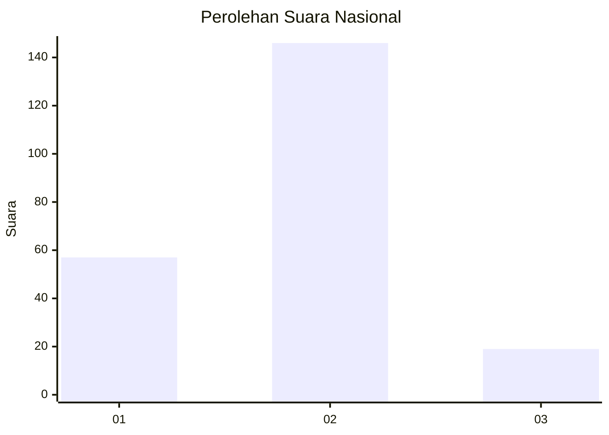
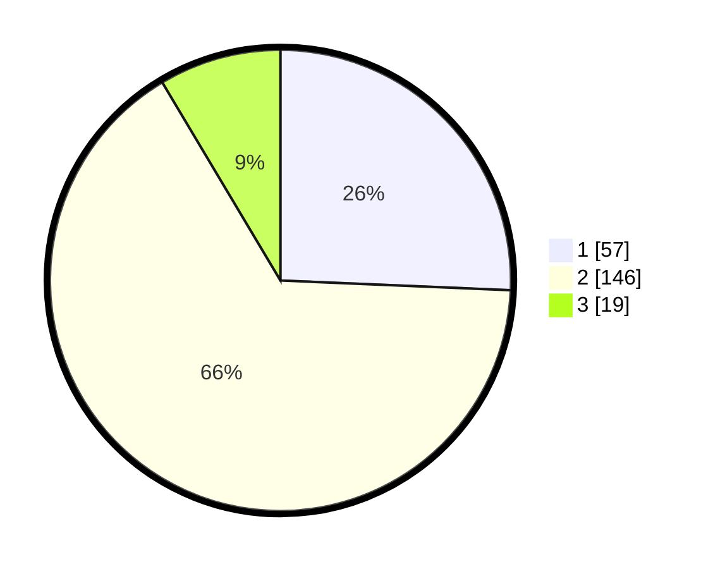

# Hasil

## Grafik

## Tabel

| No. | Nama Paslon    | Suara | Suara (raw) | Persentase |
|:--- |:-------------- | -----:| -----------:| ----------:|
| 1   | ANIES MUHAIMIN | 57    | [57][p-1]   | 25,68      |
| 2   | PRABOWO GIBRAN | 146   | [146][p-2]  | 65,77      |
| 3   | GANJAR MAHFUD  | 19    | [19][p-3]   | 8,56       |

[p-1]: https://github.com/gigit-pemilu/pemilu-2024/blob/main/pilpres/hitung-suara/sub/74-sulawesi-tenggara/sub/03-muna/sub/25-parigi/sub/1006-walambeno-wite/sub/001-tps/sub/paslon-1.txt
[p-2]: https://github.com/gigit-pemilu/pemilu-2024/blob/main/pilpres/hitung-suara/sub/74-sulawesi-tenggara/sub/03-muna/sub/25-parigi/sub/1006-walambeno-wite/sub/001-tps/sub/paslon-2.txt
[p-3]: https://github.com/gigit-pemilu/pemilu-2024/blob/main/pilpres/hitung-suara/sub/74-sulawesi-tenggara/sub/03-muna/sub/25-parigi/sub/1006-walambeno-wite/sub/001-tps/sub/paslon-3.txt

## Foto C Plano

https://sirekap-obj-formc.kpu.go.id/9048/pemilu/ppwp/74/03/25/10/06/7403251006001-20240215-005845--0bc91866-cf8d-4c5c-8eeb-33fbd3217144.jpg

https://sirekap-obj-formc.kpu.go.id/9048/pemilu/ppwp/74/03/25/10/06/7403251006001-20240215-010015--4a23e714-8c3a-40ef-bea5-56d9f784e90f.jpg

https://sirekap-obj-formc.kpu.go.id/9048/pemilu/ppwp/74/03/25/10/06/7403251006001-20240215-010240--f77fc7e2-5de6-4721-ad5f-53aa4f1e8926.jpg

## Metadata

| Key        | Value               |
| ---------- | ------------------- |
| Time Stamp | 2024-02-16 16:25:10 |

