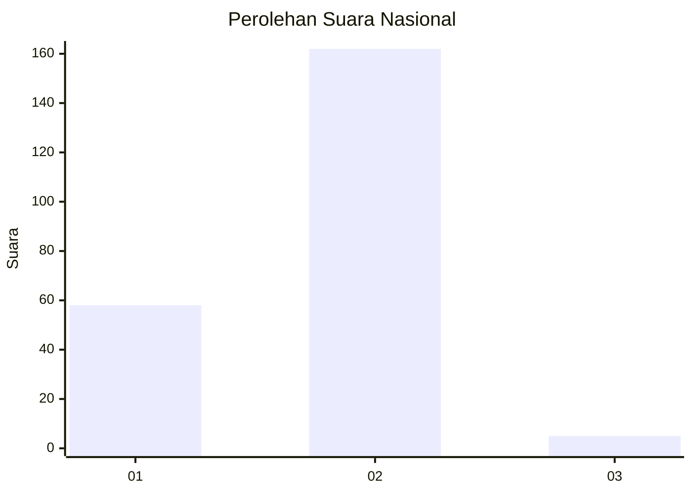
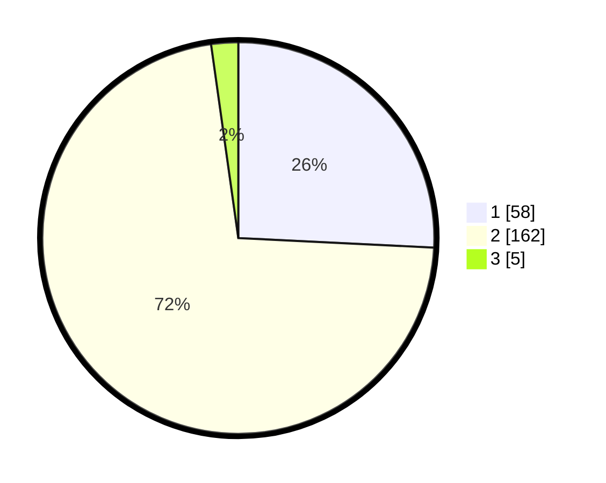

# Hasil

## Grafik

## Tabel

| No. | Nama Paslon    | Suara | Suara (raw) | Persentase |
|:--- |:-------------- | -----:| -----------:| ----------:|
| 1   | ANIES MUHAIMIN | 58    | [58][p-1]   | 25,78      |
| 2   | PRABOWO GIBRAN | 162   | [162][p-2]  | 72,00      |
| 3   | GANJAR MAHFUD  | 5     | [5][p-3]    | 2,22       |

[p-1]: https://github.com/gigit-pemilu/pemilu-2024/blob/main/pilpres/hitung-suara/sub/74-sulawesi-tenggara/sub/03-muna/sub/26-bone/sub/2007-bhone-kainsetala/sub/002-tps/sub/paslon-1.txt
[p-2]: https://github.com/gigit-pemilu/pemilu-2024/blob/main/pilpres/hitung-suara/sub/74-sulawesi-tenggara/sub/03-muna/sub/26-bone/sub/2007-bhone-kainsetala/sub/002-tps/sub/paslon-2.txt
[p-3]: https://github.com/gigit-pemilu/pemilu-2024/blob/main/pilpres/hitung-suara/sub/74-sulawesi-tenggara/sub/03-muna/sub/26-bone/sub/2007-bhone-kainsetala/sub/002-tps/sub/paslon-3.txt

## Foto C Plano

https://sirekap-obj-formc.kpu.go.id/57e1/pemilu/ppwp/74/03/26/20/07/7403262007002-20240215-103328--47a3c0e8-cc0a-4f26-877f-c12cd0e95405.jpg

https://sirekap-obj-formc.kpu.go.id/57e1/pemilu/ppwp/74/03/26/20/07/7403262007002-20240215-102911--55328a5f-3b37-4261-b7af-bdf0912cebc7.jpg

https://sirekap-obj-formc.kpu.go.id/57e1/pemilu/ppwp/74/03/26/20/07/7403262007002-20240215-101205--06c7c022-e2e1-485e-8c94-b559fcfb15ab.jpg

## Metadata

| Key        | Value               |
| ---------- | ------------------- |
| Time Stamp | 2024-02-15 20:00:44 |

