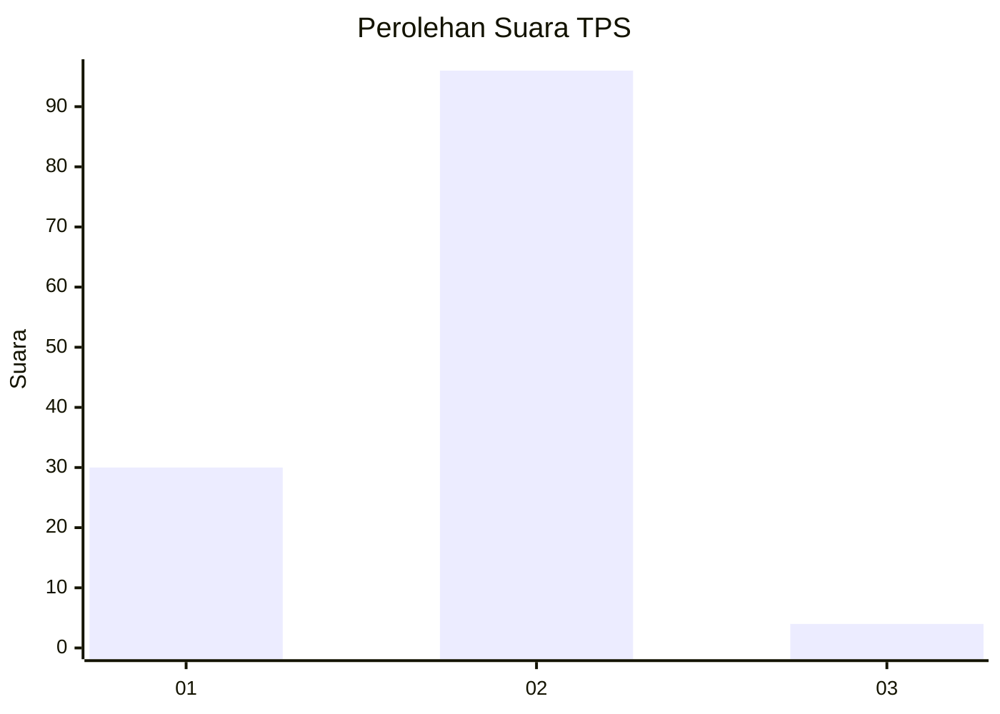
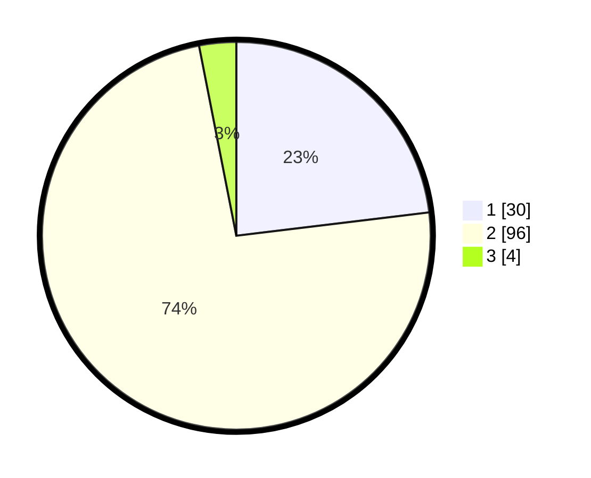

# Hasil

## Grafik

## Tabel

| No. | Nama Paslon    | Suara | Suara (raw) | Persentase |
|:--- |:-------------- | -----:| -----------:| ----------:|
| 1   | ANIES MUHAIMIN | 30    | [30][p-1]   | 23,08      |
| 2   | PRABOWO GIBRAN | 96    | [96][p-2]   | 73,85      |
| 3   | GANJAR MAHFUD  | 4     | [4][p-3]    | 3,08       |

[p-1]: https://github.com/gigit-pemilu/pemilu-2024-74-sulawesi-tenggara/blob/main/pilpres/hitung-suara/sub/74-sulawesi-tenggara/sub/03-muna/sub/28-pasir-putih/sub/2001-kogholifano/sub/002-tps/sub/paslon-1.txt
[p-2]: https://github.com/gigit-pemilu/pemilu-2024-74-sulawesi-tenggara/blob/main/pilpres/hitung-suara/sub/74-sulawesi-tenggara/sub/03-muna/sub/28-pasir-putih/sub/2001-kogholifano/sub/002-tps/sub/paslon-2.txt
[p-3]: https://github.com/gigit-pemilu/pemilu-2024-74-sulawesi-tenggara/blob/main/pilpres/hitung-suara/sub/74-sulawesi-tenggara/sub/03-muna/sub/28-pasir-putih/sub/2001-kogholifano/sub/002-tps/sub/paslon-3.txt

## Foto C Plano

https://sirekap-obj-formc.kpu.go.id/1bd0/pemilu/ppwp/74/03/28/20/01/7403282001002-20240215-151501--337adeca-56e1-422a-8877-f7563c8e771d.jpg

https://sirekap-obj-formc.kpu.go.id/1bd0/pemilu/ppwp/74/03/28/20/01/7403282001002-20240215-151653--a906d934-4fd2-4d3c-a35e-7d6b71525ebe.jpg

https://sirekap-obj-formc.kpu.go.id/1bd0/pemilu/ppwp/74/03/28/20/01/7403282001002-20240215-151805--7e3d2fac-5a9d-406b-9f63-4a1b436b7c1e.jpg

## Metadata

| Key        | Value               |
| ---------- | ------------------- |
| Time Stamp | 2024-02-16 16:25:10 |

