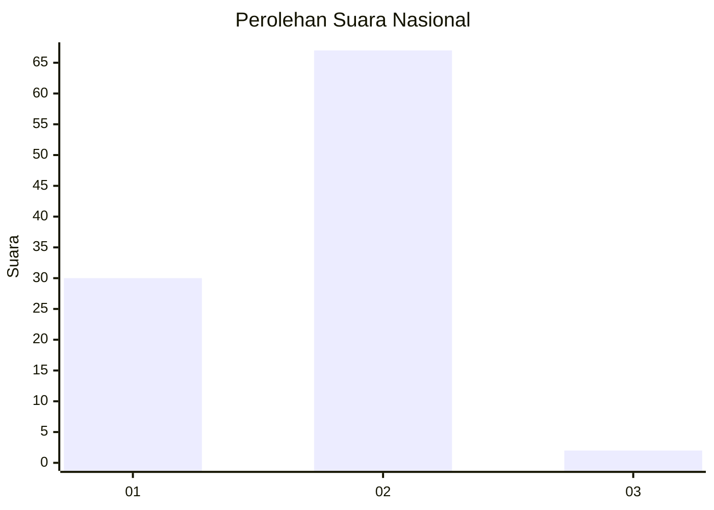
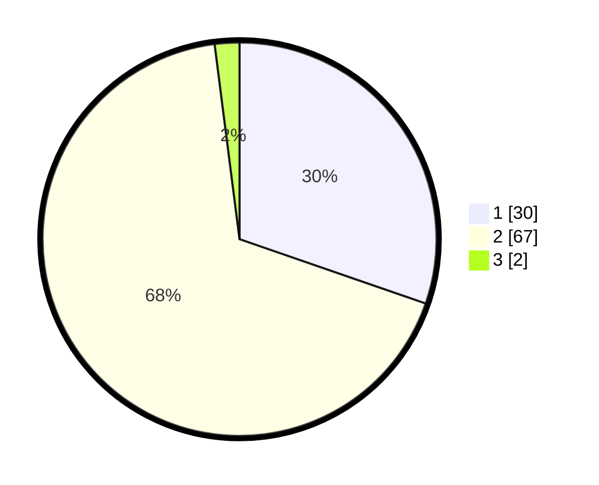

# Hasil

## Grafik

## Tabel

| No. | Nama Paslon    | Suara | Suara (raw) | Persentase |
|:--- |:-------------- | -----:| -----------:| ----------:|
| 1   | ANIES MUHAIMIN | 30    | [30][p-1]   | 30,30      |
| 2   | PRABOWO GIBRAN | 67    | [67][p-2]   | 67,68      |
| 3   | GANJAR MAHFUD  | 2     | [2][p-3]    | 2,02       |

[p-1]: https://github.com/gigit-pemilu/pemilu-2024/blob/main/pilpres/hitung-suara/sub/74-sulawesi-tenggara/sub/03-muna/sub/28-pasir-putih/sub/2009-labulawa/sub/002-tps/sub/paslon-1.txt
[p-2]: https://github.com/gigit-pemilu/pemilu-2024/blob/main/pilpres/hitung-suara/sub/74-sulawesi-tenggara/sub/03-muna/sub/28-pasir-putih/sub/2009-labulawa/sub/002-tps/sub/paslon-2.txt
[p-3]: https://github.com/gigit-pemilu/pemilu-2024/blob/main/pilpres/hitung-suara/sub/74-sulawesi-tenggara/sub/03-muna/sub/28-pasir-putih/sub/2009-labulawa/sub/002-tps/sub/paslon-3.txt

## Foto C Plano

https://sirekap-obj-formc.kpu.go.id/cf65/pemilu/ppwp/74/03/28/20/09/7403282009002-20240215-052132--b68c5169-42e7-4ce3-8b57-32c622c67064.jpg

https://sirekap-obj-formc.kpu.go.id/cf65/pemilu/ppwp/74/03/28/20/09/7403282009002-20240215-072544--164acd3d-7a39-4933-b8b3-785d330832c1.jpg

https://sirekap-obj-formc.kpu.go.id/cf65/pemilu/ppwp/74/03/28/20/09/7403282009002-20240215-072722--9e068135-075b-41ab-8fa5-0cface6fb298.jpg

## Metadata

| Key        | Value               |
| ---------- | ------------------- |
| Time Stamp | 2024-02-15 21:30:27 |

