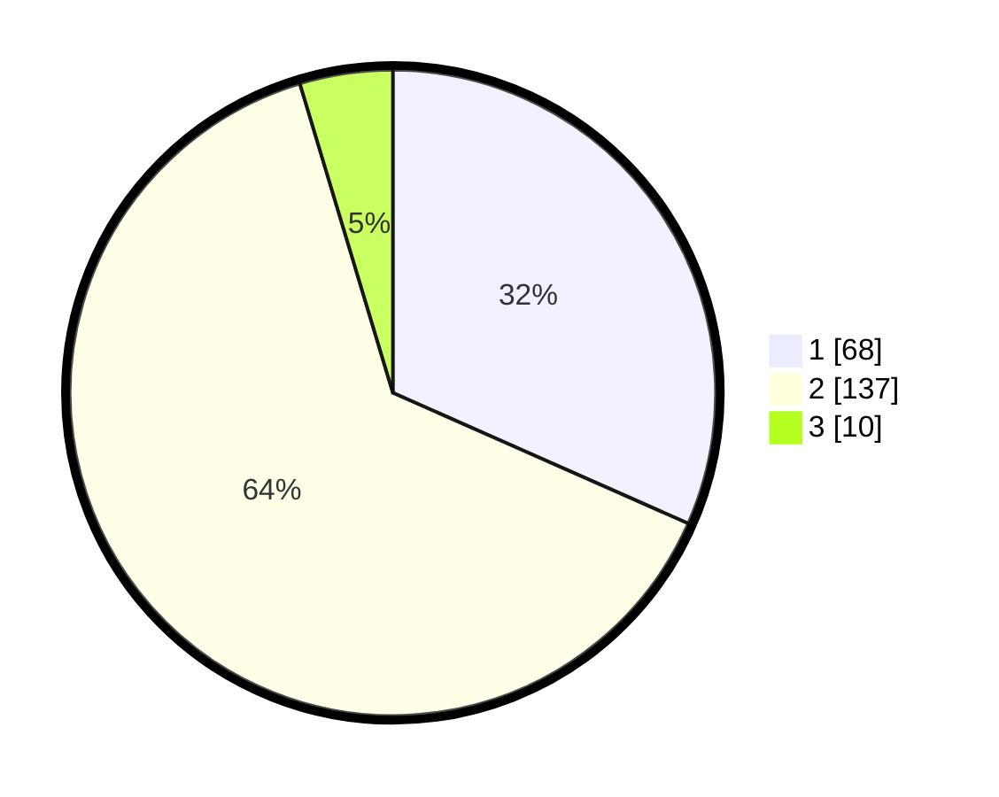

# Hasil

## Grafik

## Tabel

| No. | Nama Paslon    | Suara | Suara (raw) | Persentase |
|:--- |:-------------- | -----:| -----------:| ----------:|
| 1   | ANIES MUHAIMIN | 68    | [68][p-1]   | 31,63      |
| 2   | PRABOWO GIBRAN | 137   | [137][p-2]  | 63,72      |
| 3   | GANJAR MAHFUD  | 10    | [10][p-3]   | 4,65       |

[p-1]: https://github.com/gigit-pemilu/pemilu-2024-74-sulawesi-tenggara/blob/main/pilpres/hitung-suara/sub/74-sulawesi-tenggara/sub/03-muna/sub/30-kontu-kowuna/sub/2004-bahutara/sub/001-tps/sub/paslon-1.txt
[p-2]: https://github.com/gigit-pemilu/pemilu-2024-74-sulawesi-tenggara/blob/main/pilpres/hitung-suara/sub/74-sulawesi-tenggara/sub/03-muna/sub/30-kontu-kowuna/sub/2004-bahutara/sub/001-tps/sub/paslon-2.txt
[p-3]: https://github.com/gigit-pemilu/pemilu-2024-74-sulawesi-tenggara/blob/main/pilpres/hitung-suara/sub/74-sulawesi-tenggara/sub/03-muna/sub/30-kontu-kowuna/sub/2004-bahutara/sub/001-tps/sub/paslon-3.txt

## Foto C Plano

https://sirekap-obj-formc.kpu.go.id/aa6b/pemilu/ppwp/74/03/30/20/04/7403302004001-20240215-101204--04cf0e93-fefc-4f1a-92e2-39bc7a5774ac.jpg

https://sirekap-obj-formc.kpu.go.id/aa6b/pemilu/ppwp/74/03/30/20/04/7403302004001-20240215-114155--a4a33598-00bb-493e-9afb-2cf689c38fdb.jpg

https://sirekap-obj-formc.kpu.go.id/aa6b/pemilu/ppwp/74/03/30/20/04/7403302004001-20240215-114307--ec29c16c-e107-4420-8642-81fa47659aeb.jpg

## Metadata

| Key        | Value               |
| ---------- | ------------------- |
| Time Stamp | 2024-02-19 06:16:00 |

